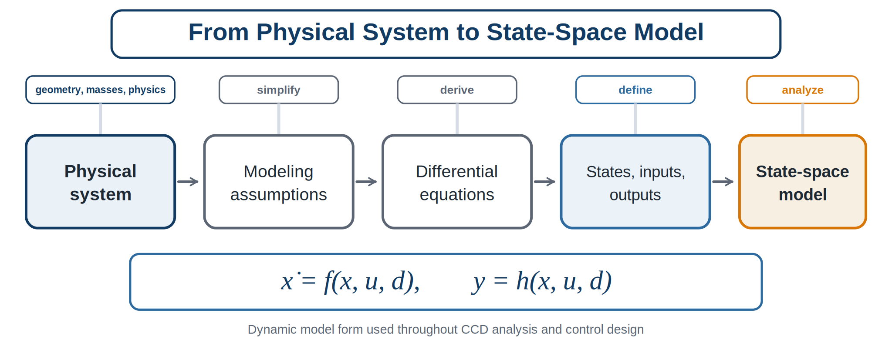
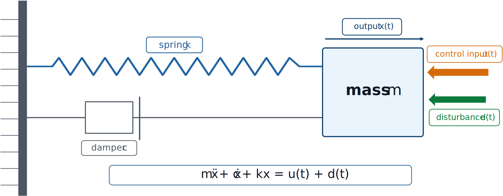

# Physical System Modeling

## Why modeling matters

Every control problem begins with a model, whether that model is explicit or implicit. Even when a controller is tuned experimentally, the engineer still carries an internal mental model of what the system does. In CCD, the model plays an even larger role: it is the bridge between plant design variables and control design variables.

A good model should be:

- **physically meaningful**, so that design-variable changes have understandable effects;
- **simple enough to analyze and optimize**, especially in early design stages;
- **rich enough to capture the dominant dynamics** that matter for control and performance; and
- **well matched to the decisions being made**. A conceptual design study does not need the same fidelity as a certification-grade simulation.

There is no perfect model. There are only models that are more or less useful for a given decision. The art of dynamic modeling lies in retaining the right physics while excluding details that do not materially affect the design question.



*A typical modeling workflow for dynamic systems used in CCD and control analysis. The process begins with the physical system and ends with a dynamic model that can be analyzed, simulated, and used for design.*

A common modeling pipeline begins with a physical system and its governing physics. We then make assumptions: rigid body or flexible body? Linear or nonlinear? Lumped parameters or distributed parameters? Small motions or large motions? These assumptions lead to differential equations. Finally, we define states, inputs, outputs, and disturbances and express the model in a convenient form such as state space.

## Levels of model fidelity

Dynamic models are often built at different levels of fidelity:

1. **Conceptual models** capture the dominant energy-storage and dissipation mechanisms. They are excellent for teaching, intuition, and early optimization.
2. **Intermediate models** add realism such as actuator dynamics, sensor dynamics, multiple degrees of freedom, or saturation.
3. **High-fidelity models** incorporate flexible modes, nonlinearities, aerodynamic or hydrodynamic effects, contact, constraints, and implementation details.

Conceptual and intermediate models build the understanding needed to use high-fidelity models responsibly.

## Coupling across energy domains: multidisciplinary analysis

Many CCD-relevant systems are not built from a single set of governing equations. A robotic system, for instance, couples mechanical dynamics with electrical actuator dynamics; a marine energy device couples hydrodynamics with the electrical or hydraulic dynamics of its power take-off. If each energy domain were modeled independently, the interaction between domains would be lost — an electric motor's rotor state could appear to change instantaneously, when in fact the mechanical load it drives constrains how fast it can actually respond.

Suppose two energy domains, labeled $\alpha$ and $\beta$, each have their own state trajectory, $\boldsymbol\xi_\alpha(t)$ and $\boldsymbol\xi_\beta(t)$, governed by their own derivative functions:

```{math}
:label: eq-ch2-mda-alpha
\dot{\boldsymbol\xi}_\alpha(t)=\mathbf{f}_\alpha\bigl(\boldsymbol\xi_\alpha(t),\boldsymbol\xi_\beta(t),\mathbf{u}_\alpha(t),t\bigr),
```

```{math}
:label: eq-ch2-mda-beta
\dot{\boldsymbol\xi}_\beta(t)=\mathbf{f}_\beta\bigl(\boldsymbol\xi_\alpha(t),\boldsymbol\xi_\beta(t),\mathbf{u}_\beta(t),t\bigr).
```

The two domains are coupled because $\dot{\boldsymbol\xi}_\alpha$ depends on $\boldsymbol\xi_\beta$ and $\dot{\boldsymbol\xi}_\beta$ depends on $\boldsymbol\xi_\alpha$. Building and solving this kind of coupled model — capturing how each energy domain affects the dynamics of the others — is called **multidisciplinary analysis (MDA)**. Once both domains are captured, the stacked state $\boldsymbol\xi=[\boldsymbol\xi_\alpha^T\ \boldsymbol\xi_\beta^T]^T$ and stacked input $\mathbf{u}=[\mathbf{u}_\alpha^T\ \mathbf{u}_\beta^T]^T$ recombine the two coupled equations into a single first-order model $\dot{\boldsymbol\xi}(t)=\mathbf{f}(\boldsymbol\xi(t),\mathbf{u}(t),t)$ of the same form used throughout this chapter. The DC motor of Activity 2.1 is exactly this construction: its electrical current equation and mechanical speed equation are coupled through the back-EMF term $K_e\omega$ and the torque term $K_ti$, and stacking $(\theta,\omega,i)$ into one state vector is an MDA step performed almost automatically.

```{admonition} CCD connection
:class: tip
MDA is not optional bookkeeping. A control or plant design decision made using only one domain's equations, with the other domain's feedback path left out, is analyzing a different (and usually easier) system than the one that will actually be built.
```

### When the model is not a clean ODE: differential-algebraic equations

Combining domains, or imposing a physical or design requirement as an equality among the states, is not always reducible to $\dot{\boldsymbol\xi}=\mathbf{f}(\boldsymbol\xi,\mathbf{u},t)$ without extra work. Sometimes a modeling assumption, a rigid physical constraint, or a path constraint that has become active removes a degree of freedom from the system and introduces an algebraic — not differential — relationship among the variables. The resulting model, in semi-explicit form, is

```{math}
:label: eq-ch2-dae
\dot{\boldsymbol\xi}(t)=\mathbf{f}\bigl(\boldsymbol\xi(t),\boldsymbol\gamma(t),\mathbf{u}(t),t\bigr),
\qquad
\mathbf{0}=\mathbf{f}_a\bigl(\boldsymbol\xi(t),\boldsymbol\gamma(t),\mathbf{u}(t),t\bigr),
```

where $\boldsymbol\gamma(t)$ is an **algebraic variable**: unlike a state, its own time derivative never appears in the model, and its value at time $t$ is instead pinned down by the algebraic equation $\mathbf{f}_a(\cdot)=\mathbf{0}$. A system of this form is called a **differential-algebraic equation (DAE)**. If the algebraic equation can, at least locally, be solved for $\boldsymbol\gamma(t)$ — equivalently, if the Jacobian of $\mathbf f_a$ with respect to $\boldsymbol\gamma$ is nonsingular — the DAE is called **index-1**, where the index counts how many times the algebraic equation must be differentiated with respect to time before the whole system reduces to an ordinary differential equation. An index-1 DAE can, in principle, always be converted to the explicit state-space form used elsewhere in this chapter; the conversion is simply not free, and some solution methods work directly with the DAE instead of performing it.

This situation is common, not exotic. A rigid mechanical constraint between two bodies, an incompressible fluid, or an inequality constraint (on stress, temperature, position, or actuator force) that has just become active can each remove a degree of freedom this way. In every one of these cases, some variable that used to be a free state must become an algebraic variable, satisfying a constraint rather than its own dynamics. In actively controlled systems, control inputs are normally treated as independent quantities, while the algebraic variables introduced by active constraints must still satisfy the underlying physics.

```{admonition} CCD connection
:class: important
Whether a model reduces cleanly to $\dot{\mathbf x}=\mathbf f(\mathbf x,\mathbf u)$ or is naturally a DAE is itself a modeling decision with consequences for CCD. Direct-transcription optimization methods, used widely for combined plant-and-control design, can pose the differential and algebraic equations as equality constraints directly, without first eliminating $\boldsymbol\gamma(t)$ by hand — one reason DAE-aware formulations matter for later chapters on CCD architectures and numerical solution strategies.
```

## A first example: mass–spring–damper system

The mass–spring–damper system contains nearly every idea we need: inertia, restoring force, damping, actuation, disturbance response, and measurable output.



*A single-degree-of-freedom mass–spring–damper system with a control input and a disturbance.*

Applying Newton's second law gives

```{math}
:label: eq-ch2-msd-second-order
m\ddot{x}(t)+c\dot{x}(t)+kx(t)=u(t)+d(t),
```

where $m$ is mass, $c$ is the damping coefficient, $k$ is spring stiffness, $x(t)$ is displacement, $u(t)$ is the control force, and $d(t)$ is an external disturbance force.

```{admonition} CCD connection
:class: important
Changing $m$, $c$, or $k$ changes the dynamic behavior. Since a controller acts through those dynamics, the best controller also changes. This is the essence of plant–control interaction.
```

:::{tip} Activity 2.1: Full and Reduced Models of a DC Motor
:class: dropdown

An armature-controlled DC motor is modeled by

```{math}
\begin{aligned}
J\dot{\omega}+b\omega&=K_ti-\tau_L,\\
L\dot{i}+Ri&=v-K_e\omega.
\end{aligned}
```

Use

```{math}
J=0.02\ \mathrm{kg\,m^2},
\qquad
b=0.08\ \mathrm{N\,m\,s},
```

and

```{math}
L=0.015\ \mathrm{H},
\qquad
R=1.2\ \Omega,
\qquad
K_t=K_e=0.25.
```

1. Using

   ```{math}
   \mathbf{x}=
   \begin{bmatrix}
   \theta&\omega&i
   \end{bmatrix}^{T},
   ```

   derive the complete state-space model with voltage $v$ as the control input and load torque $\tau_L$ as the disturbance.

2. Derive the characteristic polynomial of the unforced state matrix.

3. Explain why one eigenvalue is located at the origin when shaft position is included as a state.

4. Remove the position state and derive the two-state speed-current subsystem.

5. Prove that the speed-current subsystem is asymptotically stable for positive

   ```{math}
   J,\ b,\ L,\ R,\ K_t,\ K_e.
   ```

6. Set $L\dot{i}\approx0$ and derive the reduced first-order speed model.

7. Derive the reduced-model pole and compare it with the slow eigenvalue of the full speed-current model.

8. Simulate the full and reduced models for a $12$-V step input and zero load torque. Compare:

   1. motor speed;
   2. current;
   3. steady-state speed; and
   4. dominant time constant.

9. Repeat the comparison for

   ```{math}
   L\in\{0.005,\ 0.015,\ 0.08\}\ \mathrm{H}.
   ```

10. Define a quantitative criterion for deciding when the reduced model is acceptable.

11. Explain how changing rotor inertia $J$, inductance $L$, or torque constant $K_t$ changes both plant performance and the control-design problem.
:::
