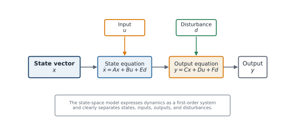

# State-Space Representation

## Why state space?

Single differential equations and transfer functions are useful, but state-space representation is more general and more natural for CCD. It handles:

- multi-input and multi-output systems;
- systems with many states;
- nonlinear dynamics;
- time-varying parameters;
- state constraints and modern controller design methods; and
- optimization formulations used in control and CCD.

The general nonlinear continuous-time state-space model is

```{math}
:label: eq-ch2-general-state-space
\dot{\mathbf{x}}(t)=\mathbf{f}(\mathbf{x}(t),\mathbf{u}(t),\mathbf{d}(t),t),
\qquad
\mathbf{y}(t)=\mathbf{h}(\mathbf{x}(t),\mathbf{u}(t),\mathbf{d}(t),t).
```

For a linear time-invariant (LTI) system, this becomes

```{math}
:label: eq-ch2-lti-state-space
\dot{\mathbf{x}}(t)=A\mathbf{x}(t)+B\mathbf{u}(t)+E\mathbf{d}(t),
\qquad
\mathbf{y}(t)=C\mathbf{x}(t)+D\mathbf{u}(t)+F\mathbf{d}(t).
```



*The state-space viewpoint separates internal dynamic variables from control inputs, disturbances, and measured outputs.*

## When the model does not start in this form

The explicit state-space forms in {eq}`eq-ch2-general-state-space` and {eq}`eq-ch2-lti-state-space` assume that every derivative $\dot{\mathbf{x}}(t)$ can be written directly as a function of the states, inputs, and disturbances. That assumption is convenient, but it is not automatic. As introduced in the previous section, coupling two energy domains through multidisciplinary analysis, or activating a path constraint on stress, position, or actuator force, can introduce an algebraic variable $\boldsymbol\gamma(t)$ tied to the states and inputs through an algebraic equation rather than a differential one, producing an index-1 differential-algebraic equation (DAE) instead of a plain ODE.

Getting from a DAE to the state-space form used in this chapter requires eliminating $\boldsymbol\gamma(t)$ — solving the algebraic constraint for $\boldsymbol\gamma(t)$ in terms of $\boldsymbol\xi(t)$ and $\mathbf u(t)$, then substituting the result back into the differential equation. For an index-1 DAE this elimination is always possible in principle, but it can be algebraically involved, and it must be redone whenever the constraint that generated $\boldsymbol\gamma(t)$ changes (for example, when a different inequality constraint becomes the active one). Some numerical and optimization methods used later in this course work with the DAE directly rather than performing this elimination, which is one reason the distinction between an ODE model and a DAE model matters beyond bookkeeping.

```{admonition} Key idea
:class: tip
State-space representation is the destination, not always the starting point. A physically derived model may arrive as a DAE; deriving the $A$, $B$, $C$, $D$ matrices (or the nonlinear $\mathbf f(\cdot)$, $\mathbf h(\cdot)$) implicitly assumes that elimination step has already been done.
```

## Converting the mass–spring–damper model

Start from {eq}`eq-ch2-msd-second-order` and define

```{math}
x_1=x, \qquad x_2=\dot{x}.
```

Then

```{math}
\dot{x}_1=x_2,
\qquad
\dot{x}_2=-\frac{k}{m}x_1-\frac{c}{m}x_2+\frac{1}{m}u+\frac{1}{m}d.
```

Therefore,

```{math}
:label: eq-ch2-msd-state-space
\begin{bmatrix}\dot{x}_1\\\dot{x}_2\end{bmatrix}
=
\begin{bmatrix}0&1\\-k/m&-c/m\end{bmatrix}
\begin{bmatrix}x_1\\x_2\end{bmatrix}
+
\begin{bmatrix}0\\1/m\end{bmatrix}u
+
\begin{bmatrix}0\\1/m\end{bmatrix}d.
```

If the output is displacement only,

```{math}
y=\begin{bmatrix}1&0\end{bmatrix}
\begin{bmatrix}x_1\\x_2\end{bmatrix}.
```

If the output includes displacement and velocity, then $\mathbf{y}=[x_1\;x_2]^T$ and $C=I$.

The plant design variables $m$, $c$, and $k$ appear directly in the system and input matrices. This is why state-space models are so useful for CCD: changing design variables changes the matrices.

## Example: a DC motor

Let $\theta$ be shaft angle, $\omega=\dot{\theta}$ shaft speed, and $i$ armature current. A basic armature-controlled DC motor model is

```{math}
J\dot{\omega}+b\omega=K_t i-\tau_L,
\qquad
L\dot{i}+Ri=v-K_e\omega,
```

where $J$ is inertia, $b$ is viscous friction, $L$ is inductance, $R$ is resistance, $K_t$ and $K_e$ are motor constants, $v$ is applied voltage, and $\tau_L$ is load torque.

With $\mathbf{x}=[\theta\;\omega\;i]^T$,

```{math}
\dot{\mathbf{x}}=
\begin{bmatrix}
0&1&0\\
0&-b/J&K_t/J\\
0&-K_e/L&-R/L
\end{bmatrix}\mathbf{x}
+
\begin{bmatrix}0\\0\\1/L\end{bmatrix}v
+
\begin{bmatrix}0\\-1/J\\0\end{bmatrix}\tau_L.
```

This model naturally combines mechanical and electrical physics.

## Linearization

Many real systems are nonlinear. Control design is often performed around an operating point using a linearized model. If

```{math}
\dot{\mathbf{x}}=\mathbf{f}(\mathbf{x},\mathbf{u}),
```

and $(\mathbf{x}_0,\mathbf{u}_0)$ is an equilibrium or operating point, a first-order Taylor expansion gives

```{math}
\delta\dot{\mathbf{x}}=A\,\delta\mathbf{x}+B\,\delta\mathbf{u},
```

where

```{math}
A=\left.\frac{\partial\mathbf{f}}{\partial\mathbf{x}}\right|_{(\mathbf{x}_0,\mathbf{u}_0)},
\qquad
B=\left.\frac{\partial\mathbf{f}}{\partial\mathbf{u}}\right|_{(\mathbf{x}_0,\mathbf{u}_0)}.
```

Linearization matters in CCD because plant design variables can change both the operating point and the local dynamics.

:::{tip} Activity 2.2: Nonlinear Pendulum Modeling, Linearization, and Local Feedback
:class: dropdown

A torque-actuated pendulum is described by

```{math}
ml^2\ddot{\theta}+b\dot{\theta}+mgl\sin\theta=u,
```

where $\theta=0$ is the downward equilibrium and $\theta=\pi$ is the upright equilibrium. Use

```{math}
m=1.2\ \mathrm{kg},
\qquad
l=0.8\ \mathrm{m},
\qquad
b=0.12\ \mathrm{N\,m\,s},
\qquad
g=9.81\ \mathrm{m/s^2},
```

with the actuator limit

```{math}
|u(t)|\leq8\ \mathrm{N\,m}.
```

1. Define

   ```{math}
   x_1=\theta,
   \qquad
   x_2=\dot{\theta},
   ```

   and derive the nonlinear state-space model

   ```{math}
   \dot{\mathbf{x}}=\mathbf{f}(\mathbf{x},u).
   ```

2. Determine all equilibrium pairs $(\mathbf{x}_e,u_e)$ for

   ```{math}
   -2\pi\leq\theta_e\leq2\pi.
   ```

3. Linearize the system about the downward equilibrium and derive the matrices $A_d$ and $B_d$.

4. Linearize the system about the upright equilibrium and derive the matrices $A_u$ and $B_u$.

5. Compute the open-loop eigenvalues of both linearized systems and classify their local stability.

6. Design the upright state-feedback law

   ```{math}
   u=-K
   \begin{bmatrix}
   \theta-\pi\\
   \dot{\theta}
   \end{bmatrix}
   ```

   so that the linearized closed-loop poles are located at

   ```{math}
   -3\pm4j.
   ```

7. Derive the resulting closed-loop linearized matrix and verify its eigenvalues analytically.

8. Simulate both the nonlinear and linearized closed-loop systems for

   ```{math}
   \theta(0)=\pi+\Delta\theta,
   \qquad
   \dot{\theta}(0)=0,
   ```

   with

   ```{math}
   \Delta\theta\in\{0.02,\ 0.10,\ 0.30,\ 0.60\}.
   ```

9. Determine the largest tested perturbation for which the linearized model predicts the nonlinear response with less than $5\%$ normalized root-mean-square error over the first five seconds.

10. Repeat the nonlinear simulations with actuator saturation and explain why local pole placement does not guarantee large-angle stabilization.
:::

:::{tip} Activity 2.3: Exact State Transition of a Mass–Spring–Damper System
:class: dropdown

Consider

```{math}
m\ddot{x}+c\dot{x}+kx=0,
```

with

```{math}
m=2\ \mathrm{kg},
\qquad
k=18\ \mathrm{N/m},
\qquad
x(0)=1,
\qquad
\dot{x}(0)=0.
```

Use the state vector

```{math}
\mathbf{x}=
\begin{bmatrix}
x\\
\dot{x}
\end{bmatrix}.
```

1. Derive the state matrix $A(c)$.

2. Derive the characteristic polynomial and the two eigenvalues as functions of $c$.

3. Determine the damping values corresponding to:

   1. underdamped motion;
   2. critical damping; and
   3. overdamped motion.

4. For the underdamped case, derive a closed-form expression for

   ```{math}
   e^{At}
   ```

   using the Cayley–Hamilton theorem.

5. Use the result to derive exact expressions for $x(t)$ and $\dot{x}(t)$.

6. Repeat the derivation for the critically damped case, taking care of the repeated eigenvalue.

7. For

   ```{math}
   c\in\{2,\ 12,\ 20\}\ \mathrm{N\,s/m},
   ```

   compute

   ```{math}
   \omega_n,
   \qquad
   \zeta,
   \qquad
   \lambda_1,
   \qquad
   \lambda_2.
   ```

8. For each damping value, determine analytically or numerically:

   1. the first zero-crossing time;
   2. the time of the first displacement extremum after $t=0$; and
   3. the $2\%$ settling time.

9. Verify the analytical state-transition solution using a high-accuracy numerical ODE solver.

10. Explain why increasing $c$ beyond critical damping can make the slowest mode slower even though the system contains more damping.
:::
