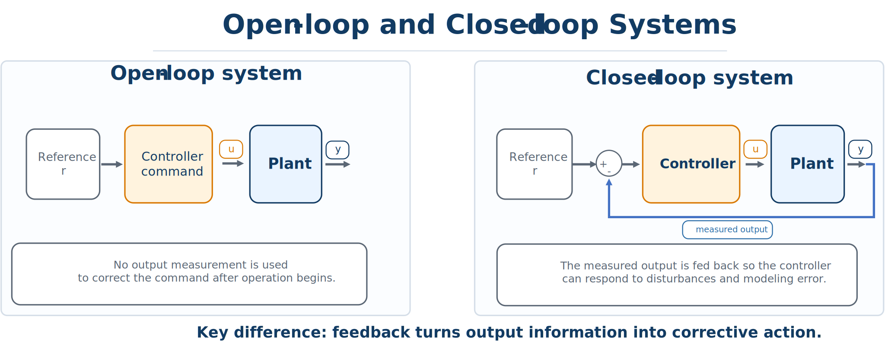

# Open-Loop and Closed-Loop Systems

## Open-loop operation

An **open-loop controller** generates a command without using measurements to correct its action during operation. It may use a model or a planned trajectory, but it does not adapt to actual measured output in real time.

Open-loop control can work well when:

- the model is accurate;
- disturbances are negligible;
- repeatability is high; and
- performance requirements are modest.

Examples include timed traffic lights, simple washing-machine cycles, or a precomputed robot motion in a highly predictable setting.

## Closed-loop operation

A **closed-loop controller** uses measurements to compare what is happening with what should happen and adjusts the input accordingly. Feedback can:

- reject disturbances;
- reduce sensitivity to modeling error;
- stabilize unstable or weakly damped plants; and
- improve tracking and regulation.



*Open-loop and closed-loop structures. Closed-loop control feeds measured output back to the controller so commands can be corrected in real time.*

## Error-driven feedback

A standard feedback idea is to compute an error

```{math}
e(t)=r(t)-y(t),
```

where $r(t)$ is a reference and $y(t)$ is the measured output. The controller then uses $e(t)$ or the measured state to choose the command. In its simplest form, this may be proportional control,

```{math}
u(t)=K_p e(t).
```

More advanced architectures include proportional–integral–derivative (PID), state feedback, observer-based feedback, and model predictive control.

## Why open-loop control often fails in practice

Suppose an open-loop command for a mass–spring–damper system is designed using nominal parameters. If the actual mass is slightly larger or the disturbance differs from the prediction, the motion may deviate from its intended path. A feedback controller corrects based on what actually happens, not only on what was predicted.

```{admonition} CCD consequence
:class: important
A plant that looks best under open-loop assumptions may not be best when feedback implementation and uncertainty are considered. CCD studies therefore often need a closed-loop model, not only an optimized open-loop trajectory.
```
