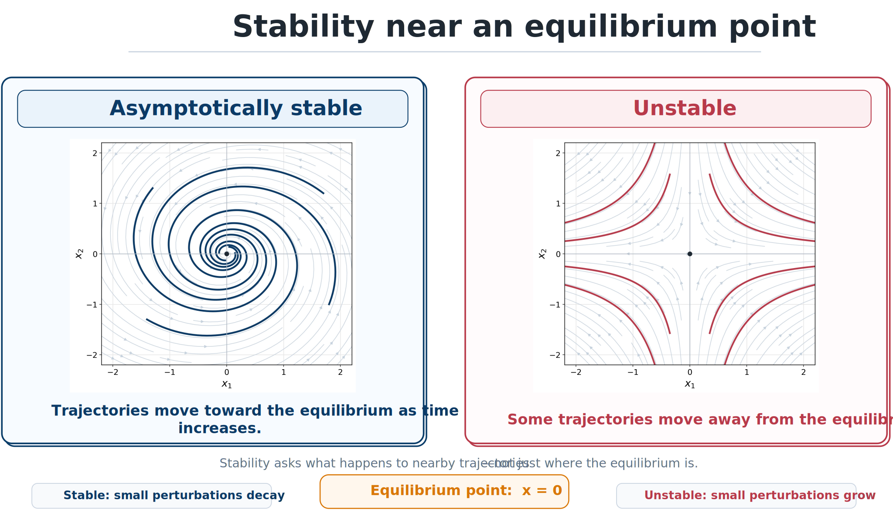
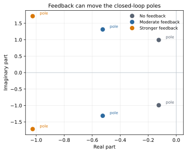

# Stability and Feedback

## Equilibrium points

An **equilibrium point** is a state at which the system can remain indefinitely if the input is held appropriately and no perturbation moves it away. For

```{math}
\dot{\mathbf{x}}=\mathbf{f}(\mathbf{x},\mathbf{u}),
```

a pair $(\mathbf{x}_e,\mathbf{u}_e)$ is an equilibrium if

```{math}
\mathbf{f}(\mathbf{x}_e,\mathbf{u}_e)=\mathbf{0}.
```

For the uncontrolled mass–spring–damper system with no disturbance, the origin $(x,\dot{x})=(0,0)$ is an equilibrium.

## What stability means

Engineers often explain stability informally:

- If a small perturbation leaves the system near the equilibrium, the equilibrium is **stable**.
- If the system returns to the equilibrium, it is **asymptotically stable**.
- If trajectories move away, the equilibrium is **unstable**.

For an LTI system, these questions reduce to the eigenvalues of the matrix $A$. For

```{math}
\dot{\mathbf{x}}=A\mathbf{x},
```

the origin is:

- **asymptotically stable** if every eigenvalue of $A$ has strictly negative real part;
- **unstable** if any eigenvalue has positive real part; and
- potentially **marginally stable**, or in need of a more careful test, when eigenvalues lie on the imaginary axis.

For the mass–spring–damper state matrix

```{math}
A=\begin{bmatrix}0&1\\-k/m&-c/m\end{bmatrix},
```

the characteristic equation is

```{math}
\lambda^2+\frac{c}{m}\lambda+\frac{k}{m}=0.
```

If $m>0$, $c>0$, and $k>0$, the eigenvalues have negative real part and the equilibrium is asymptotically stable.

## Natural frequency and damping ratio

For a second-order system,

```{math}
\omega_n=\sqrt{\frac{k}{m}},
\qquad
\zeta=\frac{c}{2\sqrt{km}}.
```

The natural frequency $\omega_n$ measures the speed of the undamped oscillatory dynamics, while the damping ratio $\zeta$ measures damping relative to critical damping. Greater stiffness generally raises natural frequency, greater damping raises damping ratio, and greater mass tends to lower natural frequency.



*Stability is ultimately about trajectories. Nearby trajectories approach an asymptotically stable equilibrium, while some trajectories move away from an unstable equilibrium.*

## How feedback changes dynamics

Consider

```{math}
\dot{\mathbf{x}}=A\mathbf{x}+B\mathbf{u}.
```

With state feedback

```{math}
:label: eq-ch2-state-feedback
\mathbf{u}=-K\mathbf{x},
```

the closed-loop system becomes

```{math}
:label: eq-ch2-closed-loop-matrix
\dot{\mathbf{x}}=(A-BK)\mathbf{x}.
```

Feedback reshapes the effective dynamics by changing the system matrix from $A$ to $A-BK$.



*Increasing feedback can shift the closed-loop poles. Pole movement changes response speed, oscillation, and stability margin.*

If the plant design changes $A$ or $B$, the same feedback matrix $K$ no longer produces the same dynamics. Conversely, if $K$ changes, the value of a plant design may change.

## A proportional–derivative example

For the mass–spring–damper system, choose

```{math}
:label: eq-ch2-pd-law
u(t)=-K_p x(t)-K_d\dot{x}(t).
```

Substituting this law into {eq}`eq-ch2-msd-second-order` gives

```{math}
:label: eq-ch2-effective-pd
m\ddot{x}(t)+(c+K_d)\dot{x}(t)+(k+K_p)x(t)=d(t).
```

The proportional term behaves like added stiffness and the derivative term behaves like added damping. The controller can improve performance, but only through the plant to which it is attached.

:::{tip} Activity 2.4: Lyapunov Analysis of a Nonlinear Feedback System
:class: dropdown

Consider the nonlinear oscillator

```{math}
m\ddot{x}+c\dot{x}+kx+\alpha x^3=u,
```

where

```{math}
m>0,
\qquad
\alpha>0.
```

Apply the PD controller

```{math}
u=-K_px-K_d\dot{x}.
```

1. Write the nonlinear closed-loop state-space model using

   ```{math}
   x_1=x,
   \qquad
   x_2=\dot{x}.
   ```

2. Determine all equilibrium points as functions of $k+K_p$.

3. Consider the candidate Lyapunov function

   ```{math}
   V(x_1,x_2)
   =\frac{1}{2}mx_2^2
   +\frac{1}{2}(k+K_p)x_1^2
   +\frac{1}{4}\alpha x_1^4.
   ```

   Derive $\dot{V}$ along closed-loop trajectories.

4. Prove global asymptotic stability of the origin when

   ```{math}
   k+K_p>0,
   \qquad
   c+K_d>0.
   ```

5. Explain what changes when

   ```{math}
   k+K_p<0.
   ```

   Determine the additional equilibria and classify them locally.

6. Replace the ideal controller with

   ```{math}
   u=\operatorname{sat}\left(-K_px-K_d\dot{x},F_{\max}\right).
   ```

7. Derive the region in the $(x,\dot{x})$ plane in which the actuator remains unsaturated:

   ```{math}
   |K_px+K_d\dot{x}|\leq F_{\max}.
   ```

8. Find the largest Lyapunov sublevel set

   ```{math}
   \Omega_\rho
   =\left\{(x,\dot{x}):V(x,\dot{x})\leq\rho\right\}
   ```

   that is guaranteed to lie inside the unsaturated region.

9. Verify the analytical stability conclusions numerically for at least four initial conditions inside and outside $\Omega_\rho$.

10. Explain why local linear eigenvalues cannot establish the global stability properties obtained from the Lyapunov analysis.
:::
