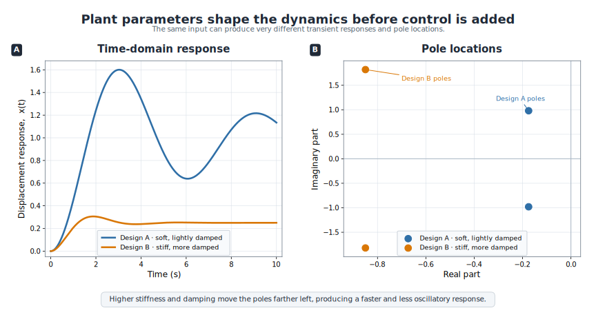

# How Plant Design Changes System Dynamics

## Design variables appear in the model

Plant design variables may include masses, inertias, stiffnesses, damping coefficients, link lengths, actuator placement, structural dimensions, sensor placement, and many other quantities. They can appear:

- in the mass matrix;
- in stiffness and damping terms;
- in aerodynamic or hydrodynamic coefficients;
- in actuator leverage or authority; and
- in sensor output equations.

Plant design therefore changes the dynamic equations, the state-space matrices, and the input–output relationships.

## Mass, stiffness, and damping

For the mass–spring–damper system:

- increasing $m$ lowers natural frequency and usually slows the response;
- increasing $k$ raises natural frequency and can make the system faster but more oscillatory if damping is not increased appropriately; and
- increasing $c$ reduces oscillation, although excessive damping may slow the response and increase energy dissipation.

These are physical design tradeoffs, not merely abstract parameter changes.



*Changing plant parameters changes dynamic behavior and shifts pole locations. Even before feedback is added, plant design choices alter response speed, overshoot, damping, and frequency content.*

## Examples from CCD application areas

CCD ideas of this kind extend well beyond the four areas developed below — they have been applied to systems as varied as chemical reactors, aircraft, underwater vehicles, wastewater treatment plants, bicycles, motorcycles, and composite smart antennas. The coupling principle is the same in every case: a controller can only reshape the dynamic pathways that the plant provides.

### Vehicles

Spring and damper selection strongly affect ride comfort and road holding. A soft suspension may improve isolation but require aggressive actuation. A stiff suspension may reduce large motions but worsen comfort. The value of active control depends on the passive design.

### Robots

Link lengths, structural stiffness, inertia distribution, and actuator placement affect natural frequencies, control bandwidth, and energy use. A heavier arm may require stronger actuators and respond more slowly. A compliant structure may need advanced feedback to suppress vibration.

### Wind turbines

Tower flexibility, blade mass distribution, and drivetrain inertia influence rotor-speed dynamics and structural loading. Blade-pitch and torque controllers must be matched to those dynamics. If a redesign changes dominant modes, the controller tuning must also change.

A commercial direct-drive, variable-speed, pitch-controlled 1.65 MW wind turbine illustrates the point concretely. Redesigning the pitch controller to co-design rotor-speed regulation together with active tower-vibration damping produced not only smooth, robust rotor-speed control, but also a significant reduction in tower vibration and the mechanical fatigue it causes. Because the controller was absorbing loads that would otherwise have to be carried structurally, the manufacturer could design a tower considerably cheaper than a competitor's while also improving reliability and maintenance characteristics. The plant that is genuinely cheapest is not the one designed in isolation — it is the one designed knowing how much of the load-carrying job the controller will take on.

### Marine energy systems

Buoy geometry, power-take-off characteristics, and mooring properties influence heave, pitch, resonance, and absorbed power. Since waves are dynamic disturbances, the plant design shapes which control strategies are possible or beneficial.

```{admonition} CCD viewpoint
:class: important
Plant design is not only about static mass or cost. It changes the dynamic pathways through which feedback acts. This is why physical and control design variables belong in the same design study.
```

:::{tip} Activity 2.5: Allocation of Closed-Loop Dynamics between Plant and Feedback
:class: dropdown

Consider

```{math}
m\ddot{x}+c\dot{x}+kx=u,
```

with the PD feedback law

```{math}
u=-K_px-K_d\dot{x}.
```

Use $m=2\ \mathrm{kg}$. The desired closed-loop dynamics are

```{math}
s^2+2\zeta_d\omega_d s+\omega_d^2=0,
```

where

```{math}
\zeta_d=0.7,
\qquad
\omega_d=4\ \mathrm{rad/s}.
```

1. Show that all plant–controller combinations producing the desired poles must satisfy

   ```{math}
   k+K_p=m\omega_d^2,
   ```

   and

   ```{math}
   c+K_d=2m\zeta_d\omega_d.
   ```

2. Consider the allocation cost

   ```{math}
   C=\alpha_k k^2+\alpha_c c^2+\alpha_p K_p^2+\alpha_d K_d^2,
   ```

   with

   ```{math}
   \alpha_k=0.04,
   \qquad
   \alpha_c=0.08,
   \qquad
   \alpha_p=0.01,
   \qquad
   \alpha_d=0.02.
   ```

   Derive the minimum-cost allocation analytically.

3. Repeat the derivation subject to the passive-safety requirements

   ```{math}
   k\geq8\ \mathrm{N/m},
   \qquad
   c\geq1.5\ \mathrm{N\,s/m}.
   ```

4. For the initial condition

   ```{math}
   x(0)=1,
   \qquad
   \dot{x}(0)=0,
   ```

   derive the closed-loop state trajectory.

5. Derive the control trajectory

   ```{math}
   u(t)=-K_px(t)-K_d\dot{x}(t)
   ```

   for an arbitrary feasible allocation.

6. Show that different allocations can produce identical closed-loop poles and identical state trajectories but different control-force histories.

7. Compute

   ```{math}
   E_u=\int_0^\infty u(t)^2\,dt
   ```

   for:

   1. the unconstrained minimum-cost allocation;
   2. the passive-safety-constrained allocation; and
   3. the fully passive allocation $K_p=K_d=0$.

8. Suppose the actuator fails at $t=1$ and

   ```{math}
   u(t)=0,
   \qquad
   t\geq1.
   ```

   Simulate and compare the three designs.

9. Explain why matching closed-loop poles alone is insufficient for choosing a plant–controller design.
:::

:::{tip} Activity 2.6: Modal Dynamics and Actuator Placement in a Two-Mass System
:class: dropdown

Two unit masses are connected by springs as described by

```{math}
M\ddot{\mathbf{q}}+C\dot{\mathbf{q}}+K\mathbf{q}=B_fu,
```

where

```{math}
M=
\begin{bmatrix}
1&0\\
0&1
\end{bmatrix},
\qquad
K=k
\begin{bmatrix}
2&-1\\
-1&2
\end{bmatrix},
```

and proportional damping is used:

```{math}
C=\beta K.
```

Use

```{math}
k=20\ \mathrm{N/m},
\qquad
\beta=0.015\ \mathrm{s}.
```

Consider three actuator placements:

```{math}
B_f^{(1)}=
\begin{bmatrix}
1\\
0
\end{bmatrix},
\qquad
B_f^{(2)}=
\begin{bmatrix}
0\\
1
\end{bmatrix},
\qquad
B_f^{(3)}=
\begin{bmatrix}
1\\
-1
\end{bmatrix}.
```

1. Derive the four-state model using

   ```{math}
   \mathbf{x}=
   \begin{bmatrix}
   \mathbf{q}\\
   \dot{\mathbf{q}}
   \end{bmatrix}.
   ```

2. Solve the generalized eigenvalue problem

   ```{math}
   K\boldsymbol{\phi}_j
   =\omega_j^2M\boldsymbol{\phi}_j
   ```

   and compute the natural frequencies and normalized mode shapes.

3. Transform the mechanical equations to modal coordinates

   ```{math}
   \mathbf{q}=\Phi\boldsymbol{\eta}.
   ```

4. For each actuator placement, compute the modal input vector

   ```{math}
   \widetilde{B}_f=\Phi^TB_f.
   ```

5. Identify which modes are weakly actuated or completely unactuated by each placement.

6. Apply the initial condition

   ```{math}
   \mathbf{q}(0)=
   \begin{bmatrix}
   1\\
   -1
   \end{bmatrix},
   \qquad
   \dot{\mathbf{q}}(0)=\mathbf{0},
   ```

   and determine which mode is initially excited.

7. For each actuator placement, design full-state feedback

   ```{math}
   u=-K_x\mathbf{x}
   ```

   to move the controllable closed-loop poles as far left as possible while satisfying

   ```{math}
   \|K_x\|_2\leq25.
   ```

8. Compare the closed-loop responses and control efforts for the three actuator placements.

9. Repeat the modal analysis after changing the second mass to

   ```{math}
   m_2=1.4\ \mathrm{kg}.
   ```

10. Explain how a physical design change can alter mode shapes, actuator authority, and the controller that performs best.
:::
