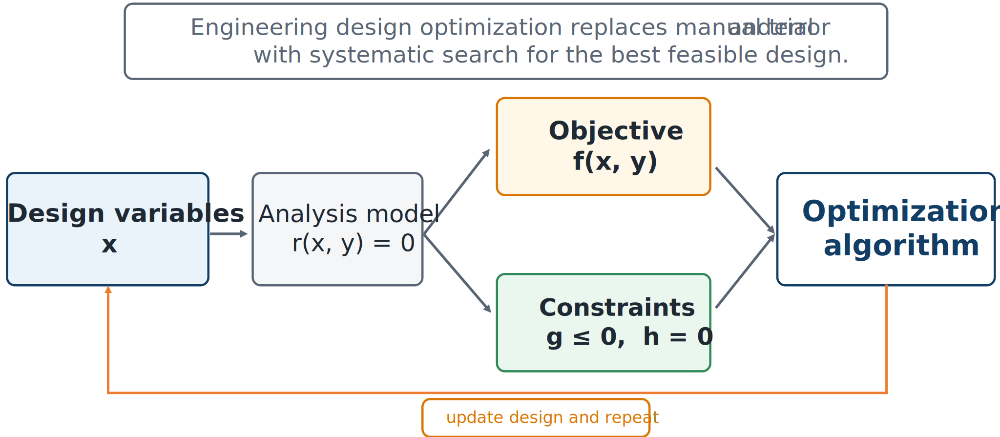

# Formulating an Engineering Design Optimization Problem

## What is engineering design optimization?

Engineering design optimization is the systematic selection of design decisions to improve a quantitative measure of performance while satisfying requirements. It automates the search within the familiar engineering loop

```{math}
\text{propose design}\rightarrow\text{analyze design}\rightarrow\text{judge result}\rightarrow\text{modify design}.
```

The engineer still decides what can change, what performance means, which models are credible, and which constraints are essential. The algorithm proposes design updates using numerical information.



*The major elements of an engineering design optimization problem.*

The four distinct elements are:

1. **Design variables** describe the choices available to the designer.
2. An **analysis model** predicts how a candidate design behaves.
3. An **objective** assigns a scalar measure of desirability.
4. **Constraints** determine whether the design is acceptable.

The algorithm is not the problem itself. It is the numerical method used to search the problem defined by the engineer.

## Optimization versus analysis

An engineering analysis asks, “What happens for this design?” An optimization study asks, “Which design should be selected from the allowed set?”

A simulation may compute stress, temperature, power, displacement, or cost for one design. Optimization wraps that model in an iterative search. A model suitable for one accurate analysis may be too slow, noisy, discontinuous, or fragile for thousands of evaluations.

## Formulation comes first

A numerical optimizer can solve the problem it is given, but it cannot decide whether that problem represents the real mission. Poor objectives or missing constraints can produce a mathematically optimal but unacceptable design:

- minimizing mass without a stiffness constraint may produce excessive deflection;
- maximizing absorbed energy without a force limit may demand an unrealizable actuator;
- minimizing cost without a reliability requirement may produce a fragile system; and
- optimizing nominal performance without disturbance scenarios may produce poor closed-loop behavior.

```{admonition} Key idea
:class: important
The most important optimization decision is often not which algorithm to use. It is how to formulate the problem so that the mathematical optimum corresponds to an engineering design worth building.
```

## Standard mathematical form

A continuous optimization problem is commonly written as

```{math}
:label: eq-ch3-standard-problem
\begin{aligned}
\underset{\mathbf{x}\in\mathbb{R}^n}{\text{minimize}}\quad &f(\mathbf{x})\\
\text{subject to}\quad &g_i(\mathbf{x})\leq0, &&i=1,\ldots,m,\\
&h_j(\mathbf{x})=0, &&j=1,\ldots,p,\\
&\mathbf{x}_L\leq\mathbf{x}\leq\mathbf{x}_U.
\end{aligned}
```

Here, $\mathbf{x}$ is the vector of design variables, $f$ is the objective, $g_i$ are inequality constraints, $h_j$ are equality constraints, and $\mathbf{x}_L,\mathbf{x}_U$ are bounds. Maximizing $P$ is equivalent to minimizing $-P$.

## Design variables

Design variables should correspond to real decisions. They may represent dimensions, materials, masses, stiffnesses, damping, controller gains, actuator sizes, sensor locations, sampling times, topology, or architecture.

- **Continuous:** any real value within a range.
- **Integer:** whole-number values, such as the number of blades.
- **Binary:** whether a component exists.
- **Categorical:** a selection such as material or gearbox type.
- **Functional:** a function of time or space, such as $u(t)$ or $t(s)$.

This chapter emphasizes continuous variables because gradient-based methods are central to large CCD problems.

## Objectives

A useful objective reflects the mission, changes meaningfully with decisions, and can be computed reliably. Common examples include mass, cost, energy, tracking error, fatigue damage, risk, or negative profit.

Dynamic-system objectives often have terminal and integral terms:

```{math}
J=\Phi(\mathbf{z}(t_f))+\int_{t_0}^{t_f}L(\mathbf{z}(t),\mathbf{u}(t),\mathbf{x},t)\,dt.
```

Multiple measures can be combined as $J=\sum_{i=1}^q w_iJ_i$, but weights encode value judgments and are sensitive to units and scaling.

## Constraints and bounds

Constraints express nonnegotiable requirements such as stress, temperature, actuator, displacement, stability, geometry, manufacturability, conservation, performance, or reliability limits.

For $\sigma(\mathbf{x})\leq\sigma_{\max}$, a normalized inequality is

```{math}
g_\sigma(\mathbf{x})=\frac{\sigma(\mathbf{x})}{\sigma_{\max}}-1\leq0.
```

Equality constraints $h_j(\mathbf{x})=0$ may represent conservation, compatibility, or coupled-analysis residuals. Bounds $x_{L,k}\leq x_k\leq x_{U,k}$ should be physically defensible: overly wide bounds expose invalid model regions, while narrow bounds can hide better designs.

## Example 3.1: cylindrical pressure vessel

For a vessel with radius $r$, thickness $t$, and fixed length $L$, minimize material volume while meeting volume and thin-wall stress requirements:

```{math}
\begin{aligned}
\underset{r,t}{\text{minimize}}\quad &2\pi rLt\\
\text{subject to}\quad &1-\frac{\pi r^2L}{V_{\min}}\leq0,\\
&\frac{pr}{\sigma_{\max}t}-1\leq0,\\
&r_L\leq r\leq r_U,\\
&t_L\leq t\leq t_U.
\end{aligned}
```

Here, $r$ and $t$ are decisions; stress and volume are predicted quantities. The stress equation belongs in the model, while the allowable stress belongs in the constraint set.

```{admonition} Checkpoint
:class: tip
For a system you know, list three true design decisions, two predicted outputs, one objective, and three nonnegotiable constraints.
```
