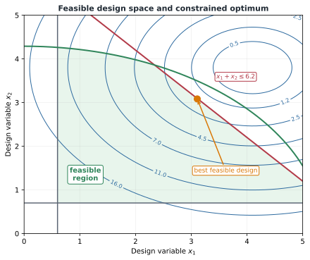
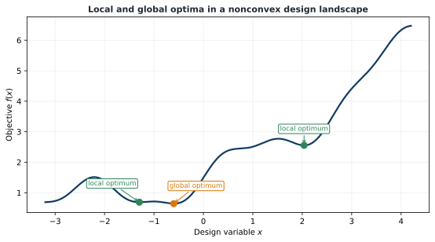

# Feasible Design Spaces and Optima

## Feasible and infeasible designs

A design is **feasible** if it satisfies every constraint. The feasible set is

```{math}
\mathcal{F}=\{\mathbf{x}:\mathbf{g}(\mathbf{x})\leq\mathbf{0},\;\mathbf{h}(\mathbf{x})=\mathbf{0},\;\mathbf{x}_L\leq\mathbf{x}\leq\mathbf{x}_U\}.
```

A design outside $\mathcal{F}$ is infeasible. The unconstrained best design is often infeasible; constraints determine how far the optimizer may move toward improved performance.



*Objective contours connect equally good designs, constraints carve out the feasible region, and the optimum often lies on one or more boundaries.*

## Active constraints and margin

At a candidate $\mathbf{x}^*$, an inequality is:

- **active** if $g_i(\mathbf{x}^*)=0$;
- **inactive** if $g_i(\mathbf{x}^*)<0$; and
- **violated** if $g_i(\mathbf{x}^*)>0$.

Active constraints often reveal the design drivers. A normalized margin may be defined as

```{math}
M_i=-g_i(\mathbf{x}).
```

Then $M_i>0$ indicates margin, $M_i=0$ activity, and $M_i<0$ violation. Reporting margins is much more informative than reporting only the objective.

## Empty and disconnected feasible sets

A formulation may have no feasible design because requirements conflict, or it may contain disconnected feasible regions. Failure to find a feasible design can mean:

- the requirements are genuinely impossible;
- bounds are too restrictive;
- equations or units are wrong;
- the solver cannot reach a feasible region; or
- poor scaling obstructs constraint satisfaction.

The correct response is diagnosis, not automatic constraint relaxation.

## Local and global optima

A feasible $\mathbf{x}^*$ is a **local minimum** if it has no better feasible neighbor in some small region. It is a **global minimum** if

```{math}
f(\mathbf{x}^*)\leq f(\mathbf{x}),\qquad\forall\mathbf{x}\in\mathcal{F}.
```



*A local algorithm can converge to different solutions from different starting points.*

Nonconvexity arises from nonlinear physics, resonance, bifurcation, contact, switching, saturation, discrete architectures, geometric constraints, multidisciplinary coupling, and time-dependent control. A successful solver run is not proof of global optimality.

In a convex minimization problem, every local optimum is global. Most CCD problems are not convex, but convex models remain useful inside algorithms such as sequential quadratic programming.

## Practical strategies for nonconvex problems

- Run a local solver from multiple initial guesses.
- Select diverse starts using engineering intuition.
- Solve a relaxed or low-fidelity problem first.
- Use continuation or homotopy to introduce difficulty gradually.
- Combine global exploration with local refinement.
- Inspect low-dimensional objective and constraint landscapes.

Global methods may improve exploration but typically require far more model evaluations and still may not guarantee the global optimum for a difficult black-box problem.

:::{tip} Activity 3.1: Local and Global Minima in a Tilted Double-Well Problem
:class: dropdown

Consider the nonconvex function

```{math}
f(x,y)=(x^2-1)^2+(y-x)^2+0.15x.
```

1. Derive the gradient and Hessian.

2. Show that every stationary point satisfies

   ```{math}
   y=x
   ```

   and

   ```{math}
   4x^3-4x+0.15=0.
   ```

3. Compute all real roots of the cubic equation to at least eight significant digits.

4. Classify every stationary point using the Hessian eigenvalues.

5. Identify the local minima, the saddle point, and the global minimum.

6. Apply gradient descent with an Armijo backtracking line search from the initial points

   ```{math}
   (-2,2),\quad(-1,0),\quad(0,0),\quad(1,0),\quad(2,-2).
   ```

7. Repeat using Newton's method with line search.

8. Construct a basin-of-attraction plot on

   ```{math}
   -2\leq x\leq2,
   \qquad
   -2\leq y\leq2.
   ```

9. Explain why convergence from several initial guesses provides evidence about nonconvexity but does not prove global optimality.

10. Add the constraint

   ```{math}
   x+y\geq0
   ```

   and determine the constrained global minimum using KKT conditions.
:::
