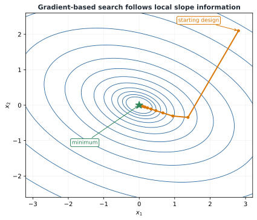

# Gradient-Based Optimization

## The gradient

For a scalar objective $f(\mathbf{x})$,

```{math}
\nabla f(\mathbf{x})=
\begin{bmatrix}
\partial f/\partial x_1&\partial f/\partial x_2&\cdots&\partial f/\partial x_n
\end{bmatrix}^T.
```

The gradient points in the direction of steepest local increase in Euclidean coordinates, so $-\nabla f$ points toward steepest local decrease.

## Gradient descent

The basic update is

```{math}
:label: eq-ch3-gradient-descent
\mathbf{x}_{k+1}=\mathbf{x}_k-\alpha_k\nabla f(\mathbf{x}_k),
```

where $\alpha_k>0$ is the step length.



*Each update uses local slope information. Small steps are slow, while overly large steps may overshoot or diverge.*

## Line search and trust regions

A line-search method chooses a direction $\mathbf{p}_k$ and seeks an acceptable solution to

```{math}
\underset{\alpha>0}{\text{minimize}}\quad f(\mathbf{x}_k+\alpha\mathbf{p}_k).
```

The direction may come from steepest descent, Newton, or quasi-Newton information. A practical line search seeks sufficient reduction rather than an exact one-dimensional optimum. Trust-region methods instead restrict the step to a region where a local model is considered reliable.

## Newton and quasi-Newton methods

A second-order Taylor approximation is

```{math}
f(\mathbf{x}_k+\mathbf{p})\approx f(\mathbf{x}_k)+\nabla f(\mathbf{x}_k)^T\mathbf{p}+\frac12\mathbf{p}^TH(\mathbf{x}_k)\mathbf{p}.
```

Minimizing this quadratic model gives the Newton step

```{math}
H(\mathbf{x}_k)\mathbf{p}_k=-\nabla f(\mathbf{x}_k).
```

Newton's method can converge rapidly near a well-behaved optimum, but exact Hessians may be expensive and the step may fail if the Hessian is indefinite or ill-conditioned. Quasi-Newton methods such as BFGS estimate Hessian information from changes in gradients.

## Computing derivatives

Derivatives may come from analytical differentiation, finite differences, complex-step differentiation, automatic differentiation, or direct and adjoint sensitivity methods. Finite differences are simple but vulnerable to truncation and roundoff error. Automatic differentiation and analytic sensitivities are often preferable for large, high-accuracy problems.

## Worked example 3.2: quadratic minimization

Consider

```{math}
f(x_1,x_2)=2x_1^2+x_1x_2+x_2^2-6x_1-5x_2.
```

Its gradient is

```{math}
\nabla f=\begin{bmatrix}4x_1+x_2-6\\x_1+2x_2-5\end{bmatrix}.
```

Setting $\nabla f=0$ gives $x_1^*=1$ and $x_2^*=2$. The Hessian

```{math}
H=\begin{bmatrix}4&1\\1&2\end{bmatrix}
```

is positive definite, so this stationary point is the unique global minimum of the convex quadratic.
