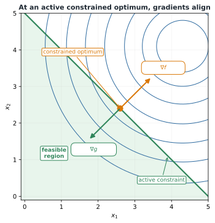
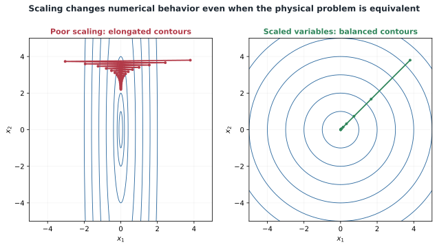

# Constrained Optimization, Scaling, and Conditioning

## Why $\nabla f=0$ is insufficient

For an unconstrained differentiable optimum, $\nabla f(\mathbf{x}^*)=0$ is necessary. At a constrained optimum, the gradient need not vanish because active constraints block motion in improving directions.



*At an active boundary, the objective gradient is balanced by the active constraint gradient.*

## Lagrangian and KKT conditions

Define the Lagrangian

```{math}
\mathcal{L}(\mathbf{x},\boldsymbol{\lambda},\boldsymbol{\nu})
=f(\mathbf{x})+\sum_{i=1}^{m}\lambda_i g_i(\mathbf{x})+\sum_{j=1}^{p}\nu_jh_j(\mathbf{x}).
```


Under suitable regularity conditions, a local optimum satisfies the Karush–Kuhn–Tucker conditions:

```{math}
\begin{aligned}
\nabla_{\mathbf{x}}\mathcal{L}&=0,\\
g_i(\mathbf{x})&\leq0,\\
h_j(\mathbf{x})&=0,\\
\lambda_i&\geq0,\\
\lambda_i g_i(\mathbf{x})&=0.
\end{aligned}
```

The last condition is **complementary slackness**: an inequality is either inactive with zero multiplier, or active and potentially influential.

A multiplier measures the local value of relaxing its constraint. A large multiplier indicates that a small relaxation could significantly improve the objective and can help prioritize requirements.

## Major constrained algorithms

- **Penalty and augmented-Lagrangian methods** add measures of constraint violation to the objective.
- **Sequential quadratic programming (SQP)** solves a sequence of quadratic constrained approximations.
- **Interior-point methods** approach the solution from within the feasible region using barrier terms.

Modern nonlinear-programming solvers often use SQP or interior-point methods. CCD users should understand the required inputs and returned diagnostics even if they do not implement these solvers.

## Gradient-based and gradient-free solvers in CCD practice

SQP and interior-point methods are gradient-based: they exploit derivative information and typically converge in far fewer function evaluations than derivative-free alternatives, but they converge to the local optimum nearest the initial guess. Gradient-free algorithms—such as covariance matrix adaptation evolution strategy (CMA-ES), genetic algorithms (GA), and particle swarm optimization (PSO)—require only function evaluations, tolerate noisy or discontinuous objectives, and search more globally, but the number of evaluations they need tends to grow rapidly with the number of design variables, so they scale poorly to high-dimensional problems even after they have located a promising region.

A recent review of wind-turbine control co-design practice illustrates how these families are actually combined rather than chosen exclusively. Because CCD problems often combine a low-dimensional, potentially multimodal plant-design search with a much higher-dimensional control-trajectory search, a common hybrid strategy assigns a gradient-free optimizer (CMA-ES, GA, or PSO) to the plant-design variables and a gradient-based optimizer (SQP or an interior-point method) to the control-design variables, matching each discipline to the solver family best suited to its dimensionality and smoothness. Widely used implementations include CMA-ES and COBYLA on the gradient-free side, and SNOPT (a sparse SQP implementation) and IPOPT (an interior-point implementation) on the gradient-based side.

```{admonition} Key idea
:class: tip
Solver choice is itself a CCD design decision. It should follow from the dimensionality and smoothness of the plant and control subproblems, not from habit or default settings.
```

## Why scaling matters

Mathematically equivalent formulations can behave very differently numerically. A solver may handle variables near $10^{-6}$ and $10^6$ unevenly, especially when using common step and convergence tolerances.



*Scaling produces a numerically more balanced landscape.*

## Variable, objective, and constraint scaling

A physical variable may be represented as

```{math}
x_i=x_{i,\mathrm{ref}}+s_i\tilde{x}_i,
```

with typical $\tilde{x}_i$ values near one. Bound-based scaling maps a variable to $[0,1]$:

```{math}
\tilde{x}_i=\frac{x_i-x_{L,i}}{x_{U,i}-x_{L,i}}.
```

Functions can similarly be scaled using meaningful nonzero references:

```{math}
\tilde{f}=\frac{f}{f_{\mathrm{ref}}},
\qquad
\tilde{g}_i=\frac{g_i}{g_{i,\mathrm{ref}}}.
```

## Conditioning and tolerances

Conditioning describes solution sensitivity to small changes in data. Poor conditioning can cause slow convergence, sensitivity to tolerances, inaccurate finite differences, unstable linear algebra, and large design changes from small numerical errors.

Scaling improves algorithm behavior but cannot remove genuine physical ill-conditioning. If two variables have nearly identical effects, the design may be fundamentally poorly identifiable.

Solver tolerances operate in the provided coordinates. A residual tolerance of $10^{-6}$ has a different meaning for a normalized constraint than for a dimensional force balance. Scale first, then select tolerances.

## Example 3.3: poorly scaled quadratic

For

```{math}
f(x_1,x_2)=10^6x_1^2+x_2^2,
```

the curvature in $x_1$ is a million times larger than in $x_2$. Gradient descent needs a small step for stability in $x_1$, making progress in $x_2$ slow. Define

```{math}
\tilde{x}_1=1000x_1,\qquad\tilde{x}_2=x_2.
```

Then $f=\tilde{x}_1^2+\tilde{x}_2^2$, which has balanced curvature.

```{admonition} Key idea
:class: important
Consistent scaling does not change the physical problem. It changes how the numerical algorithm sees the problem, often turning an unreliable search into a robust one.
```

:::{tip} Activity 3.2: KKT Analysis of a Minimum-Mass Cantilever Beam
:class: dropdown

A rectangular cantilever beam has width $b$, height $h$, length $L$, elastic modulus $E$, material density $\rho$, and an end load $P$. Its mass is

```{math}
m(b,h)=\rho Lbh.
```

The maximum bending stress and tip displacement are

```{math}
\sigma(b,h)=\frac{6PL}{bh^2},
\qquad
\delta(b,h)=\frac{4PL^3}{Ebh^3}.
```

The optimization problem is

```{math}
\begin{aligned}
\min_{b,h}\quad &\rho Lbh,\\
\text{subject to}\quad
&\frac{6PL}{bh^2}-\sigma_{\max}\leq0,\\
&\frac{4PL^3}{Ebh^3}-\delta_{\max}\leq0,\\
&b_{\min}\leq b\leq b_{\max},\\
&h_{\min}\leq h\leq h_{\max}.
\end{aligned}
```

Use

```{math}
L=1.2\ \mathrm{m},
\qquad
P=8\ \mathrm{kN},
\qquad
E=70\ \mathrm{GPa},
```

```{math}
\rho=2700\ \mathrm{kg/m^3},
\qquad
\sigma_{\max}=120\ \mathrm{MPa},
\qquad
\delta_{\max}=4\ \mathrm{mm},
```

and

```{math}
0.01\leq b\leq0.12\ \mathrm{m},
\qquad
0.02\leq h\leq0.20\ \mathrm{m}.
```

1. Write the Lagrangian, including multipliers for the stress, displacement, and bound constraints.

2. Write all KKT conditions: stationarity, primal feasibility, dual feasibility, and complementary slackness.

3. Assume initially that the stress and displacement constraints are active and all bounds are inactive. Solve the two active constraints analytically for $b$ and $h$.

4. Check whether the resulting design satisfies the variable bounds.

5. Compute the associated Lagrange multipliers and determine whether the assumed active set satisfies dual feasibility.

6. Enumerate all physically plausible active sets involving:

   1. stress only;
   2. displacement only;
   3. stress and displacement; and
   4. one performance constraint and one variable bound.

7. Determine the globally optimal feasible design by comparing all valid KKT candidates.

8. Interpret each nonzero multiplier as the local value of relaxing its corresponding engineering requirement.
:::

:::{tip} Activity 3.3: Scaling, Conditioning, and Gradient-Method Convergence
:class: dropdown

Consider the quadratic optimization problem

```{math}
\min_{\mathbf{x}\in\mathbb{R}^3}\quad
f(\mathbf{x})
=\frac{1}{2}\mathbf{x}^TH\mathbf{x}-\mathbf{b}^T\mathbf{x},
```

where

```{math}
H=
\begin{bmatrix}
10^8&0&0\\
0&1&0\\
0&0&10^{-4}
\end{bmatrix},
\qquad
\mathbf{b}=
\begin{bmatrix}
10^4\\
1\\
10^{-2}
\end{bmatrix}.
```

1. Compute the exact minimizer

   ```{math}
   \mathbf{x}^*=H^{-1}\mathbf{b}.
   ```

2. Compute the $2$-norm condition number $\kappa_2(H)$.

3. For fixed-step gradient descent,

   ```{math}
   \mathbf{x}^{(k+1)}
   =\mathbf{x}^{(k)}
   -\alpha\nabla f\left(\mathbf{x}^{(k)}\right),
   ```

   derive the largest stable step size.

4. Derive the optimal fixed step size

   ```{math}
   \alpha^*=\frac{2}{\lambda_{\max}+\lambda_{\min}},
   ```

   and the corresponding worst-case error contraction factor

   ```{math}
   q^*=\frac{\kappa_2(H)-1}{\kappa_2(H)+1}.
   ```

5. Estimate the number of iterations required to reduce the error norm by a factor of $10^{-6}$.

6. Introduce the scaled variables

   ```{math}
   \mathbf{x}=S\mathbf{z},
   \qquad
   S=
   \begin{bmatrix}
   10^{-4}&0&0\\
   0&1&0\\
   0&0&10^2
   \end{bmatrix}.
   ```

7. Derive the scaled Hessian

   ```{math}
   \widetilde{H}=S^THS
   ```

   and compute its condition number.

8. Compare gradient descent, Newton's method, and BFGS on the original and scaled formulations from

   ```{math}
   \mathbf{x}^{(0)}=
   \begin{bmatrix}
   1\\
   1\\
   1
   \end{bmatrix}.
   ```

9. Explain why variable scaling changes numerical behavior without changing the underlying physical optimum.

10. Give one example of physical ill-conditioning that cannot be eliminated by simple coordinate scaling.
:::
