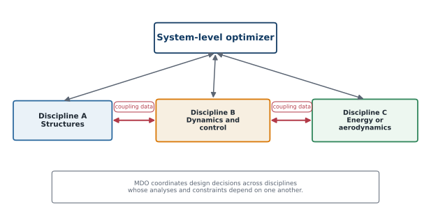

# Multidisciplinary Design Optimization

## Why MDO is needed

Large engineering systems involve interacting disciplines. A wind turbine, for example, combines structures, aerodynamics, dynamics, controls, electrical systems, economics, and manufacturing. Improving one discipline in isolation may worsen another.

Multidisciplinary design optimization coordinates decisions across coupled disciplines. CCD is a specialized dynamic-system MDO problem in which plant and control design are dominant interacting disciplines.



*A conceptual MDO problem. Coupling variables communicate interactions between disciplines.*

## Coupling variables

A coupling variable is an output from one discipline that becomes an input to another. Examples include:

- structural deflection affecting aerodynamic loads;
- aerodynamic loads affecting structural stress;
- plant dynamics affecting controller performance;
- control forces affecting fatigue and actuator sizing; and
- thermal behavior affecting electrical efficiency.

Coupling creates implicit dependencies. One design change may influence many disciplines through several paths.

## Coupled analysis equations

A two-discipline model can be written as

```{math}
\mathbf{y}_1=\mathbf{F}_1(\mathbf{x},\mathbf{y}_2),
\qquad
\mathbf{y}_2=\mathbf{F}_2(\mathbf{x},\mathbf{y}_1).
```

A consistent multidisciplinary state satisfies both equations simultaneously. Consistency may be enforced by an inner coupled solver or directly within the optimization formulation.

## MDO architectures: MDF, IDF, and ATC

An MDO *architecture* specifies which variables the optimizer controls directly and how multidisciplinary consistency is enforced. Architectures fall into two broad families: **monolithic**, which solve a single optimization problem, and **distributed**, which decompose that problem into coordinated subproblems.

**Multidisciplinary feasible (MDF).** MDF is the architecture closest to a single-discipline problem: the optimizer sees only the original design variables, objective, and constraints, exactly as in earlier sections of this chapter. The difference is that evaluating the objective and constraints at each iteration requires converging the coupled system first, typically with a fixed-point iteration such as Gauss–Seidel. Every design the optimizer considers during the search is therefore multidisciplinary feasible—an advantage if the optimization is stopped early—but the coupled solve nested inside every function call can be expensive, and computing gradients requires *coupled* (total) derivatives rather than simple partial derivatives.

**Individual discipline feasible (IDF).** IDF instead gives each discipline an independent copy of the coupling variables it needs, called *target* variables, and lets each discipline solve its own equations without waiting on the others. The optimizer becomes responsible for driving these copies toward the actual coupling values by adding *consistency constraints*,

```{math}
h_i^c=\hat{u}_i^t-\hat{u}_i=0,\qquad i=1,\ldots,m,
```

to the problem, where $\hat u_i^t$ is the target copy supplied to discipline $i$ and $\hat u_i$ is the coupling variable that discipline actually computes. IDF trades a larger optimization problem (more variables and constraints) for disciplines that can be solved independently, in parallel, and it often converges better with gradient-based algorithms than the nested fixed-point iteration inside MDF. The cost is that multidisciplinary feasibility is only guaranteed once the optimization itself has converged, not at every intermediate iteration.

**Analytical target cascading (ATC).** ATC plays a role similar to IDF's consistency constraints but enforces them with penalty terms in the objective instead of equality constraints,

```{math}
\min\quad f_0(x_0,\hat u^t)+\sum_{i=1}^m\Phi_i\!\left(x_{0i}^t-x_0,\;\hat u_i^t-\hat u_i\right),
```

where $\Phi_i$ is a penalty (commonly quadratic) that is driven toward zero as the penalty weights are increased across outer iterations. ATC originated as a way to cascade targets down a hierarchy of design requirements and later became a general MDO architecture; it converges to the same optimum as MDF and IDF only if the penalty weights are increased enough that every consistency penalty vanishes. Other distributed architectures—such as collaborative optimization and bilevel integrated system synthesis—use the same target/consistency idea with different coordination mechanics, but MDF, IDF, and ATC illustrate the essential trade-off: how tightly consistency is enforced during the search versus how independently each discipline can be solved.

Allison and Herber's review of MDO for dynamic engineering systems applies these same MDF/IDF ideas directly to CCD problems, and highlights a complication that rarely arises in static MDO: coupling variables are often entire time histories rather than scalars. In one example, a block-diagram model of a vane-airflow sensor is partitioned into a drag-force block and a response-dynamics block linked by drag-torque and angular-position signals; formulating this partition as IDF requires the optimizer to specify complete discretized torque and position trajectories as target coupling variables, since the signals connecting the two blocks are themselves time-varying. In a second example—an electric-vehicle design problem that separates motor design from vehicle/powertrain design—the coupling variables are function-valued motor properties (such as a torque–speed curve) rather than plain time histories; because directly discretizing such function-valued coupling variables would again inflate the problem dimension, reduced-dimension representations of these coupling variables are needed to keep the decomposition practical. Both examples reinforce the same lesson for CCD: whether a coupling variable is a scalar, a full trajectory, or an intermediate function-valued quantity should drive the choice of architecture and coupling representation, not just the architecture's usual convergence trade-offs.

The central lesson is to recognize when analyses depend on one another and represent those dependencies consistently—not merely to memorize architecture names.

## CCD as MDO

Changing plant design can alter state-space matrices, natural frequencies, damping, actuator authority, control effort, and closed-loop performance. Changing controller design can alter performance, load histories, actuator sizing and power, and the value of passive stiffness, damping, or mass.

```{admonition} Plant–control coupling
:class: important
These reciprocal effects mean the plant and controller cannot be evaluated as independent disciplines. Their consistency and shared performance must be handled at the system level.
```

:::{tip} Activity 3.4: Total Derivatives through a Coupled Multidisciplinary Model
:class: dropdown

Consider two coupled disciplines:

```{math}
\begin{aligned}
r_1&=y_1-x_1^2-\frac{1}{2}y_2=0,\\
r_2&=y_2-\sin x_2-\frac{1}{4}y_1=0.
\end{aligned}
```

The objective and constraint are

```{math}
f=(y_1-1)^2+(y_2-0.5)^2+0.1(x_1^2+x_2^2),
```

and

```{math}
g=y_1+y_2-2\leq0.
```

The design bounds are

```{math}
-1.5\leq x_1\leq1.5,
\qquad
-2\leq x_2\leq2.
```

1. Write the coupled residual system in the compact form

   ```{math}
   \mathbf{r}\left(\mathbf{x},\mathbf{y}\right)=\mathbf{0}.
   ```

2. Solve the coupled equations analytically for

   ```{math}
   y_1(\mathbf{x}),
   \qquad
   y_2(\mathbf{x}).
   ```

3. Derive the total state sensitivity using the implicit-function theorem:

   ```{math}
   \frac{d\mathbf{y}}{d\mathbf{x}}
   =-\left(\frac{\partial\mathbf{r}}{\partial\mathbf{y}}\right)^{-1}
   \frac{\partial\mathbf{r}}{\partial\mathbf{x}}.
   ```

4. Derive the total derivatives

   ```{math}
   \frac{df}{d\mathbf{x}},
   \qquad
   \frac{dg}{d\mathbf{x}}.
   ```

5. Evaluate the analytical total derivatives at

   ```{math}
   \mathbf{x}=
   \begin{bmatrix}
   0.8\\
   0.4
   \end{bmatrix}.
   ```

6. Verify the derivatives using complex-step differentiation.

7. Show that using only the partial derivative

   ```{math}
   \frac{\partial f}{\partial\mathbf{x}}
   ```

   while ignoring

   ```{math}
   \frac{d\mathbf{y}}{d\mathbf{x}}
   ```

   gives an incorrect search direction.

8. Formulate and solve the problem using a multidisciplinary feasible architecture in which the coupling equations are converged at every design iteration.

9. Reformulate the same problem using an individual-discipline feasible architecture in which $y_1$ and $y_2$ are optimization variables and the coupling equalities are consistency constraints.

10. Compare the two formulations in terms of variable count, constraint count, derivative structure, and convergence.
:::

:::{tip} Activity 3.5: OpenMDAO Benchmark using the Sellar Coupled Problem
:class: dropdown

Consider the classical two-discipline Sellar problem:

```{math}
\begin{aligned}
y_1&=z_1^2+z_2+x-0.2y_2,\\
y_2&=\sqrt{y_1}+z_1+z_2.
\end{aligned}
```

The optimization problem is

```{math}
\begin{aligned}
\min_{x,z_1,z_2}\quad
&f=x^2+z_2+y_1+e^{-y_2},\\
\text{subject to}\quad
&3.16-y_1\leq0,\\
&y_2-24\leq0,
\end{aligned}
```

with bounds

```{math}
0\leq x\leq10,
\qquad
-10\leq z_1\leq10,
\qquad
0\leq z_2\leq10.
```

1. Identify:

   1. local design variables;
   2. shared design variables;
   3. discipline outputs;
   4. coupling variables; and
   5. system-level objective and constraints.

2. Derive the coupled residual equations.

3. Derive the fixed-point iteration that results from solving the disciplines in Gauss–Seidel order.

4. Determine the local convergence condition for the coupling iteration from the spectral radius of the iteration Jacobian.

5. Implement the multidisciplinary feasible formulation in OpenMDAO, using a nonlinear block Gauss–Seidel or Newton solver for the coupled analysis.

6. Supply exact partial derivatives for both disciplines and use OpenMDAO's total-derivative check.

7. Solve the optimization using at least three different initial designs.

8. Reformulate the problem using an individual-discipline feasible architecture by promoting $y_1$ and $y_2$ to design variables and adding consistency constraints.

9. Compare the two architectures in terms of:

   1. number of design variables;
   2. number of constraints;
   3. coupling-solver iterations;
   4. optimizer iterations;
   5. total derivative accuracy; and
   6. final objective value.

10. Perturb the discipline equations by replacing

   ```{math}
   -0.2y_2
   ```

   with

   ```{math}
   -\beta y_2,
   ```

   where

   ```{math}
   0.1\leq\beta\leq0.8.
   ```

   Determine how coupling strength affects fixed-point convergence and optimization performance.

11. Explain why a converged multidisciplinary analysis does not by itself prove that the optimization result is globally optimal or numerically reliable.
:::
