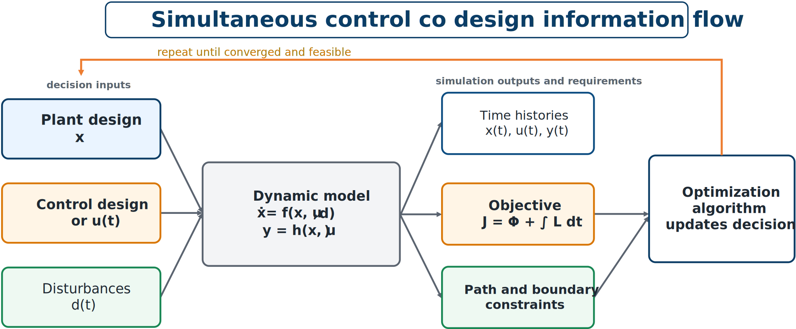

# Optimization of Dynamic Systems

## Why dynamic optimization is different

In static optimization, the model returns quantities for one design condition. In dynamic optimization, the model generates trajectories over time. Objectives and constraints may depend on the entire trajectory rather than on one scalar state.



*Optimization of a dynamic system: design decisions enter the model, whose time histories determine performance and feasibility.*

## General formulation

A dynamic optimization problem can be written as

```{math}
:label: eq-ch3-dynamic-optimization
\begin{aligned}
\underset{\mathbf{x},\mathbf{u}(\cdot),\mathbf{z}(\cdot)}{\text{minimize}}\quad
&\Phi(\mathbf{z}(t_f),\mathbf{x})+\int_{t_0}^{t_f}L(\mathbf{z}(t),\mathbf{u}(t),\mathbf{x},t)\,dt\\
\text{subject to}\quad
&\dot{\mathbf{z}}(t)=\mathbf{f}(\mathbf{z}(t),\mathbf{u}(t),\mathbf{x},\mathbf{d}(t),t),\\
&\mathbf{c}(\mathbf{z}(t),\mathbf{u}(t),\mathbf{x},t)\leq\mathbf{0},\\
&\mathbf{b}(\mathbf{z}(t_0),\mathbf{z}(t_f),\mathbf{x})=\mathbf{0},\\
&\mathbf{x}_L\leq\mathbf{x}\leq\mathbf{x}_U.
\end{aligned}
```

The objective combines a terminal term $\Phi$, such as final error or energy, and an integral term $L$, such as accumulated tracking error, fatigue, energy, or control effort.

## Path and boundary constraints

Path constraints must hold throughout the time interval:

```{math}
\mathbf{c}(\mathbf{z}(t),\mathbf{u}(t),\mathbf{x},t)\leq\mathbf{0},
\qquad t\in[t_0,t_f].
```

Examples include actuator, displacement, temperature, contact-force, power, and stress limits. A violation may occur between sampled times, so the discretization must be fine enough to detect it.

Boundary constraints apply at the initial or final time, for example

```{math}
\mathbf{z}(t_0)=\mathbf{z}_0,
\qquad
\|\mathbf{z}(t_f)-\mathbf{z}_{\mathrm{target}}\|\leq\varepsilon.
```

## Simulation-based optimization

A common workflow is to select design variables, simulate the dynamic model, compute objectives and constraints from the resulting trajectories, and return them to the optimizer. This works naturally when control is parameterized by a few variables. Optimizing an entire control trajectory requires specialized optimal-control transcription methods.

## A small CCD formulation

For

```{math}
m\ddot{q}+c\dot{q}+kq=u(t)+d(t),
```

let $c$, $k$, $K_p$, and $K_d$ be decisions and use $u=-K_pq-K_d\dot{q}$. One possible objective is

```{math}
J=\int_0^T\left(w_qq^2+w_v\dot{q}^2+w_uu^2\right)dt+w_cc+w_kk.
```

Possible constraints include $|q(t)|\leq q_{\max}$, $|u(t)|\leq u_{\max}$, and bounds on $c$, $k$, $K_p$, and $K_d$. This is already a CCD problem because plant and controller variables are optimized together.

:::{tip} Activity 3.6: Discrete Adjoint Sensitivities for Simulation-Based Optimization
:class: dropdown

Consider the nonlinear time-marching model

```{math}
x_{k+1}
=x_k+h\left(-p_1x_k-p_2x_k^3+u_k\right),
\qquad
k=0,\ldots,N-1,
```

with

```{math}
x_0=1,
\qquad
h=0.05,
\qquad
N=100.
```

The design variables are

```{math}
\mathbf{z}
=
\begin{bmatrix}
p_1&p_2&u_0&u_1&\cdots&u_{N-1}
\end{bmatrix}^{T}.
```

Minimize

```{math}
\begin{aligned}
J
=&\frac{1}{2}\left(x_N-x_{\mathrm{target}}\right)^2\\
&+\frac{h}{2}\sum_{k=0}^{N-1}\left(qx_k^2+ru_k^2\right)
+\frac{\gamma}{2}\left(p_1^2+p_2^2\right),
\end{aligned}
```

where

```{math}
x_{\mathrm{target}}=0,
\qquad
q=1,
\qquad
r=0.02,
\qquad
\gamma=0.01.
```

1. Derive the direct sensitivity recursion for

   ```{math}
   \frac{\partial x_k}{\partial z_j}.
   ```

2. Determine the computational complexity of forming the complete gradient using direct sensitivities.

3. Introduce a discrete adjoint sequence $\lambda_k$ and derive its backward recursion.

4. Derive

   ```{math}
   \frac{\partial J}{\partial p_1},
   \qquad
   \frac{\partial J}{\partial p_2},
   \qquad
   \frac{\partial J}{\partial u_k}.
   ```

5. Implement direct sensitivity, adjoint sensitivity, forward finite difference, central finite difference, and complex-step gradients.

6. Perform a directional-derivative test using a random normalized direction $\mathbf{v}$:

   ```{math}
   \frac{J(\mathbf{z}+\epsilon\mathbf{v})-J(\mathbf{z})}{\epsilon}
   \approx\nabla J(\mathbf{z})^T\mathbf{v}.
   ```

7. Compare gradient errors for

   ```{math}
   10^{-2}\leq\epsilon\leq10^{-14}.
   ```

8. Compare computational cost as $N$ increases from $100$ to $10\,000$.

9. Explain why the adjoint method is especially attractive when the number of design variables is large and the number of scalar outputs is small.

10. Use an optimization solver to minimize $J$ subject to

   ```{math}
   0.1\leq p_1\leq3,
   \qquad
   0\leq p_2\leq2,
   \qquad
   -2\leq u_k\leq2.
   ```
:::
