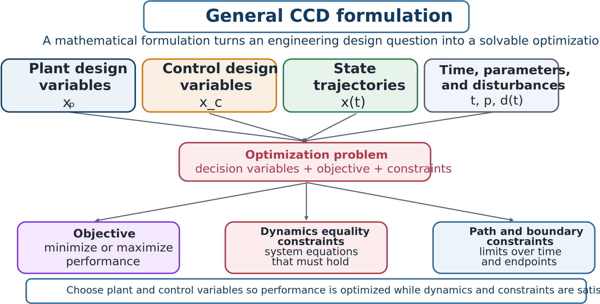
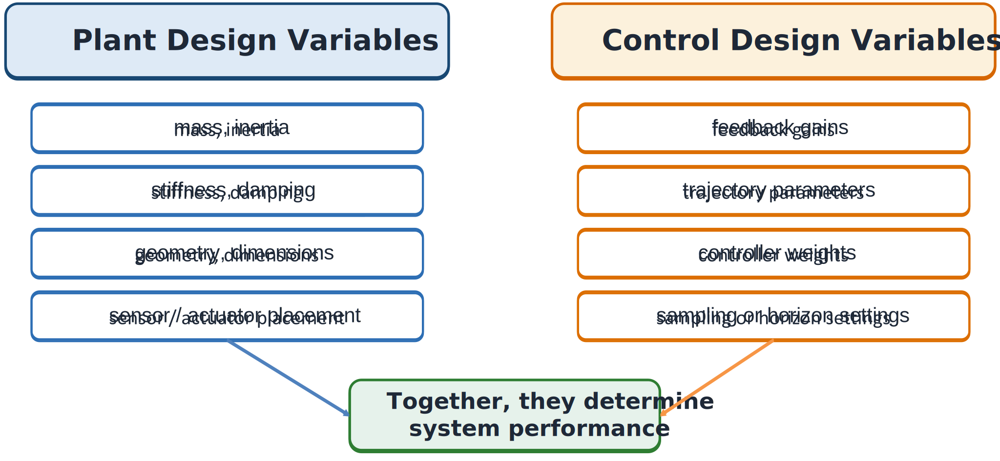

# Formulation and Design Variables

## Why formulation matters

A CCD study begins as an engineering question:

> What tower geometry and pitch-control tuning should reduce wind-turbine loads while maintaining power quality?

> What suspension parameters and feedback gains should balance ride comfort, road holding, and actuator effort?

To turn such questions into optimization problems, we must identify:

- the **decision variables**;
- the quantity to **minimize or maximize**;
- the **physical laws** the design must obey;
- the **engineering limits** that cannot be violated; and
- the **time interval** over which the problem applies.



*The main ingredients of a mathematical CCD formulation.*

A formulation determines what the optimizer is allowed to do. Poorly defined variables, a misleading objective, or missing physics can produce a numerically polished but physically meaningless result.

## Plant design variables

Plant variables describe physical-system, structural, mechanism, or hardware decisions. Denote them by

```{math}
\mathbf{x}_p\in\mathbb{R}^{n_p}.
```

Examples include suspension stiffness and damping, structural dimensions, inertia and mass distribution, actuator or sensor placement, buoy or rotor geometry, and power-take-off parameters. These decisions often enter the dynamic model directly through mass, stiffness, damping, actuation, or output equations.

Typical examples are:

- **Vehicle suspension:** $k_s$, $c_s$, and tire stiffness $k_t$.
- **Robot arm:** link lengths, gear ratios, motor sizes, and joint stiffness.
- **Wind turbine:** blade properties, tower diameter, and drivetrain inertia.
- **Marine energy device:** buoy radius, draft, PTO characteristics, and mooring stiffness.

Plant variables usually have defensible bounds,

```{math}
\mathbf{x}_p^L\leq\mathbf{x}_p\leq\mathbf{x}_p^U,
```

reflecting manufacturability, safety, packaging, cost, and physical realism.

## Control design variables

Control variables define how the controller behaves. Denote them by

```{math}
\mathbf{x}_c\in\mathbb{R}^{n_c}.
```



*Plant and control variables are distinct, but both affect system performance and must be chosen together.*

Control variables may include PID or state-feedback gains, weighting matrices, trajectory parameters, feedforward coefficients, switching thresholds, sampling times, prediction horizons, or coefficients in a control-law parameterization.

## Parameterized control and free trajectories

There are two common control representations:

1. **Parameterized control design:** a law depends on finite parameters $\mathbf{x}_c$, for example

   ```{math}
   u(t)=-K(\mathbf{x}_c)x(t).
   ```

2. **Direct trajectory optimization:** the function $u(t)$ itself is a time-varying decision.

Either can be used in CCD. The appropriate choice depends on the problem structure, intended controller implementation, and numerical method.

## Partitioning the control-variable set

It is often useful to be explicit about which part of $\mathbf{x}_c$ is time-independent and which is a genuine trajectory. Writing

```{math}
\mathbf{x}_c=\begin{bmatrix}\mathbf{p}\\\mathbf{u}\end{bmatrix},
```

separates **control parameters** $\mathbf{p}$—time-independent quantities such as feedback gains, weighting-matrix entries, or a prediction horizon—from **open-loop control (OLC) variables** $\mathbf{u}(\cdot)$, the time-varying trajectory itself. A formulation may include only $\mathbf{p}$ (a fully parameterized feedback law), only $\mathbf{u}(\cdot)$ (direct trajectory optimization with no parametric structure), or both at once, for example a parameterized feedback law whose reference trajectory is itself optimized. The general continuous-time CCD formulation developed later in this chapter accommodates all three cases without change; only the content of $\mathbf{x}_c$ differs.
