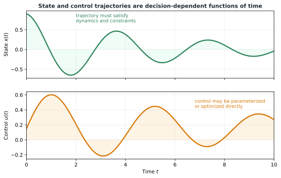
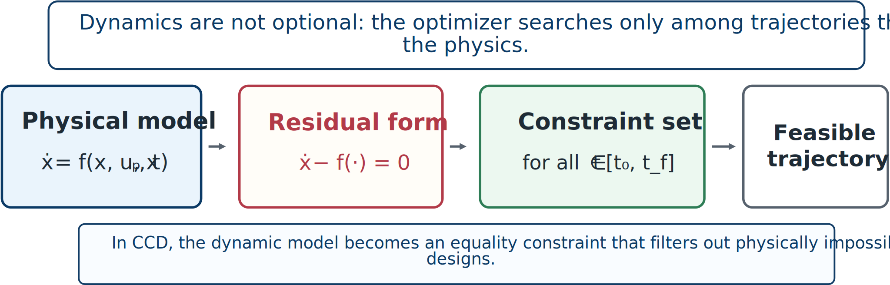

# State Trajectories and Dynamic Equality Constraints

## Time-dependent decisions

Dynamic optimization involves functions of time. The state and control trajectories are

```{math}
\mathbf{x}(t)\in\mathbb{R}^{n_x},
\qquad
\mathbf{u}(t)\in\mathbb{R}^{n_u},
\qquad t\in[t_0,t_f].
```



*State and control trajectories must evolve consistently with the system dynamics and constraints.*

Trajectories matter because comfort, energy, tracking, stress, and control effort depend on behavior over an interval—not merely one instant. Initial and terminal conditions may be fixed or constrained:

```{math}
\mathbf{x}(t_0)=\mathbf{x}_0,
\qquad
\mathbf{x}(t_f)\in\mathcal{X}_f.
```

The final time may itself be fixed or optimized.

## Dynamics as equality constraints

The dynamics enforce physical laws. A general continuous-time model is

```{math}
:label: eq-ch4-general-dynamics
\dot{\mathbf{x}}(t)=
\mathbf{f}(\mathbf{x}(t),\mathbf{u}(t),\mathbf{x}_p,\mathbf{x}_c,\mathbf{d}(t),t).
```

This is an equality constraint restricting the feasible trajectory set.



*The optimizer must search among trajectories that satisfy the physical model.*

In residual form,

```{math}
:label: eq-ch4-dynamics-residual
\dot{\mathbf{x}}(t)-
\mathbf{f}(\mathbf{x}(t),\mathbf{u}(t),\mathbf{x}_p,\mathbf{x}_c,\mathbf{d}(t),t)=\mathbf{0},
\qquad t\in[t_0,t_f].
```

## Mass–spring–damper example

Let $\mathbf{x}_p=[m,c,k]^T$, $x_1=x$, and $x_2=\dot{x}$. Then

```{math}
\dot{x}_1=x_2,
\qquad
\dot{x}_2=-\frac{k}{m}x_1-\frac{c}{m}x_2+\frac{1}{m}u.
```

These equations define the feasible state trajectories for any candidate plant and control input.

## Other equality constraints

CCD formulations may also contain algebraic equalities for kinematic loop closure, geometric compatibility, steady-state equations, periodicity, and actuator or sensor calibration. The equality set can therefore be larger than the state equations alone.

## Differential-algebraic form

When the dynamics contain algebraic equalities in addition to the state derivatives, the model is a **differential-algebraic equation (DAE)** rather than a plain ODE. In semi-explicit form,

```{math}
:label: eq-ch4-dae
\dot{\mathbf{x}}(t)=\mathbf{f}(\mathbf{x}(t),\boldsymbol{\gamma}(t),\mathbf{u}(t),\mathbf{x}_p,\mathbf{x}_c,t),
\qquad
\mathbf{0}=\mathbf{f}_a(\mathbf{x}(t),\boldsymbol{\gamma}(t),\mathbf{u}(t),\mathbf{x}_p,\mathbf{x}_c,t),
```

where $\boldsymbol{\gamma}(t)$ is an **algebraic variable**: a quantity that must satisfy the algebraic constraint $\mathbf{f}_a(\cdot)=\mathbf{0}$ at every instant but has no derivative of its own appearing in the model. Solving the algebraic equation in Eq. {eq}`eq-ch4-dae` for $\boldsymbol{\gamma}(t)$ requires that the Jacobian $\partial\mathbf{f}_a/\partial\boldsymbol{\gamma}$ be nonsingular; a DAE with this property is called **index-1**, where the *index* counts how many times the algebraic equations must be differentiated before the system reduces to an ordinary differential equation. Index-1 DAEs are the most tractable case and the one nearly all CCD dynamic-optimization software targets.

Algebraic variables arise naturally in CCD. Kinematic loop closure and geometric compatibility, mentioned above, are two sources; another is a path inequality constraint that becomes active during part of the trajectory. Every time an inequality constraint is pinned to its bound, one degree of freedom is lost: a state variable must become dependent on the others through the newly active algebraic equation. In actively controlled systems, the control input is the natural candidate to absorb this loss—an actuator command that saturates, for instance, stops behaving as a free trajectory and becomes an algebraic variable determined by the active bound—while the state variables continue to evolve according to the underlying physics. Each additional active inequality constraint can raise the DAE index and make the numerical solution correspondingly harder.

:::{tip} Activity 4.1: Formulating Actuator Dynamics, Rate Limits, and Energy Limits
:class: dropdown

Consider the plant

```{math}
\dot{x}_1=x_2,
\qquad
m\dot{x}_2=-kx_1-cx_2+f_a+d(t),
```

where $f_a(t)$ is the actual actuator force. The actuator command is $u_c(t)$, but the actuator has first-order dynamics:

```{math}
\dot{f}_a=\frac{1}{\tau_a}\left(u_c-f_a\right).
```

The actuator capacity and bandwidth are design variables:

```{math}
0.5\leq F_{\max}\leq5,
\qquad
0.02\leq\tau_a\leq0.3.
```

The actuator is subject to

```{math}
|u_c(t)|\leq F_{\max},
\qquad
|f_a(t)|\leq F_{\max},
\qquad
|\dot{f}_a(t)|\leq R_{\max},
```

and

```{math}
\int_0^T f_a(t)^2dt\leq E_{\max}.
```

1. Construct an augmented state vector that includes the actuator dynamics.

2. Introduce an energy-accumulation state $e(t)$ such that

   ```{math}
   \dot{e}=f_a^2,
   \qquad
   e(0)=0.
   ```

3. Rewrite the energy limit as a terminal boundary constraint.

4. Rewrite the actuator-rate constraint entirely in terms of $u_c$, $f_a$, and $\tau_a$, without using $\dot{f}_a$ explicitly.

5. Write the complete augmented dynamics in residual form

   ```{math}
   \mathbf{r}
   \left(\dot{\mathbf{x}},\mathbf{x},u_c,\mathbf{x}_p,t\right)
   =\mathbf{0}.
   ```

6. Identify which of the following are plant variables, control trajectories, states, path constraints, and boundary constraints:

   ```{math}
   k,\quad c,\quad F_{\max},\quad \tau_a,\quad
   u_c(t),\quad f_a(t),\quad e(t).
   ```

7. Explain why imposing only

   ```{math}
   |u_c(t)|\leq F_{\max}
   ```

   is not sufficient to guarantee that the actual actuator force is physically feasible.

8. Add the actuator-design penalty

   ```{math}
   J_{\mathrm{act}}
   =\alpha_FF_{\max}^2+\frac{\alpha_\tau}{\tau_a},
   ```

   and explain the physical tradeoff represented by the second term.
:::
