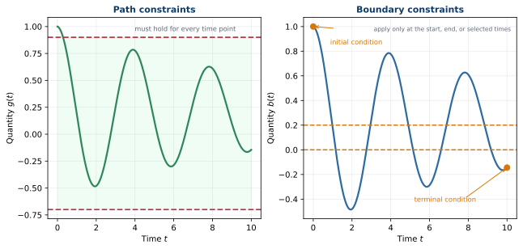

# Path and Boundary Constraints

## Path constraints

A path constraint must hold throughout the time interval:

```{math}
:label: eq-ch4-path-constraint
\mathbf{g}(\mathbf{x}(t),\mathbf{u}(t),\mathbf{x}_p,\mathbf{x}_c,\mathbf{d}(t),t)\leq\mathbf{0},
\qquad t\in[t_0,t_f].
```

Examples include actuator saturation, displacement and angle limits, structural loads, temperature, speed, and safety envelopes.

## Boundary constraints

Boundary constraints apply at the start, end, or designated points:

```{math}
:label: eq-ch4-boundary-constraint
\mathbf{b}(\mathbf{x}(t_0),\mathbf{x}(t_f),\mathbf{u}(t_0),\mathbf{u}(t_f),
\mathbf{x}_p,\mathbf{x}_c,t_0,t_f)=\mathbf{0}.
```

They can enforce initial states, final positions, periodicity, terminal performance, endpoint compatibility, or mission completion. Boundary inequalities are also possible.



*Path constraints apply throughout time; boundary constraints apply at selected points.*

For example,

```{math}
|u(t)|\leq u_{\max},\qquad\forall t,
```

is an actuator path constraint, while

```{math}
q(t_f)=q_f
```

is a terminal boundary constraint.

```{admonition} Key idea
:class: important
Path constraints protect the design at all times. Boundary constraints enforce what must happen at the beginning, end, or another designated point. The distinction affects both modeling and numerical solution.
```

## Physical-design constraints

Some path-like constraints depend only on the plant design and the trajectory it produces—not on an instantaneous operating limit such as actuator saturation. It is common in the CCD literature to separate these out as a dedicated **physical-constraint function**,

```{math}
:label: eq-ch4-physical-constraint
\mathbf{g}_p(\mathbf{x}(t),\mathbf{x}_p,t)\leq\mathbf{0},
```

distinct from the general path constraint $\mathbf{g}(\cdot)$ above. $\mathbf{g}_p(\cdot)$ captures requirements such as material stress or fatigue limits, buckling, deflection, and packaging or geometric envelopes—quantities that describe whether the *hardware itself* is physically realizable and durable, as opposed to quantities that describe instantaneous *operating* behavior such as actuator saturation or a safety envelope. The distinction is one of engineering bookkeeping rather than mathematics: both are inequality constraints evaluated along the trajectory, and a complete CCD formulation must respect both.

An example makes the distinction concrete. In a quarter-car active-suspension co-design study, the plant vector expands well beyond an abstract stiffness and damping pair to the physical spring and damper geometry—wire diameter, coil diameter, pitch, number of active coils, valve diameter, damper piston diameter, and damper stroke. The resulting $\mathbf{g}_p(\cdot)$ set includes a spring-buckling constraint, a fatigue criterion combining mean and alternating shear stress, a damper-fluid thermal limit, a maximum damper seal pressure, and several packaging and clearance constraints tying the spring and damper geometry to the available pocket length in the vehicle. The examples section later in this chapter revisits this system in detail.
