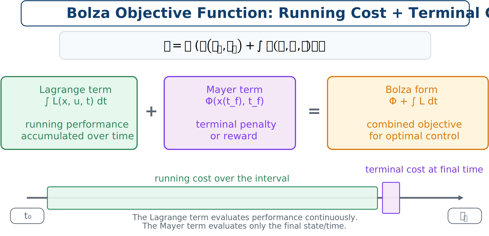

# Lagrange, Mayer, and Bolza Objectives

The objective defines what “good” means. CCD objectives may represent energy, ride quality, tracking error, power, structural load, cost, or combinations of goals.

## Lagrange form

The Lagrange form accumulates a running cost:

```{math}
:label: eq-ch4-lagrange-objective
J=\int_{t_0}^{t_f}L(\mathbf{x}(t),\mathbf{u}(t),\mathbf{x}_p,\mathbf{x}_c,t)\,dt.
```

It is appropriate for total energy, integrated tracking error, mean-squared acceleration, or accumulated control effort. For example,

```{math}
J=\int_{t_0}^{t_f}\left(q_1x(t)^2+q_2\dot{x}(t)^2+ru(t)^2\right)dt.
```

## Mayer form

The Mayer form depends only on terminal quantities:

```{math}
:label: eq-ch4-mayer-objective
J=\Phi(\mathbf{x}(t_f),\mathbf{x}_p,\mathbf{x}_c,t_f).
```

Examples include minimizing final error or final time and maximizing final stored energy:

```{math}
J=(x(t_f)-x_f)^2.
```

## Bolza form

The Bolza form combines terminal and running terms:

```{math}
:label: eq-ch4-bolza-objective
J=\Phi(\mathbf{x}(t_f),\mathbf{x}_p,\mathbf{x}_c,t_f)
+\int_{t_0}^{t_f}L(\mathbf{x}(t),\mathbf{u}(t),\mathbf{x}_p,\mathbf{x}_c,t)\,dt.
```



*Lagrange, Mayer, and Bolza objective forms.*

The forms are closely related. Lagrange and Mayer problems are special cases of Bolza. A Bolza problem can also be rewritten in Mayer form by introducing an auxiliary state. Keeping the conceptual distinction makes engineering formulations easier to interpret.

:::{tip} Activity 4.2: Conversion among Lagrange, Mayer, and Bolza Forms
:class: dropdown

Consider the dynamic optimization problem

```{math}
\min_{u(\cdot)}\quad
J=\int_0^{t_f}\left[x(t)^2+\rho u(t)^2\right]dt,
```

subject to

```{math}
\dot{x}(t)=a x(t)+b u(t),
\qquad
x(0)=x_0.
```

1. Introduce an auxiliary state $z(t)$ and convert the Lagrange objective into an equivalent Mayer objective.

2. State the initial condition for $z(t)$ and write the augmented dynamics.

3. Prove that

   ```{math}
   z(t_f)=\int_0^{t_f}\left[x(t)^2+\rho u(t)^2\right]dt.
   ```

4. Now consider the Bolza objective

   ```{math}
   J
   =\frac{1}{2}q_f x(t_f)^2
   +\int_0^{t_f}\left[x(t)^2+\rho u(t)^2\right]dt.
   ```

   Convert it into a pure Mayer problem.

5. Add the integral energy constraint

   ```{math}
   \int_0^{t_f}u(t)^2dt\leq E_{\max}.
   ```

   Introduce another auxiliary state and rewrite the integral inequality as a terminal boundary constraint.

6. Show that the resulting augmented system contains no integral objective or integral constraint.

7. Explain why the Mayer transformation is mathematically exact but may still affect numerical conditioning and scaling.

8. Generalize the transformation to the vector running cost

   ```{math}
   \mathbf{L}\left(\mathbf{x},\mathbf{u},\mathbf{x}_p,t\right)
   \in\mathbb{R}^{n_L}.
   ```
:::
