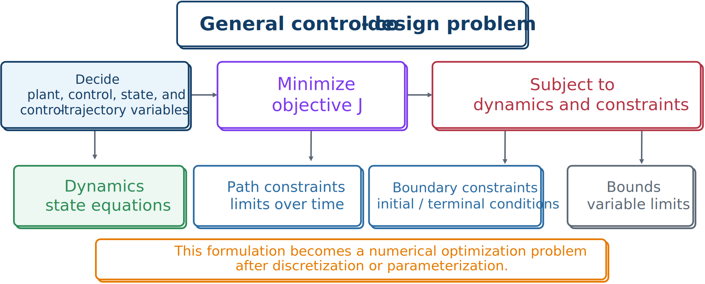
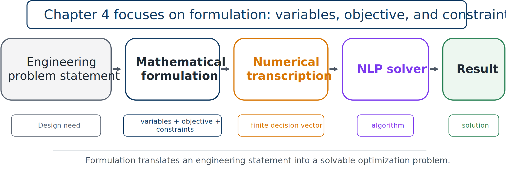

# A General Continuous-Time CCD Formulation

Combining the pieces gives the broad formulation

```{math}
:label: eq-ch4-general-ccd
\begin{aligned}
\underset{\mathbf{x}_p,\mathbf{x}_c,\mathbf{x}(\cdot),\mathbf{u}(\cdot)}{\text{minimize}}\quad
&J=\Phi(\mathbf{x}(t_f),\mathbf{x}_p,\mathbf{x}_c,t_f)
+\int_{t_0}^{t_f}L(\mathbf{x}(t),\mathbf{u}(t),\mathbf{x}_p,\mathbf{x}_c,t)\,dt\\
\text{subject to}\quad
&\dot{\mathbf{x}}(t)=\mathbf{f}(\mathbf{x}(t),\mathbf{u}(t),\mathbf{x}_p,\mathbf{x}_c,\mathbf{d}(t),t),\\
&\mathbf{g}(\mathbf{x}(t),\mathbf{u}(t),\mathbf{x}_p,\mathbf{x}_c,\mathbf{d}(t),t)\leq\mathbf{0},\\
&\mathbf{b}(\mathbf{x}(t_0),\mathbf{x}(t_f),\mathbf{u}(t_0),\mathbf{u}(t_f),
\mathbf{x}_p,\mathbf{x}_c,t_0,t_f)=\mathbf{0},\\
&\mathbf{x}_p^L\leq\mathbf{x}_p\leq\mathbf{x}_p^U,\\
&\mathbf{x}_c^L\leq\mathbf{x}_c\leq\mathbf{x}_c^U,
\qquad t\in[t_0,t_f].
\end{aligned}
```



*Decision variables, objective, physical dynamics, and constraint sets together define the CCD problem.*

The objective measures performance. The differential equations encode physical behavior. Path constraints impose time-dependent engineering limits. Boundary constraints enforce endpoint requirements. Bounds restrict finite-dimensional plant and controller decisions.

## Continuous-time and numerical formulations

The continuous-time problem is infinite-dimensional because state and control trajectories are functions. Numerical solution requires a finite representation through parameterization, sampling, or transcription.



*Mathematical formulation precedes numerical transcription and solution.*

The numerical stage typically parameterizes trajectories, enforces dynamics through simulation or defect equations, and approximates integrals by quadrature. Those choices should come after the engineering formulation is correct.

:::{tip} Activity 4.3: Complete Continuous-Time CCD Formulation with Free Final Time
:class: dropdown

Consider the controlled mass–spring–damper system

```{math}
m\ddot{q}(t)+c\dot{q}(t)+kq(t)=u(t)+d(t),
```

where

```{math}
m=1.5\ \mathrm{kg},
\qquad
d(t)=2e^{-0.5t}\sin(3t).
```

The plant design variables are

```{math}
0.5\leq k\leq 8,
\qquad
0.1\leq c\leq 4,
\qquad
0.5\leq F_{\max}\leq 6,
```

and the final time is also a design variable:

```{math}
2\leq t_f\leq 8.
```

The control trajectory satisfies

```{math}
|u(t)|\leq F_{\max}.
```

The initial and terminal conditions are

```{math}
q(0)=1,
\qquad
\dot{q}(0)=0,
```

and

```{math}
q(t_f)=0,
\qquad
\dot{q}(t_f)=0.
```

The displacement and velocity must satisfy

```{math}
|q(t)|\leq 1.2,
\qquad
|\dot{q}(t)|\leq 2.5.
```

Minimize

```{math}
\begin{aligned}
J
=&\int_0^{t_f}
\left[q(t)^2+0.1\dot{q}(t)^2+0.02u(t)^2\right]dt\\
&+0.03k^2+0.02c^2+0.04F_{\max}^2+0.2t_f.
\end{aligned}
```

1. Define a first-order state vector and derive the state equations in the form

   ```{math}
   \dot{\mathbf{x}}
   =\mathbf{f}\left(\mathbf{x},u,\mathbf{x}_p,t\right).
   ```

2. Define the complete plant-design vector, control trajectory, state trajectory, and free-time variable.

3. Write the problem in the general Bolza form

   ```{math}
   \begin{aligned}
   \min_{\mathbf{x}_p,u(\cdot),\mathbf{x}(\cdot),t_f}\quad
   &\Phi\left(\mathbf{x}(0),\mathbf{x}(t_f),\mathbf{x}_p,t_f\right)
   +\int_0^{t_f}L\left(\mathbf{x},u,\mathbf{x}_p,t\right)dt,\\
   \text{subject to}\quad
   &\dot{\mathbf{x}}
   -\mathbf{f}\left(\mathbf{x},u,\mathbf{x}_p,t\right)
   =\mathbf{0},
   \end{aligned}
   ```

   together with all path, boundary, and bound constraints.

4. Classify every constraint as one of the following:

   1. dynamic equality constraint;
   2. path inequality constraint;
   3. boundary equality constraint; or
   4. simple bound.

5. Determine whether $F_{\max}$ is redundant when $u(t)$ is also bounded. Explain why it is still a meaningful plant or actuator-design variable in this formulation.

6. Replace the terminal equalities with the terminal tolerance

   ```{math}
   \left\|\mathbf{x}(t_f)\right\|_2\leq 10^{-2},
   ```

   and write the equivalent scalar inequality constraint.

7. Explain which terms in the objective discourage the optimizer from selecting the largest possible actuator, the stiffest possible spring, or the longest possible maneuver time.
:::

:::{tip} Activity 4.4: Time Normalization for a Free-Final-Time CCD Problem
:class: dropdown

Consider the general free-final-time CCD problem

```{math}
\begin{aligned}
\min_{\mathbf{x}_p,\mathbf{x}_c,\mathbf{u}(\cdot),t_f}\quad
&\Phi\left(\mathbf{x}(t_f),\mathbf{x}_p,\mathbf{x}_c,t_f\right)\\
&+\int_{t_0}^{t_f}
L\left(\mathbf{x},\mathbf{u},\mathbf{x}_p,\mathbf{x}_c,t\right)dt,
\end{aligned}
```

subject to

```{math}
\dot{\mathbf{x}}
=\mathbf{f}\left(\mathbf{x},\mathbf{u},\mathbf{x}_p,\mathbf{x}_c,t\right).
```

Introduce normalized time

```{math}
\tau=\frac{t-t_0}{t_f-t_0},
\qquad
0\leq\tau\leq1.
```

1. Derive

   ```{math}
   \frac{dt}{d\tau}=t_f-t_0.
   ```

2. Show that the transformed dynamics are

   ```{math}
   \frac{d\mathbf{x}}{d\tau}
   =(t_f-t_0)
   \mathbf{f}\left(
   \mathbf{x},\mathbf{u},\mathbf{x}_p,\mathbf{x}_c,t(\tau)
   \right).
   ```

3. Transform the integral objective to the fixed interval $\tau\in[0,1]$.

4. Transform the path constraint

   ```{math}
   \mathbf{g}\left(\mathbf{x}(t),\mathbf{u}(t),\mathbf{x}_p,t\right)
   \leq\mathbf{0}.
   ```

5. Transform the explicit time-dependent disturbance

   ```{math}
   d(t)=A\sin(\omega t+\phi).
   ```

6. For the scalar system

   ```{math}
   \dot{x}=-px+u,
   \qquad
   x(0)=1,
   \qquad
   x(t_f)=0,
   ```

   write the complete normalized-time formulation when

   ```{math}
   J=t_f+\int_0^{t_f}\left(x^2+0.1u^2\right)dt.
   ```

7. Explain why $t_f$ appears in both the transformed dynamics and the transformed running cost.

8. State the condition that must be imposed to prevent the optimizer from selecting $t_f=t_0$.
:::

:::{tip} Activity 4.5: Multi-Scenario Robust CCD Formulation
:class: dropdown

A controlled system is described under scenario $s$ by

```{math}
\dot{\mathbf{x}}_s
=\mathbf{f}\left(
\mathbf{x}_s,\mathbf{u}_s,\mathbf{x}_p,\boldsymbol{\theta}_s,t
\right),
\qquad
s=1,\ldots,N_s,
```

where $\mathbf{x}_p$ is a common plant design and $\boldsymbol{\theta}_s$ contains scenario-dependent parameters. Each scenario has objective

```{math}
J_s
=\Phi_s\left(\mathbf{x}_s(t_f),\mathbf{x}_p\right)
+\int_0^{t_f}
L_s\left(\mathbf{x}_s,\mathbf{u}_s,\mathbf{x}_p,t\right)dt.
```

The robust objective is

```{math}
J_R
=\sum_{s=1}^{N_s}p_sJ_s
+\lambda\max_s J_s,
```

where

```{math}
p_s\geq0,
\qquad
\sum_{s=1}^{N_s}p_s=1.
```

1. Write the complete multi-scenario CCD problem when the plant design $\mathbf{x}_p$ is common to all scenarios but each scenario has its own open-loop control trajectory $\mathbf{u}_s(t)$.

2. Introduce an epigraph variable $\eta$ and replace

   ```{math}
   \max_s J_s
   ```

   with smooth algebraic inequalities.

3. Write the resulting objective and all epigraph constraints.

4. Add scenario-wise path constraints

   ```{math}
   \mathbf{g}_s\left(
   \mathbf{x}_s,\mathbf{u}_s,\mathbf{x}_p,t
   \right)\leq\mathbf{0}.
   ```

5. Add the common actuator-capacity variable $F_{\max}$ and impose

   ```{math}
   |u_s(t)|\leq F_{\max},
   \qquad
   s=1,\ldots,N_s.
   ```

6. Now assume that one causal feedback controller

   ```{math}
   \mathbf{u}_s(t)
   =\boldsymbol{\pi}\left(\mathbf{y}_s(t);\mathbf{x}_c\right)
   ```

   must be shared by all scenarios. Rewrite the decision-variable set.

7. Explain the difference between scenario-dependent open-loop controls and a common feedback law from the viewpoint of information availability and implementability.

8. If each scenario has $n_x$ states, $n_u$ controls, and $N+1$ transcription nodes, determine the total number of trajectory decision variables for:

   1. scenario-dependent open-loop controls; and
   2. common parameterized feedback with $n_c$ controller parameters.
:::

:::{tip} Activity 4.6: Multiphase Hybrid Control Co-Design Formulation
:class: dropdown

A robotic system performs two phases:

1. a free-motion phase; and
2. a contact phase.

During phase 1,

```{math}
\dot{\mathbf{x}}^{(1)}
=\mathbf{f}^{(1)}\left(
\mathbf{x}^{(1)},\mathbf{u}^{(1)},\mathbf{x}_p,t
\right),
\qquad
t\in[t_0,t_s].
```

At contact, the state undergoes the jump

```{math}
\mathbf{x}^{(2)}(t_s^+)
=\boldsymbol{\Delta}\left(
\mathbf{x}^{(1)}(t_s^-),\mathbf{x}_p
\right).
```

During phase 2,

```{math}
\dot{\mathbf{x}}^{(2)}
=\mathbf{f}^{(2)}\left(
\mathbf{x}^{(2)},\mathbf{u}^{(2)},\mathbf{x}_p,t
\right),
\qquad
t\in[t_s,t_f].
```

The switching time $t_s$ and final time $t_f$ are decision variables. The objective is

```{math}
\begin{aligned}
J
=&\int_{t_0}^{t_s}
L^{(1)}\left(
\mathbf{x}^{(1)},\mathbf{u}^{(1)},\mathbf{x}_p,t
\right)dt\\
&+\int_{t_s}^{t_f}
L^{(2)}\left(
\mathbf{x}^{(2)},\mathbf{u}^{(2)},\mathbf{x}_p,t
\right)dt\\
&+\Phi\left(\mathbf{x}^{(2)}(t_f),\mathbf{x}_p,t_f\right).
\end{aligned}
```

1. Write the full multiphase CCD decision set, including plant variables, both state trajectories, both control trajectories, $t_s$, and $t_f$.

2. Write the dynamic equality constraints for both phases.

3. Write the phase-linkage constraint associated with the jump map.

4. Add the event condition

   ```{math}
   h_{\mathrm{contact}}\left(
   \mathbf{x}^{(1)}(t_s^-),\mathbf{x}_p
   \right)=0.
   ```

5. Add the time-ordering constraints

   ```{math}
   t_0<t_s<t_f.
   ```

6. Suppose the normal contact force in phase 2 is

   ```{math}
   F_n
   =\psi\left(
   \mathbf{x}^{(2)},\mathbf{u}^{(2)},\mathbf{x}_p
   \right).
   ```

   Write the unilateral-contact path constraint.

7. Suppose the impact impulse must satisfy

   ```{math}
   I\left(\mathbf{x}^{(1)}(t_s^-),\mathbf{x}_p\right)
   \leq I_{\max}.
   ```

   Classify this as a path or boundary constraint and justify your answer.

8. Convert both phases to fixed normalized-time intervals

   ```{math}
   \tau_1,\tau_2\in[0,1].
   ```

   Derive the scaled dynamics for each phase.

9. Explain why using one continuous dynamic model without the jump map would produce an incorrect formulation.

10. Describe how the formulation would change if the contact sequence itself were an architecture decision rather than fixed in advance.
:::
