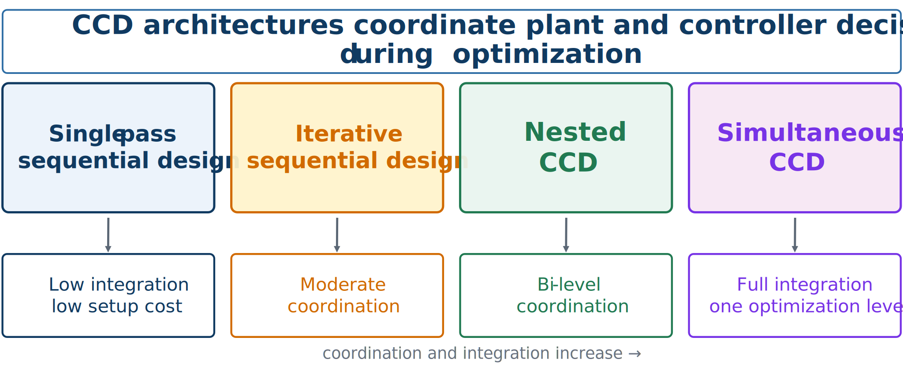
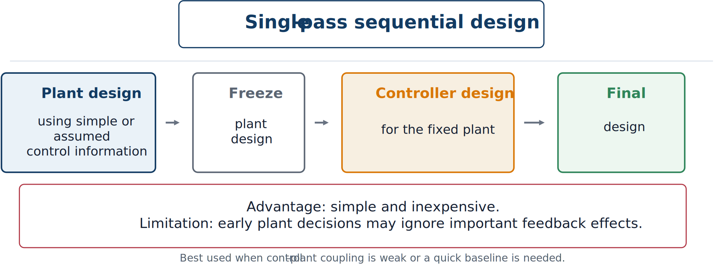

# Architecture Landscape and Single-Pass Design

## Why architecture matters

A generic CCD problem may be written as

```{math}
\underset{\mathbf{x}_p,\mathbf{x}_c}{\text{minimize}}\quad J(\mathbf{x}_p,\mathbf{x}_c)
\qquad\text{subject to dynamic and engineering constraints.}
```

This statement does not say how to organize the optimization. An architecture answers:

- Which subproblem is solved first?
- Which variables are fixed while others change?
- Does plant optimization call controller optimization as an inner loop?
- Are all decisions handled at one level or several?
- How often is information exchanged?



*The main CCD architectures differ in coordination strength and implementation cost.*

Engineering teams may already have separate plant and controller tools, or may be limited by simulation cost, derivative availability, and software structure. If plant–control coupling is weak, a simple method may be enough. Strong coupling makes weak coordination more likely to miss good designs.

```{admonition} Main idea
:class: important
Different architectures may address the same underlying CCD formulation while coordinating its variables in very different ways.
```

## CCD architectures within the broader MDO taxonomy

The four architectures introduced in this chapter are not invented in isolation. Each has a direct analogue in the general multidisciplinary design optimization (MDO) literature, which classifies formulations by how they handle the coupling between disciplinary analyses.

- **Multidisciplinary feasible (MDF)** formulations perform all analysis inside the optimization loop, so every point the optimizer visits is consistent with the system's governing equations before optimality is reached. Nested CCD is a special case of MDF: the plant design is proposed by the (outer) optimizer, the associated response is obtained for that candidate plant — here, through an inner optimal-control solve rather than a single simulation pass — and the outer optimizer sees only a single reduced objective function value in return.
- **Individual disciplinary feasible (IDF)** formulations instead promote the variables that couple subsystems to the status of independent optimization variables, adding equality constraints that only need to hold at convergence rather than at every iterate. Applied to a dynamic system, this can mean treating a subset of state variables, or entire trajectory segments as in multiple shooting, as optimization variables in their own right. IDF sacrifices guaranteed feasibility during the search in exchange for decoupling the underlying analyses, which is what enables coarse-grained parallel computation across subsystems.
- **Distributed, multilevel formulations** go further and distribute the optimization itself, not merely the analysis, across subproblems. Augmented Lagrangian coordination (ALC) is one such formulation, described in the MDO literature as a nonhierarchical generalization of analytical target cascading (ATC), an earlier multilevel coordination strategy. In ALC, each subsystem — for example, each time segment of a discretized trajectory — solves its own local optimization problem using a local copy of the shared coupling variables, and a coordination algorithm drives the local copies toward agreement through an augmented Lagrangian penalty rather than a hard equality constraint.

```{admonition} Where this chapter's architectures sit
:class: tip
Single-pass and iterative sequential design are not standard MDO architectures at all — they solve reduced problems that need not honor the full system-level objective, which is exactly the weak-coordination property criticized earlier in this course. Nested CCD is essentially MDF applied to a plant-versus-control partition of the design variables. Simultaneous CCD, once transcribed into a nonlinear program, has an MDF-like character too: the discretized dynamics appear as ordinary equality constraints handled by the same optimizer that resolves the design variables, rather than by a separate inner solve. IDF-style and ALC-style decompositions are the architectures to reach for when a single monolithic dynamic model cannot be assembled or solved directly — a case the four architectures developed in this chapter do not, by themselves, address.
```

## Single-pass sequential design

The plant is designed first using a nominal controller or simplified control assumption. The chosen plant is then fixed while the controller is optimized.



*Single-pass sequential design makes one pass through the two stages.*

A simple mathematical representation is

```{math}
\mathbf{x}_p^*=\arg\min_{\mathbf{x}_p}J_p(\mathbf{x}_p;\hat{\mathbf{x}}_c),
\qquad
\mathbf{x}_c^*=\arg\min_{\mathbf{x}_c}J_c(\mathbf{x}_p^*,\mathbf{x}_c),
```

where $\hat{\mathbf{x}}_c$ is an assumed controller.

### Advantages

- Easy to explain and implement.
- Reuses existing disciplinary workflows.
- Requires little optimization infrastructure.
- Can work when plant–control coupling is weak.

### Limitations

Early physical decisions ignore how an improved controller might alter plant tradeoffs. A passive structure may be oversized because feedback load reduction was not considered. The method is simple, but coordination is weak.

### Example

If suspension stiffness and damping are selected using passive metrics and an active controller is added afterward, the process may miss a softer plant that delivers better comfort under feedback while still meeting handling constraints.

:::{tip} Activity 5.1: Exact Comparison of Four CCD Architectures
:class: dropdown

Consider the unconstrained control co-design problem

```{math}
\min_{p,c}\;
J(p,c)
=\frac{1}{2}\left(6p^2+6pc+4c^2\right)-8p-6c,
```

where $p$ is a plant-design variable and $c$ is a controller-design variable.

1. Verify that $J$ is strictly convex.

2. In a single-pass sequential design, first optimize $p$ using the nominal controller $\hat{c}=0$, and then optimize $c$ for the fixed value of $p$. Compute

   ```{math}
   p_{\mathrm{seq}},
   \qquad
   c_{\mathrm{seq}},
   \qquad
   J_{\mathrm{seq}}.
   ```

3. Formulate the nested problem

   ```{math}
   \phi(p)=\min_c J(p,c),
   \qquad
   \min_p\phi(p).
   ```

   Derive $c^*(p)$ and the reduced objective $\phi(p)$.

4. Solve the nested problem analytically.

5. Solve the simultaneous problem by imposing

   ```{math}
   \nabla J(p,c)=\mathbf{0}.
   ```

6. Show that the nested and simultaneous solutions are identical.

7. Compute the relative performance loss of the single-pass sequential design:

   ```{math}
   \eta_{\mathrm{seq}}
   =\frac{J_{\mathrm{seq}}-J_{\mathrm{sim}}}
   {|J_{\mathrm{sim}}|}.
   ```

8. Explain why strict convexity is important for the equivalence observed in this problem.
:::
