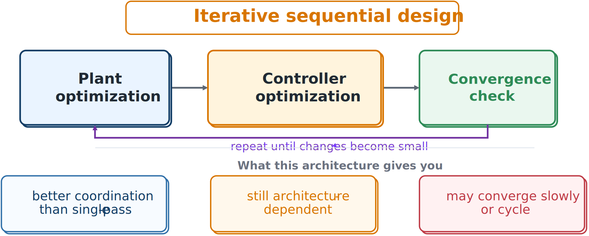

# Iterative Sequential Design

Iterative sequential design alternates plant and controller optimization until changes become small.



*Repeated information exchange provides more coordination than a single pass.*

An abstract update is

```{math}
\mathbf{x}_p^{(k+1)}=\arg\min_{\mathbf{x}_p}J(\mathbf{x}_p,\mathbf{x}_c^{(k)}),
\qquad
\mathbf{x}_c^{(k+1)}=\arg\min_{\mathbf{x}_c}J(\mathbf{x}_p^{(k+1)},\mathbf{x}_c).
```

The plant step uses the current controller, and the controller step uses the updated plant.

## Advantages

- Can substantially improve on a single-pass design.
- Preserves separate plant and controller subproblems.
- Reuses legacy models and tools.
- Is easier to implement than full simultaneous CCD.

## Limitations

- Convergence is not guaranteed.
- Results can depend on update order.
- The process may cycle or converge slowly.
- The final point can differ from a fully coordinated optimum.

In strongly coupled problems, each improvement in one discipline changes the best response of the other, making repeated alternation expensive.

## Example

A wind-turbine team may alternate structural redesign and pitch-controller retuning. Performance can improve gradually, but many costly simulation-based iterations may be required.

:::{tip} Activity 5.2: Convergence of Iterative Sequential Design
:class: dropdown

Consider the quadratic CCD problem

```{math}
J(\mathbf{p},\mathbf{c})
=\frac{1}{2}\mathbf{p}^TA\mathbf{p}
+\mathbf{p}^TB\mathbf{c}
+\frac{1}{2}\mathbf{c}^TC\mathbf{c}
-\mathbf{a}^T\mathbf{p}
-\mathbf{b}^T\mathbf{c},
```

where $A$ and $C$ are symmetric positive-definite matrices. An iterative sequential method performs

```{math}
\begin{aligned}
\mathbf{p}^{(k+1)}
&=\arg\min_{\mathbf{p}}J\left(\mathbf{p},\mathbf{c}^{(k)}\right),\\
\mathbf{c}^{(k+1)}
&=\arg\min_{\mathbf{c}}J\left(\mathbf{p}^{(k+1)},\mathbf{c}\right).
\end{aligned}
```

1. Derive the explicit update equations

   ```{math}
   \begin{aligned}
   \mathbf{p}^{(k+1)}
   &=A^{-1}\left(\mathbf{a}-B\mathbf{c}^{(k)}\right),\\
   \mathbf{c}^{(k+1)}
   &=C^{-1}\left(\mathbf{b}-B^T\mathbf{p}^{(k+1)}\right).
   \end{aligned}
   ```

2. Let $\mathbf{c}^*$ denote the simultaneous optimum. Show that the controller error satisfies

   ```{math}
   \mathbf{c}^{(k+1)}-\mathbf{c}^*
   =M\left(\mathbf{c}^{(k)}-\mathbf{c}^*\right),
   ```

   where

   ```{math}
   M=C^{-1}B^TA^{-1}B.
   ```

3. Prove that the iterative sequential method converges for every initial controller if

   ```{math}
   \rho(M)<1,
   ```

   where $\rho(\cdot)$ denotes spectral radius.

4. Use

   ```{math}
   A=
   \begin{bmatrix}
   4&1\\
   1&3
   \end{bmatrix},
   \qquad
   C=
   \begin{bmatrix}
   3&0.5\\
   0.5&2
   \end{bmatrix},
   ```

   and

   ```{math}
   B=
   \begin{bmatrix}
   1.8&0.4\\
   0.2&1.2
   \end{bmatrix},
   \qquad
   \mathbf{a}=
   \begin{bmatrix}
   2\\
   1
   \end{bmatrix},
   \qquad
   \mathbf{b}=
   \begin{bmatrix}
   1\\
   2
   \end{bmatrix}.
   ```

   Compute $\rho(M)$ and determine whether the iterative sequential method converges.

5. Starting from

   ```{math}
   \mathbf{c}^{(0)}=
   \begin{bmatrix}
   0\\
   0
   \end{bmatrix},
   ```

   perform ten alternating iterations and compare the result with the simultaneous optimum.

6. Explain how the strength of plant–controller coupling is reflected in $\rho(M)$.
:::
