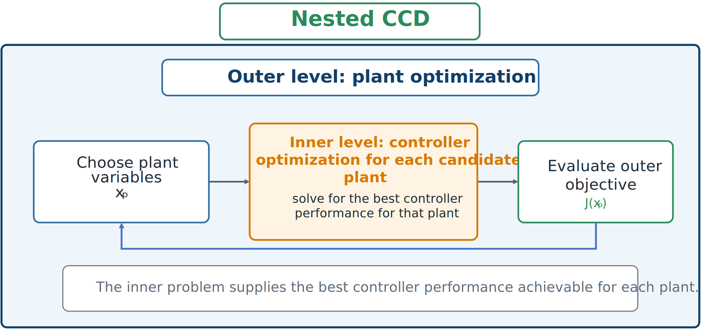

# Nested Control Co-Design

Nested CCD uses a **bi-level** structure. The outer optimization chooses plant variables; for each plant candidate, an inner optimization finds its best controller.



*Each plant is evaluated through an inner controller-optimization problem.*

An idealized formulation is

```{math}
\underset{\mathbf{x}_p}{\text{minimize}}\quad\phi(\mathbf{x}_p),
\qquad
\phi(\mathbf{x}_p)=\underset{\mathbf{x}_c}{\text{minimize}}\quad J(\mathbf{x}_p,\mathbf{x}_c),
```

subject to the relevant plant, controller, dynamic, and engineering constraints.

The outer loop does not directly choose $\mathbf{x}_c$; it sees the best achievable performance returned by the inner controller solve. This evaluates each plant fairly under the chosen controller structure.

## Advantages

- Stronger coordination than sequential approaches.
- Natural separation of plant and controller roles.
- Clear interpretation of plant quality under best achievable control.
- Compatibility with established controller-tuning tools.

## Limitations

Every outer evaluation may require a complete inner optimization. Additional challenges include:

- noise or discontinuity when inner solves are incomplete;
- difficulty differentiating through the inner optimum;
- sensitivity to inner-solver reliability; and
- potentially very high total simulation cost.

## Example

For active suspension, the outer loop varies stiffness and damping. For each candidate, the inner loop computes optimal feedback gains. The outer loop compares plants using the optimized closed-loop performance returned by the controller solver.

## A precise bi-level formulation

The idealized statement above hides an important detail: the inner minimization only makes sense if a feasible controller exists for the candidate plant. Write the inner-loop feasible set for a given plant candidate $\mathbf{x}_p^\dagger$ as $\Lambda(\mathbf{x}_p^\dagger)$, the set of controller variables $\mathbf{x}_c$ satisfying the dynamic, path, and boundary constraints associated with that plant. The nested strategy's *induced region* is then the set of pairs $(\mathbf{x}_p,\mathbf{x}_c)$ such that $\mathbf{x}_p$ satisfies its own constraints and $\mathbf{x}_c$ minimizes $J(\mathbf{x}_p,\cdot)$ over $\Lambda(\mathbf{x}_p)$.

This induced region is generally a strict subset of the simultaneous problem's feasible set: a pair $(\mathbf{x}_p,\mathbf{x}_c)$ may satisfy every constraint yet never be produced by the nested strategy if $\mathbf{x}_c$ is feasible but not the *optimal* response to $\mathbf{x}_p$. For the nested and simultaneous strategies to be equivalent, $\Lambda(\mathbf{x}_p')$ must be nonempty for every plant design $\mathbf{x}_p'$ the outer loop is allowed to propose — otherwise the inner optimization has nothing to return, and the reduced objective $\phi(\mathbf{x}_p')$ is undefined. This "outer-loop feasibility" property is not automatic and, for general co-design problems, is not guaranteed even by classical results such as linear-system controllability once realistic path constraints are present. Practical nested implementations often add an explicit outer-loop feasibility constraint on $\mathbf{x}_p$ so that only plant designs with a workable inner problem are ever offered to the optimizer.

```{admonition} Why this matters in practice
:class: warning
An infeasible inner controller optimization is not a corner case. In a documented active-suspension co-design study, uniformly sampling plant designs within their simple box bounds produced an infeasible inner-loop optimal-control problem 44% of the time; requiring feasibility with respect to the full constraint set reduced this to about 0.033%, but a nested implementation that does not screen for this can still fail outright on an otherwise reasonable starting point. [Equivalence and Computational Tradeoffs](05-equivalence-and-computational-tradeoffs.md) returns to this issue with the full comparison it comes from.
```

## Optimality conditions for the nested strategy

The inner controller problem, for a fixed candidate plant, is an ordinary optimal control problem. Adjoining the dynamics and any path constraints with costates $\boldsymbol{\lambda}(t)$ and multipliers $\boldsymbol{\mu}(t)$ forms the Hamiltonian $H=\mathcal{L}+\boldsymbol{\lambda}^T f+\boldsymbol{\mu}^T C$, and Pontryagin's minimum principle supplies the usual costate dynamics, control stationarity, complementary slackness, and transversality conditions at $t_0$ and $t_f$ — all evaluated at the candidate plant. These conditions are exactly the necessary conditions the inner loop must satisfy.

The outer-loop problem is finite-dimensional in $\mathbf{x}_p$ alone, so its necessary conditions follow from ordinary KKT theory once the *total* derivative of the reduced objective $\phi(\mathbf{x}_p)=J(\mathbf{x}_p,\mathbf{x}_c^*(\mathbf{x}_p))$ is available:

```{math}
\frac{d\phi}{d\mathbf{x}_p}
=\frac{\partial J}{\partial \mathbf{x}_p}
+\frac{\partial J}{\partial \mathbf{x}_c}\frac{d\mathbf{x}_c^*}{d\mathbf{x}_p}.
```

If the inner problem's necessary conditions hold exactly, the second term can be shown to vanish by the envelope theorem — Activity 5.4 works through this cancellation explicitly for a quadratic inner problem with an equality-constrained inner solution. In that idealized case, the outer-loop gradient reduces to $\partial J/\partial \mathbf{x}_p$ evaluated along the optimal inner trajectory, and the bookkeeping for $d\mathbf{x}_c^*/d\mathbf{x}_p$ can, in principle, be skipped. In practice this shortcut is dangerous: a numerical inner solver only ever converges to a nonzero optimality or feasibility residual, so the envelope-theorem cancellation is only approximate, and dropping the correction term can silently corrupt the outer-loop gradient. This is the numerical effect Activity 5.4 asks you to quantify directly by sweeping the inner solver's tolerance.

When the inner problem is a linear-quadratic dynamic optimization problem — quadratic objective, linear time-invariant dynamics, no path constraints, infinite time horizon — the inner loop collapses to a single algebraic Riccati equation, and the optimal feedback gain has the closed form

```{math}
\mathbf{u}^*=-K^*\boldsymbol{\xi},
\qquad
K^*=R^{-1}B^TP^*,
```

where $P^*$ is the unique positive-definite solution of $P^*A+A^TP^*-P^*BR^{-1}B^TP^*+Q=0$. This is precisely the structure exploited in Activity 5.3, and it is one of two special inner-loop forms — the other being a general finite-horizon linear-quadratic dynamic optimization problem, solvable after discretization as a convex quadratic program — that make nested CCD attractive in practice: the inner loop can be solved to high accuracy and speed by a tailored algorithm rather than a general-purpose nonlinear optimal control solver.

:::{tip} Activity 5.3: Nested LQR Control Co-Design
:class: dropdown

Consider the scalar plant

```{math}
\dot{x}=-px+u,
\qquad
x(0)=1,
```

where

```{math}
0.1\leq p\leq3
```

is a plant-design variable. Use the feedback controller

```{math}
u=-Kx,
\qquad
K\geq0.
```

The infinite-horizon system-level objective is

```{math}
J(p,K)
=\int_0^\infty\left(x(t)^2+r\,u(t)^2\right)dt
+\alpha p^2,
```

with

```{math}
r=0.2,
\qquad
\alpha=0.08.
```

1. Show that the closed-loop state is

   ```{math}
   x(t)=e^{-(p+K)t}.
   ```

2. Derive the finite-dimensional objective

   ```{math}
   J(p,K)
   =\frac{1+rK^2}{2(p+K)}+\alpha p^2.
   ```

3. For fixed $p$, solve the inner controller problem and show that

   ```{math}
   K^*(p)=-p+\sqrt{p^2+\frac{1}{r}}.
   ```

4. Derive the nested value function

   ```{math}
   \phi(p)=J\left(p,K^*(p)\right).
   ```

5. Independently derive the same inner solution using the scalar algebraic Riccati equation.

6. Minimize $\phi(p)$ over the admissible interval and compute

   ```{math}
   p^*_{\mathrm{nested}},
   \qquad
   K^*_{\mathrm{nested}}.
   ```

7. Solve the simultaneous problem

   ```{math}
   \min_{p,K}J(p,K)
   ```

   directly and verify that it produces the same optimum.

8. Perform a single-pass sequential design by first setting $K=0$ and optimizing $p$, and then optimizing $K$ for the fixed plant. Compare the sequential and coordinated solutions.
:::

:::{tip} Activity 5.4: Differentiating a Nested Value Function
:class: dropdown

Consider the nested CCD problem

```{math}
\min_{\mathbf{p}}\;
\phi(\mathbf{p})
=\frac{1}{2}\mathbf{p}^TQ\mathbf{p}
+\min_{\mathbf{c}}
\left[
\frac{1}{2}\mathbf{c}^TH\mathbf{c}
+\mathbf{p}^TD\mathbf{c}
\right],
```

subject to the inner equality constraint

```{math}
A\mathbf{c}=\mathbf{b}+E\mathbf{p},
```

where $H$ is symmetric positive definite and $A$ has full row rank.

1. Write the KKT system for the inner problem:

   ```{math}
   \begin{bmatrix}
   H&A^T\\
   A&0
   \end{bmatrix}
   \begin{bmatrix}
   \mathbf{c}^*\\
   \boldsymbol{\lambda}^*
   \end{bmatrix}
   =
   \begin{bmatrix}
   -D^T\mathbf{p}\\
   \mathbf{b}+E\mathbf{p}
   \end{bmatrix}.
   ```

2. Differentiate the KKT system with respect to $\mathbf{p}$ and derive

   ```{math}
   \frac{d\mathbf{c}^*}{d\mathbf{p}},
   \qquad
   \frac{d\boldsymbol{\lambda}^*}{d\mathbf{p}}.
   ```

3. Derive the total derivative of the nested objective,

   ```{math}
   \frac{d\phi}{d\mathbf{p}}.
   ```

4. Show how the envelope theorem eliminates the explicit $d\mathbf{c}^*/d\mathbf{p}$ term when the inner KKT conditions are satisfied exactly.

5. Explain why this simplification may fail numerically when the inner problem is terminated with a large optimality or feasibility residual.

6. Implement the nested gradient for a randomly generated positive-definite $H$ and verify it using complex-step or central finite differences.

7. Investigate how the outer-gradient error changes when the inner solver tolerance is varied from $10^{-3}$ to $10^{-10}$.
:::

:::{tip} Activity 5.5: KKT Reformulation of a Constrained Bilevel CCD Problem
:class: dropdown

Consider the nested problem

```{math}
\min_{0\leq p\leq3}\;
\phi(p)
=(p-2)^2
+\min_{0\leq c\leq1}
\left[(c-p)^2+0.1c^2\right].
```

1. Solve the unconstrained inner problem and obtain

   ```{math}
   c_{\mathrm{uc}}(p).
   ```

2. Derive the exact piecewise inner solution $c^*(p)$.

3. Derive the piecewise value function $\phi(p)$ and identify every point at which its derivative changes expression.

4. Solve the nested problem analytically.

5. Introduce Lagrange multipliers $\mu_L$ and $\mu_U$ for

   ```{math}
   -c\leq0,
   \qquad
   c-1\leq0,
   ```

   and write the inner KKT conditions:

   ```{math}
   \begin{aligned}
   2(c-p)+0.2c-\mu_L+\mu_U&=0,\\
   \mu_Lc&=0,\\
   \mu_U(c-1)&=0,\\
   \mu_L,\mu_U&\geq0.
   \end{aligned}
   ```

6. Reformulate the bilevel problem as a single-level mathematical program with complementarity constraints.

7. Enumerate the possible active sets and recover the nested optimum from the KKT reformulation.

8. Solve the direct simultaneous problem

   ```{math}
   \min_{0\leq p\leq3,\;0\leq c\leq1}
   (p-2)^2+(c-p)^2+0.1c^2
   ```

   and compare its solution with the nested result.

9. Explain why complementarity constraints create numerical difficulties for conventional nonlinear programming solvers.
:::
