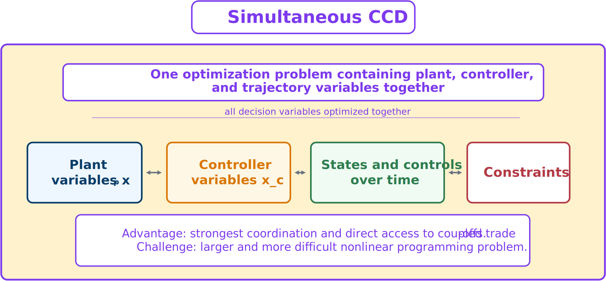

# Simultaneous Control Co-Design

Simultaneous CCD optimizes plant, controller, and often trajectory variables in one integrated problem.



*All coupled decisions are optimized together.*

A generic continuous-time statement is

```{math}
\underset{\mathbf{x}_p,\mathbf{x}_c,\mathbf{x}(\cdot),\mathbf{u}(\cdot)}{\text{minimize}}
\quad J(\mathbf{x}_p,\mathbf{x}_c,\mathbf{x},\mathbf{u})
\qquad\text{subject to all model and engineering constraints.}
```

After transcription, this becomes one large nonlinear program. The optimizer can change physical and control decisions together while accounting for the resulting trajectories and constraints.

## Advantages

- Strongest coordination.
- Direct access to plant–control tradeoffs.
- Unified mathematical structure.
- Natural use of sparse gradient-based optimization.

## Limitations

The integrated nonlinear program can be large and difficult. Successful implementation may require:

- careful scaling;
- strong initial guesses;
- reliable derivatives;
- specialized nonlinear-programming tools; and
- sophisticated software integration.

Simultaneous CCD offers a direct route to a coordinated optimum, especially under strong coupling, but it is not automatically the easiest or most reliable architecture.

## Optimality conditions

Because the simultaneous problem folds the plant variables into the same optimization as the state trajectory, its necessary conditions can be derived directly with Pontryagin's minimum principle by treating the plant variables as an additional, time-invariant part of an augmented state:

```{math}
\boldsymbol{\Theta}=\begin{bmatrix}\boldsymbol{\xi}\\ \mathbf{x}_p\end{bmatrix},
\qquad
\dot{\boldsymbol{\Theta}}=\begin{bmatrix}f\\ \mathbf{0}\end{bmatrix}.
```

Treating $\mathbf{x}_p$ as a free initial condition of this augmented state folds the plant-design decision into the same costate machinery used for the true states, at the cost of an additional transversality-type stationarity condition that couples the plant costate to the partial derivatives of the terminal cost and boundary constraints with respect to $\mathbf{x}_p$, integrated together with the running-cost and dynamic sensitivities over the whole horizon. The essential result is that the simultaneous strategy's necessary conditions are the ordinary costate dynamics, control stationarity, and complementary-slackness conditions for the states and controls, augmented with one additional stationarity condition on $\mathbf{x}_p$ that cannot be separated from the necessary conditions on the rest of the trajectory. This is the formal sense in which simultaneous CCD has the strongest coordination: in the nested strategy, by contrast, the outer-loop condition on $\mathbf{x}_p$ only sees the trajectory indirectly, through the already-optimized reduced objective $\phi(\mathbf{x}_p)$.

## From infinite-dimensional problem to finite nonlinear program

Simultaneous CCD is almost always solved after **direct transcription (DT)**: the state and control trajectories are approximated at a finite set of mesh points, and the dynamic constraint is replaced by a large but sparse set of algebraic *defect* equations enforced at those points. The plant variables $\mathbf{x}_p$ enter this nonlinear program as ordinary optimization variables alongside the discretized states and controls, which is what makes the "unified mathematical structure" and "natural use of sparse gradient-based optimization" advantages listed above concrete — a sparse NLP solver can exploit the resulting Jacobian sparsity pattern directly, without any special-purpose inner solve.

```{admonition} A structural limitation
:class: warning
Not every co-design problem can be posed as an efficient simultaneous quadratic-program formulation. If a plant variable multiplies the state inside the dynamics — a *bilinear* dynamic constraint such as $\dot{\xi}=-k\xi$ with $k$ a plant-design variable — fixing $k$ keeps the dynamics linear, but once $k$ is a joint optimization variable the corresponding defect constraints become quadratic rather than linear, so the convex quadratic-program structure that makes linear-quadratic inner loops so efficient no longer applies directly to the simultaneous formulation. The nested strategy sidesteps this cleanly: its inner loop only ever sees one fixed value of $k$ at a time, so the inner problem stays exactly linear-quadratic even though the plant variable multiplies the state.
```
