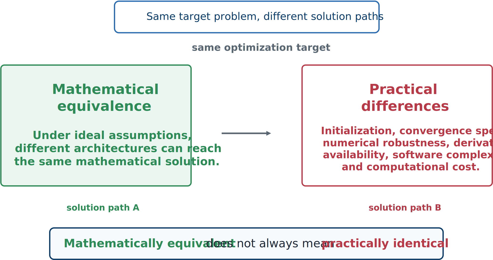
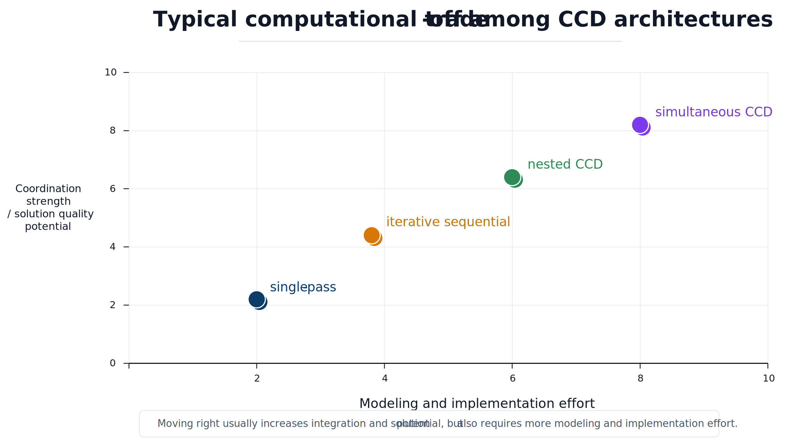

# Equivalence and Computational Tradeoffs

## Mathematical equivalence

Nested and simultaneous CCD may target the same underlying problem. If the nested inner controller optimization is solved exactly for every plant and the outer optimization finds the global optimum, it should identify the same pair $(\mathbf{x}_p^*,\mathbf{x}_c^*)$ as a perfect simultaneous method.



*Architectures may be mathematically equivalent under ideal assumptions while behaving differently in actual computation.*

## Why practical behavior differs

Real optimization is not exact:

- **Local minima:** architectures may converge to different basins.
- **Initialization:** sensitivity differs across formulations.
- **Approximate inner solves:** nested objectives may be evaluated inconsistently.
- **Derivative quality:** simultaneous methods often depend heavily on accurate Jacobians.
- **Scaling:** a large unified nonlinear program can be difficult to balance.
- **Stopping criteria:** different tolerances produce different practical endpoints.

```{admonition} Important distinction
:class: important
Two architectures may be equivalent as statements of an ideal solution yet very different as computational procedures. For engineering work, the practical difference often matters more than formal equivalence.
```

## Coordination versus complexity



*Greater coordination often comes with greater implementation and computational complexity.*

The typical pattern is:

- **Single-pass sequential:** lowest setup cost and weakest coordination.
- **Iterative sequential:** moderate effort and coordination.
- **Nested CCD:** strong coordination with potentially expensive repeated solves.
- **Simultaneous CCD:** strongest coordination and often the most demanding integrated formulation.

### Simulation cost

Long simulations make repeated nested outer-loop evaluations expensive. A simultaneous solve may avoid repeated full re-optimization but introduces a much larger single problem.

### Derivative availability

Reliable gradients can make simultaneous methods highly effective. When derivatives are unavailable, sequential or nested strategies—possibly with derivative-free outer loops—may be easier.

### Software and organizational cost

A team with separate plant and controls groups may adopt iterative or nested approaches more readily than a unified simultaneous framework.

### Robustness versus optimality

A simpler architecture may be chosen because it is understandable, robust, and compatible with existing tools. Maximum performance may justify the added effort of simultaneous CCD.

:::{tip} Activity 5.6: Computational Benchmark of CCD Architectures
:class: dropdown

Consider the controlled oscillator

```{math}
\dot{\mathbf{x}}
=
\begin{bmatrix}
0&1\\
-k&-c
\end{bmatrix}
\mathbf{x}
+
\begin{bmatrix}
0\\
1
\end{bmatrix}u,
```

with feedback

```{math}
u=-K_p x_1-K_d x_2.
```

The design bounds are

```{math}
0.2\leq k\leq5,
\qquad
0.05\leq c\leq3,
```

and

```{math}
0\leq K_p\leq10,
\qquad
0\leq K_d\leq8.
```

Define

```{math}
A_{\mathrm{cl}}
=
\begin{bmatrix}
0&1\\
-(k+K_p)&-(c+K_d)
\end{bmatrix},
```

and

```{math}
Q=
\begin{bmatrix}
10&0\\
0&1
\end{bmatrix},
\qquad
R=0.05.
```

For every stable design, let $P$ satisfy

```{math}
A_{\mathrm{cl}}^TP
+PA_{\mathrm{cl}}
+Q
+
\begin{bmatrix}
K_p\\
K_d
\end{bmatrix}
R
\begin{bmatrix}
K_p&K_d
\end{bmatrix}
=0.
```

Use

```{math}
\Sigma_0=
\begin{bmatrix}
1&0\\
0&0.25
\end{bmatrix},
```

and define

```{math}
J(k,c,K_p,K_d)
=\operatorname{tr}(P\Sigma_0)
+0.02k^2
+0.02c^2
+0.005K_p^2
+0.005K_d^2.
```

1. Derive the closed-loop stability conditions.

2. Implement a single-pass sequential architecture:

   1. optimize $k$ and $c$ with $K_p=K_d=0$; and
   2. freeze the plant and optimize $K_p$ and $K_d$.

3. Implement iterative sequential design by alternating exact or numerically converged plant and controller subproblems until

   ```{math}
   \left\|\mathbf{z}^{(j+1)}-\mathbf{z}^{(j)}\right\|_2<10^{-6}.
   ```

4. Implement nested CCD:

   ```{math}
   \min_{k,c}
   \left[
   \min_{K_p,K_d}J(k,c,K_p,K_d)
   \right].
   ```

5. Implement simultaneous CCD:

   ```{math}
   \min_{k,c,K_p,K_d}J(k,c,K_p,K_d).
   ```

6. Use at least ten initial guesses for the nested and simultaneous problems. MATLAB `fmincon`, IPOPT, SNOPT, or an equivalent constrained optimizer may be used.

7. Compare

   ```{math}
   J^*,
   \qquad
   k^*,
   \qquad
   c^*,
   \qquad
   K_p^*,
   \qquad
   K_d^*,
   ```

   together with function evaluations, derivative evaluations, CPU time, and sensitivity to initialization.

8. Repeat the nested study with inner optimality tolerances $10^{-3}$, $10^{-6}$, and $10^{-9}$. Quantify the effect of imperfect inner solves on the outer optimum.

9. Determine whether the best nested and simultaneous solutions agree to within $10^{-5}$ in objective value.

10. Explain any disagreement in terms of local minima, inner-loop accuracy, derivative quality, scaling, or solver termination criteria.
:::
