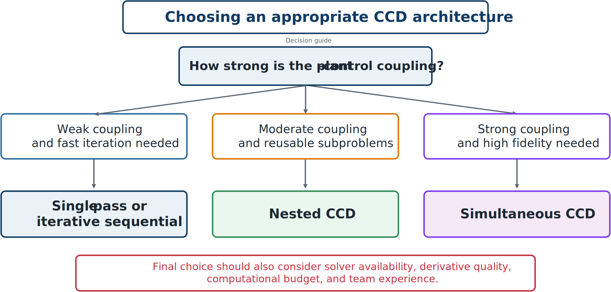

# Choosing an Appropriate Architecture

No architecture is always best. Selection depends on coupling strength, simulation cost, derivatives, model structure, available software, and the goal of the study.

*Plant–control coupling is central to architecture choice, but it is not the only consideration.*

## Favor single-pass sequential design when

- coupling is weak;
- a quick baseline is needed;
- ease of implementation dominates; and
- the controller has modest influence on plant tradeoffs.

## Favor iterative sequential design when

- some coupling exists but full integration is impractical;
- separate plant and controller tools must remain;
- repeated coordination is affordable; and
- moderate improvement over a baseline is desired.

## Favor nested CCD when

- controller optimization is reliable and well defined;
- every plant should be evaluated under best achievable control;
- the structure naturally suggests outer plant and inner control loops; and
- controller-tool reuse is important.

## Favor simultaneous CCD when

- plant–control coupling is strong;
- maximum coordinated performance is sought;
- accurate gradients and modern nonlinear-programming tools are available; and
- unified model integration is feasible.

## Questions to ask before choosing

1. How expensive is each simulation?
2. Are accurate derivatives available?
3. How nonlinear and nonconvex is the problem?
4. How many variables and trajectory points are involved?
5. Which legacy tools must be preserved?
6. Is the aim a quick baseline or the best achievable design?
