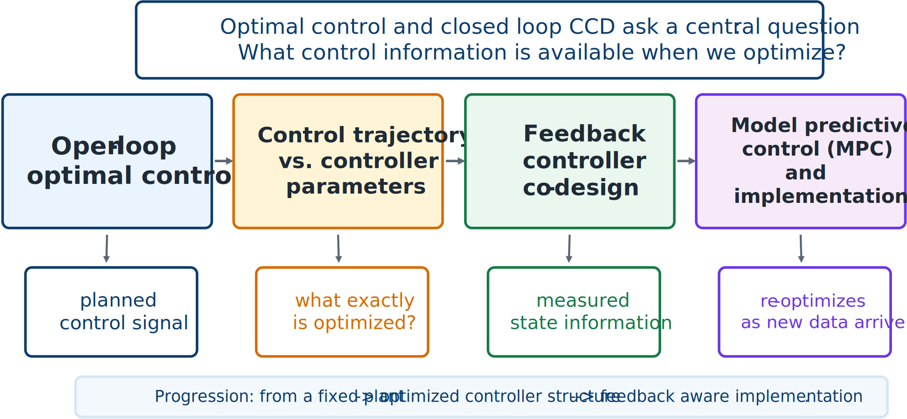

# Chapter 6: Optimal Control and Closed-Loop Control Co-Design

*From ideal control trajectories to implementable feedback policies*

> The key distinction is information: an open-loop optimizer assumes a planned future, while a closed-loop controller reacts to measurements as the future unfolds.

Previous chapters formulated CCD problems and compared solution architectures. We now ask: **What kind of control object is being optimized?**

An optimizer may choose a complete control history $\mathbf{u}(t)$ over a finite interval, as in optimal control, or choose parameters of a feedback law. The first often gives an ideal performance benchmark; the second usually yields an implementable controller. This chapter connects those viewpoints through feedback-controller co-design, information availability, and model predictive control (MPC).

*The chapter’s main thread runs from ideal open-loop optimization to implementable closed-loop control.*

## Learning objectives

After completing this chapter, you should be able to:

1. explain open-loop optimal control and its role in CCD;
2. distinguish control-trajectory and controller-parameter optimization;
3. formulate feedback-controller co-design;
4. explain the limitations of perfect future information;
5. classify information available during operation;
6. explain receding-horizon MPC; and
7. describe paths from OLOC solutions to implementable feedback controllers.