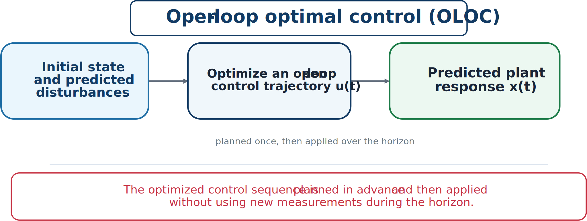

# Open-Loop Optimal Control

A **control trajectory** is a signal planned over time. A **controller** is a rule mapping available information to actions during operation. Disturbance, noise, and model uncertainty make exact future behavior unknowable, so most practical systems ultimately require feedback.

```{admonition} Main idea
:class: important
Open-loop optimal control provides useful ideal benchmarks and design insight, but engineered systems usually need feedback that responds to measured information.
```

## Basic formulation

Open-loop optimal control (OLOC) chooses $\mathbf{u}(t)$ over $t\in[t_0,t_f]$ using a model, initial condition, and assumed future information:

```{math}
\begin{aligned}
\underset{\mathbf{u}(\cdot),\mathbf{x}(\cdot)}{\text{minimize}}\quad
&J=\Phi(\mathbf{x}(t_f))+\int_{t_0}^{t_f}L(\mathbf{x}(t),\mathbf{u}(t),t)\,dt\\
\text{subject to}\quad
&\dot{\mathbf{x}}(t)=\mathbf{f}(\mathbf{x}(t),\mathbf{u}(t),t),\\
&\mathbf{x}(t_0)=\mathbf{x}_0,\\
&\mathbf{c}(\mathbf{x}(t),\mathbf{u}(t),t)\leq\mathbf{0},\\
&\mathbf{b}(\mathbf{x}(t_f))\leq\mathbf{0}.
\end{aligned}
```



*The open-loop trajectory is planned first and then applied as planned.*

OLOC can be reasonable when the horizon is short, uncertainty is small, the result is a benchmark, or the trajectory is repeatedly recomputed as in MPC.

## Role in CCD

OLOC can answer:

- What is the best achievable performance for a candidate plant under an assumed scenario?
- How much energy can ideally be extracted or saved?
- What qualitative features should control action have?
- Which plant properties make the control task easier?

For a wave-energy device, optimizing PTO force against a fixed recorded wave provides an upper-bound energy benchmark. It does not automatically produce a realizable controller, but it exposes valuable plant and control structure.
