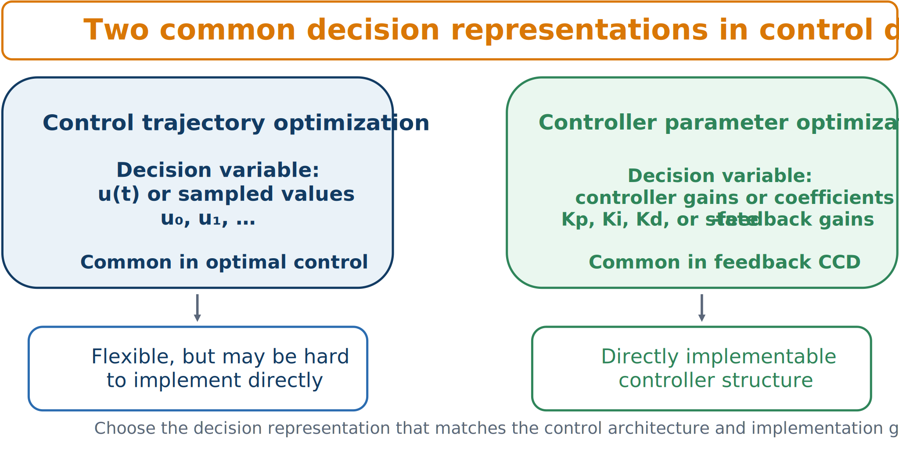

# Control Trajectories versus Controller Parameters

Two different control-related decision sets are common:

1. the time-varying signal $\mathbf{u}(t)$ or its sampled values; and
2. parameters $\mathbf{x}_c$ in a policy $\mathbf{u}=\boldsymbol{\kappa}(\mathbf{y};\mathbf{x}_c)$.



*Trajectory optimization chooses a signal; controller-parameter optimization chooses a rule that generates the signal from information.*

## Optimizing trajectories

A discretized trajectory may use decisions

```{math}
\mathbf{u}_1,\mathbf{u}_2,\ldots,\mathbf{u}_N.
```

This offers high flexibility, reveals best-case performance, and matches optimal-control theory. However, the result may be specific to one disturbance realization, difficult to implement directly, and does not itself define feedback.

## Optimizing controller parameters

Choose a realizable structure

```{math}
\mathbf{u}(t)=\boldsymbol{\kappa}(\mathbf{y}(t);\mathbf{x}_c),
```

where $\mathbf{y}(t)$ contains available measurements. Parameters may be PID gains, state-feedback gains, estimator settings, basis weights, or MPC tuning weights.

This representation is directly implementable, explicitly feedback-based, and often lower dimensional. Its limitation is structural: a restricted controller may sacrifice ideal performance, and selecting the controller architecture is itself a design decision.

## Why this matters for plant design

A plant optimized under unrestricted open-loop control may not remain best when paired with a realistic feedback structure. The control representation changes the attainable closed-loop behavior and can therefore change the optimal physical design.

:::{tip} Activity 6.1: Open-Loop versus Feedback Control Co-Design
:class: dropdown

Consider the mass-normalized system

```{math}
\dot{x}_1=x_2,
\qquad
\dot{x}_2=-kx_1-cx_2+u+d(t).
```

The plant variables are

```{math}
0.5\leq k\leq 8,
\qquad
0.1\leq c\leq 3,
```

and the actuator-capacity variable is

```{math}
0.5\leq F_{\max}\leq 5.
```

Use the feedback law

```{math}
u(t)=
\operatorname{sat}
\left(
-K_px_1(t)-K_dx_2(t),
F_{\max}
\right),
```

with

```{math}
0\leq K_p\leq 10,
\qquad
0\leq K_d\leq 8.
```

Minimize

```{math}
\begin{aligned}
J=&
\frac{1}{N_s}
\sum_{s=1}^{N_s}
\int_0^8
\left[
x_{1,s}^2
+0.1x_{2,s}^2
+0.02u_s^2
\right]dt
\nonumber\\
&+
0.01k^2
+
0.02c^2
+
0.04F_{\max}^2.
\end{aligned}
```

Use the scenarios

```{math}
\mathbf{x}_0^{(1)}=
\begin{bmatrix}
1\\
0
\end{bmatrix},
\qquad
\mathbf{x}_0^{(2)}=
\begin{bmatrix}
0.5\\
1
\end{bmatrix},
\qquad
\mathbf{x}_0^{(3)}=
\begin{bmatrix}
-1\\
0.5
\end{bmatrix},
```

with

```{math}
d_1(t)=0,
\qquad
d_2(t)=0.4\sin(2t),
\qquad
d_3(t)=0.3\sin(3t).
```

1. Derive the unsaturated closed-loop dynamics.

2. Derive the conditions on $k$, $c$, $K_p$, and $K_d$ for asymptotic stability.

3. Add the passive-safety constraint

   ```{math}
   \zeta_{\mathrm{passive}}
   =\frac{c}{2\sqrt{k}}
   \geq 0.15.
   ```

4. Optimize

   ```{math}
   k,\quad c,\quad F_{\max},\quad K_p,\quad K_d
   ```

   simultaneously.

5. For the optimized plant, solve a separate OLOC problem in GPOPS-II or Dymos for each disturbance scenario.

6. Compute the relative implementation gap

   ```{math}
   G=
   \frac{J_{\mathrm{feedback}}-J_{\mathrm{OLOC}}}
   {J_{\mathrm{OLOC}}}.
   ```

7. Explain why the plant optimized with unrestricted OLOC may differ from the plant optimized with the parameterized feedback controller.
:::
