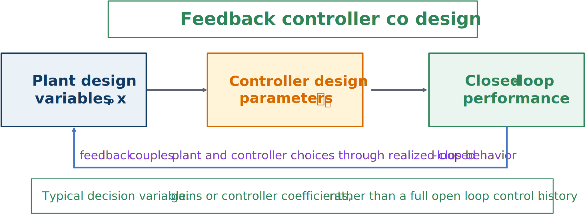

# Feedback-Controller Co-Design

Feedback-controller co-design optimizes physical variables together with parameters of a realizable feedback controller.



*Performance is assessed in closed loop under a parameterized feedback law.*

A generic formulation is

```{math}
\begin{aligned}
\underset{\mathbf{x}_p,\mathbf{x}_c}{\text{minimize}}\quad
&J(\mathbf{x}_p,\mathbf{x}_c)\\
\text{subject to}\quad
&\dot{\mathbf{x}}(t)=\mathbf{f}(\mathbf{x}(t),\mathbf{u}(t),\mathbf{x}_p,\mathbf{w}(t)),\\
&\mathbf{u}(t)=\boldsymbol{\kappa}(\mathbf{y}(t);\mathbf{x}_c),\\
&\mathbf{y}(t)=\mathbf{h}(\mathbf{x}(t),\mathbf{x}_p),\\
&\text{state, control, and design constraints.}
\end{aligned}
```

The optimizer chooses policy parameters rather than every future control value. The realized response depends on the plant, controller, disturbance, and available measurements.

## Why closed-loop co-design is more realistic

Feedback can reject disturbances, reduce sensitivity to model mismatch, and react as state deviations occur. Vehicles, robots, wind turbines, marine devices, and industrial processes therefore operate primarily in closed loop.

For a wind turbine, structural variables and pitch-controller gains can be optimized together. During operation, the controller uses measured rotor speed and other signals to respond to changing wind conditions.

:::{tip} Activity 6.2: Sensor and Output-Feedback Co-Design
:class: dropdown

Consider the stochastic plant

```{math}
\dot{\mathbf{x}}=A(p)\mathbf{x}+Bu+\mathbf{w},
```

where

```{math}
A(p)=
\begin{bmatrix}
0&1\\
-p&-0.4
\end{bmatrix},
\qquad
B=
\begin{bmatrix}
0\\
1
\end{bmatrix},
```

and $1\leq p\leq4$ is a plant-design variable.

The process-noise covariance is

```{math}
W=
\begin{bmatrix}
0&0\\
0&0.04
\end{bmatrix}.
```

Three sensor architectures are available:

```{math}
C_1=
\begin{bmatrix}
1&0
\end{bmatrix},
\qquad
V_1=0.01,
\qquad
C_{\mathrm{sensor},1}=0.20,
```

```{math}
C_2=
\begin{bmatrix}
0&1
\end{bmatrix},
\qquad
V_2=0.04,
\qquad
C_{\mathrm{sensor},2}=0.10,
```

and

```{math}
C_3=I,
\qquad
V_3=
\begin{bmatrix}
0.01&0\\
0&0.04
\end{bmatrix},
\qquad
C_{\mathrm{sensor},3}=0.35.
```

Use the control-performance weights

```{math}
Q=
\begin{bmatrix}
10&0\\
0&1
\end{bmatrix},
\qquad
R=0.2.
```

1. Compute the observability matrix for each sensor architecture and determine whether the system is observable for all feasible $p$.

2. For each value of $p$, solve the LQR algebraic Riccati equation and compute the state-feedback gain $K(p)$.

3. For each sensor architecture, solve the Kalman-filter Riccati equation

   ```{math}
   A\Sigma+\Sigma A^T-\Sigma C^TV^{-1}C\Sigma+W=0
   ```

   and compute

   ```{math}
   L=\Sigma C^TV^{-1}.
   ```

4. Construct the LQG controller

   ```{math}
   u=-K\hat{\mathbf{x}}.
   ```

5. For each sensor architecture, optimize $p$ using

   ```{math}
   J_{\mathrm{total}}
   =\mathbb{E}
   \left[
   \int_0^{20}
   \left(\mathbf{x}^TQ\mathbf{x}+Ru^2\right)dt
   \right]
   +0.03p^2+C_{\mathrm{sensor}}.
   ```

6. Estimate the expected cost using at least 200 Monte Carlo noise realizations.

7. Identify the optimal plant–sensor–controller combination.

8. Explain why the separation principle does not imply that sensor selection and plant design can be performed independently.
:::
