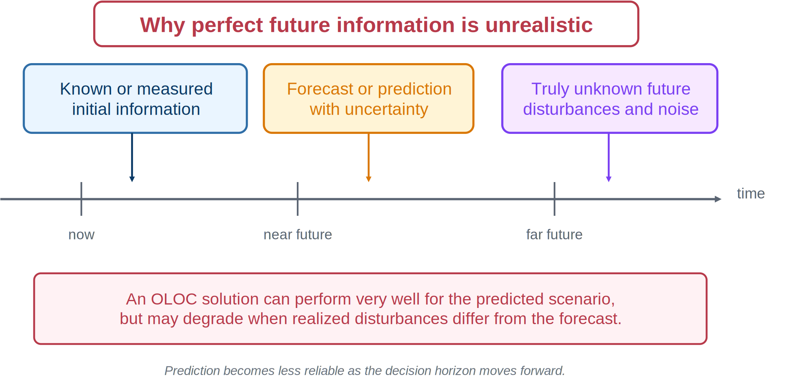
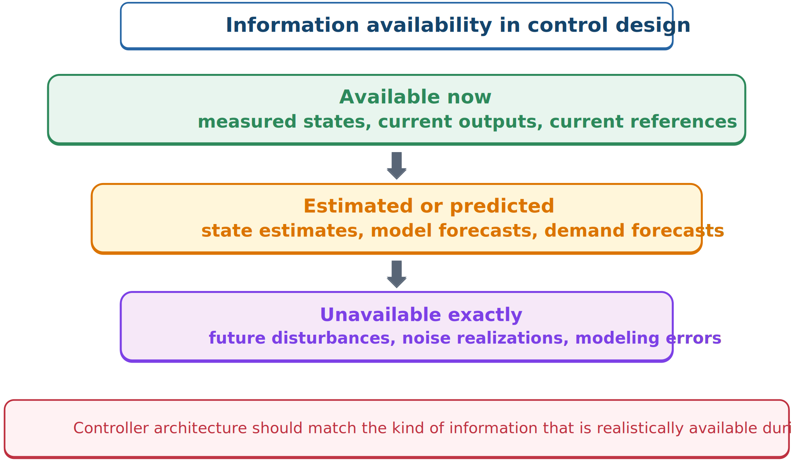

# Future Information and Information Availability

## The hidden open-loop assumption

Many OLOC studies assume an exact future disturbance or reference history: a wave record, road profile, or wind trace. This is convenient but often unrealistic.



*Perfect future information is rarely available.*

An optimizer with exact foresight may exploit details a real controller could never know. Its performance should be interpreted as an upper bound, benchmark, or source of design insight—not automatically as implementable performance.

Forecasts can still be useful. Weather forecasts, route preview, and demand prediction provide future information with uncertainty. Forecast is not certainty, and a practical controller must account for error.

## Control as an information problem

The key question is: **What information is available when an action must be chosen?**



*A controller can use only realistically measured, estimated, or predicted information.*

Three useful categories are:

1. **Available now:** current measurements, state estimates, and commands.
2. **Estimated or predicted:** observer states, previews, and uncertain forecasts.
3. **Unavailable exactly:** future disturbances, future sensor noise, and future modeling errors.

## A formal information-horizon taxonomy

A co-design framework developed for semi-active suspension design gives these three categories precise names and ties each to a recognizable class of problem:

- **Complete horizon:** the control problem—whether OLOC or a closed-loop controller—is solved with complete information about the environment (exogenous inputs, disturbances, the physical model) over the entire time horizon. This is a strong assumption, but it is standard practice in offline optimization problems such as robotic-manipulator path planning and space-shuttle reentry trajectory design, where the full mission profile is known before the trajectory is ever computed.
- **Instantaneous:** environment information is available only at the current instant. Closed-loop control for tracking and regulation is the textbook example. With only instantaneous information, achieving an acceptable level of performance over the *entire* horizon—for instance, satisfying a path constraint—can be genuinely difficult.
- **Limited horizon:** the control problem is solved for only a small portion of the horizon, and that partial solution is recomputed at regular intervals during operation. Look-ahead control of wind turbines and fuel-optimal routing of hauling trucks or railways are representative examples. This is the category MPC belongs to: it is a limited-horizon strategy that can approach the performance of a complete-horizon solution while retaining the practicality of instantaneous information, making it a genuine middle ground rather than a compromise between two unrelated extremes.

This taxonomy sharpens the three-part classification above: "available now" is instantaneous information; "estimated or predicted" is limited-horizon information, with the horizon length itself a design choice; and "unavailable exactly" is precisely what a complete-horizon OLOC study assumes away.

## Implications for CCD

Plant decisions can change information availability. Sensor placement can improve observability; mechanical redesign can make important modes easier to measure; actuator selection changes authority; robust physical design can reduce sensitivity to uncertain disturbances.

```{admonition} Important viewpoint
:class: important
A control architecture should not assume more information than the real system can obtain. Practical control selects actions from the right information set, not from impossible foresight.
```

:::{tip} Activity 6.3: Perfect-Information OLOC versus Causal Feedback
:class: dropdown

Consider

```{math}
\dot{x}(t)=-0.8x(t)+u(t)+w(t),
\qquad
x(0)=1,
\qquad
0\leq t\leq 6,
```

with

```{math}
-3\leq u(t)\leq 3.
```

The nominal disturbance is

```{math}
w_0(t)=0.4\sin(1.5t)+0.2\sin(4t).
```

Minimize

```{math}
J=
\frac{1}{2}x(6)^2
+
\frac{1}{2}
\int_0^6
\left[
x(t)^2+0.05u(t)^2
\right]dt.
```

1. Write the Hamiltonian and derive the costate equation.

2. Show that the unconstrained optimal control is

   ```{math}
   u^*(t)=-\frac{\lambda(t)}{0.05},
   ```

   and write the corresponding saturated optimal-control law.

3. State the terminal condition for the costate.

4. Solve the two-point boundary-value problem using GPOPS-II, Dymos, or a shooting method.

5. Design a finite-horizon causal LQR controller

   ```{math}
   u(t)=-K(t)x(t)
   ```

   by solving the Riccati equation backward in time.

6. Apply both controllers to the perturbed disturbance

   ```{math}
   w(t)=w_0(t)+0.15\sin(2.3t+\phi),
   ```

   for

   ```{math}
   \phi\in
   \left\{0,\frac{\pi}{2},\pi,\frac{3\pi}{2}\right\}.
   ```

7. Compare the nominal and perturbed costs. Quantify the performance advantage caused by perfect future disturbance information.
:::

:::{tip} Activity 6.4: Disturbance Preview and Information Availability
:class: dropdown

Consider the discrete-time system

```{math}
\mathbf{x}_{k+1}=A\mathbf{x}_k+Bu_k+Ew_k,
```

where

```{math}
A=
\begin{bmatrix}
1 & h\\
0 & 1
\end{bmatrix},
\qquad
B=E=
\begin{bmatrix}
h^2/2\\
h
\end{bmatrix},
\qquad
h=0.1.
```

Use the horizon $N=60$ and the objective

```{math}
J=
\mathbf{x}_N^TQ_f\mathbf{x}_N
+
\sum_{k=0}^{N-1}
\left(
\mathbf{x}_k^TQ\mathbf{x}_k
+
Ru_k^2
\right),
```

with

```{math}
Q=
\begin{bmatrix}
10&0\\
0&1
\end{bmatrix},
\qquad
Q_f=10Q,
\qquad
R=0.1.
```

The disturbance is

```{math}
w_k=
0.8\sin(0.25k)
+
0.3\sin(0.9k).
```

Assume that at time $k$, the controller knows only the next $L$ disturbance values.

1. Assume the value function has the affine-quadratic form

   ```{math}
   V_k(\mathbf{x})
   =\mathbf{x}^TP_k\mathbf{x}
   +2\mathbf{s}_k^T\mathbf{x}
   +c_k.
   ```

   Derive the dynamic-programming recursion for $P_k$, $\mathbf{s}_k$, and $c_k$.

2. Show that the optimal control has the form

   ```{math}
   u_k=-K_k\mathbf{x}_k-u_{k,\mathrm{ff}},
   ```

   where the feedforward term depends on the available disturbance preview.

3. Implement controllers for $L=0,\ 2,\ 5,\ 10,\ 20,\ 60$.

4. Plot the optimal cost as a function of preview length.

5. Compute the marginal value of preview:

   ```{math}
   \Delta J_L=J_L-J_{L+1}.
   ```

6. Determine the preview length beyond which additional information provides less than a $1\%$ improvement.

7. Explain how the optimal physical design of a suspension or energy converter could change as $L$ changes.
:::
