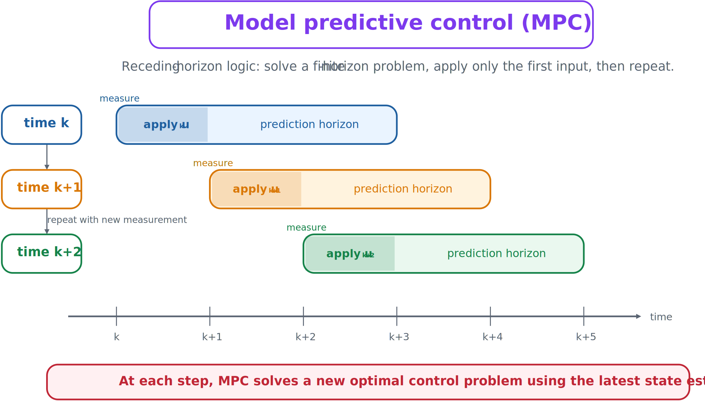

# Model Predictive Control

Model predictive control bridges optimal control and practical feedback. At each time step, MPC solves a finite-horizon problem using the current state estimate and possibly short-term forecasts. It applies only the first action, advances one step, and solves again.



*The receding-horizon strategy repeatedly updates a local open-loop plan.*

## Why MPC is feedback

Each internal optimization is open loop, but the overall controller is closed loop because every new solve uses updated measurements or estimates.

At time $k$:

1. measure or estimate $\mathbf{x}_k$;
2. solve a finite-horizon optimal-control problem;
3. obtain $\mathbf{u}_k,\ldots,\mathbf{u}_{k+N-1}$;
4. apply only $\mathbf{u}_k$; and
5. advance and repeat.

## Advantages

- Incorporates a predictive model directly.
- Handles multivariable systems naturally.
- Enforces state and input constraints.
- Updates from measurements, creating feedback.
- Can use preview and short-term forecasts.

## Limitations

- Requires online optimization.
- Depends on model quality.
- Is sensitive to horizon length and discretization.
- Can be difficult to execute in real time for fast or large systems.

## MPC in CCD

Plant design may be optimized with MPC prediction horizon, control horizon, weighting matrices, and estimator settings. This gives a more implementable closed-loop formulation than pure OLOC while retaining optimization-based constraint handling.

:::{tip} Activity 6.5: Nested Plant--MPC Co-Design
:class: dropdown

Consider the sampled system

```{math}
\mathbf{x}_{k+1}=A(k_s)\mathbf{x}_k+Bu_k+Ew_k,
```

where

```{math}
A(k_s)=
\begin{bmatrix}
1&h\\
-k_sh&1-0.4h
\end{bmatrix},
\qquad
B=E=
\begin{bmatrix}
0\\
h
\end{bmatrix},
\qquad
h=0.1.
```

The plant variables are

```{math}
0.5\leq k_s\leq5,
\qquad
0.5\leq F_{\max}\leq3.
```

At every time step, use MPC to solve

```{math}
\min_{\{u_i\}}
\sum_{i=0}^{N_p-1}
\left(
\mathbf{x}_i^TQ\mathbf{x}_i
+
Ru_i^2
\right)
+
\mathbf{x}_{N_p}^TP\mathbf{x}_{N_p},
```

subject to

```{math}
\mathbf{x}_{i+1}=A(k_s)\mathbf{x}_i+Bu_i,
```

and

```{math}
|u_i|\leq F_{\max},
\qquad
|x_{1,i}|\leq1.
```

Use

```{math}
Q=
\begin{bmatrix}
10&0\\
0&1
\end{bmatrix},
\qquad
R=0.05.
```

1. Derive the condensed prediction equation

   ```{math}
   \mathbf{X}=\mathcal{A}\mathbf{x}_k+\mathcal{B}\mathbf{U}.
   ```

2. Write the MPC problem as a quadratic program

   ```{math}
   \min_{\mathbf{U}}
   \frac{1}{2}\mathbf{U}^TH\mathbf{U}
   +\mathbf{f}^T\mathbf{U}.
   ```

3. Implement a nested CCD architecture in which the outer optimization chooses $k_s$ and $F_{\max}$, while the inner problem performs closed-loop MPC simulation.

4. Use prediction horizons $N_p=5,\ 10,\ 20,\ 40$.

5. Minimize

   ```{math}
   J_{\mathrm{CCD}}
   =\sum_{k=0}^{100}
   \left(\mathbf{x}_k^TQ\mathbf{x}_k+Ru_k^2\right)
   +0.02k_s^2+0.05F_{\max}^2.
   ```

6. Compare the optimal plant for each prediction horizon.

7. Compare the MPC result with a full-horizon OLOC solution obtained using GPOPS-II or Dymos.

8. Introduce a $20\%$ stiffness-model error and determine whether recursive feasibility is maintained.

9. Explain why prediction horizon should be regarded as a control-design variable in CCD.
:::
