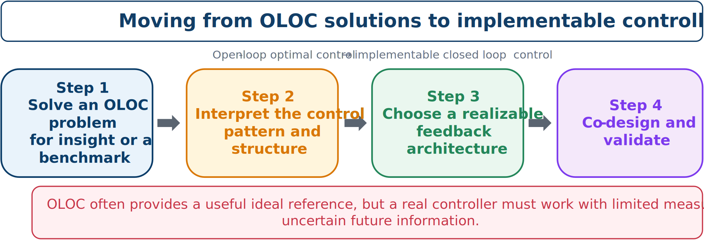

# From OLOC to Implementable Control

A productive development path is:

1. solve an ideal OLOC problem;
2. study its control patterns and performance;
3. choose a realizable controller structure that captures the important behavior; and
4. co-design the plant with that implementable controller.



*An ideal trajectory can guide—but should not be confused with—the final controller.*

## What OLOC can teach us

An optimal trajectory can reveal:

- when control action should be active;
- whether it behaves like stiffness, damping, or phase lead;
- required control bandwidth and authority; and
- which physical plant properties are most valuable.

## Typical transitions

- OLOC $\rightarrow$ PID or gain-scheduled feedback.
- OLOC $\rightarrow$ LQR or state feedback.
- OLOC $\rightarrow$ MPC.
- OLOC $\rightarrow$ a rule-based controller informed by optimal behavior.
- OLOC $\rightarrow$ a parameterized policy fitted to optimal trajectories.

OLOC remains valuable because it supplies a best-case reference, explains ideal behavior, benchmarks practical controllers, and helps separate plant limitations from controller limitations. It is often best treated as an intermediate design-analysis tool.

:::{tip} Activity 6.6: Converting an OLOC Trajectory into TVLQR Feedback
:class: dropdown

Consider a torque-controlled pendulum. Let $\theta=0$ denote the upright position and $\theta=\pi$ the downward position.

The dynamics are

```{math}
\dot{\theta}=\omega,
\qquad
\dot{\omega}
=\frac{g}{l}\sin\theta
-\frac{b}{ml^2}\omega
+\frac{1}{ml^2}u.
```

Use

```{math}
m=1\ \mathrm{kg},
\qquad
l=1\ \mathrm{m},
\qquad
b=0.05\ \mathrm{N\,m\,s},
```

and

```{math}
g=9.81\ \mathrm{m/s^2},
\qquad
|u(t)|\leq8\ \mathrm{N\,m}.
```

The boundary conditions are

```{math}
\mathbf{x}(0)=
\begin{bmatrix}
\pi\\
0
\end{bmatrix},
\qquad
\mathbf{x}(4)=
\begin{bmatrix}
0\\
0
\end{bmatrix}.
```

Minimize

```{math}
J=
\int_0^4
\left(
0.001\omega(t)^2
+
0.01u(t)^2
\right)dt.
```

1. Solve the swing-up OLOC problem using GPOPS-II or Dymos.

2. Denote the optimal trajectory by

   ```{math}
   \mathbf{x}^*(t),
   \qquad
   u^*(t).
   ```

   Linearize the dynamics along the optimal trajectory and show that

   ```{math}
   A(t)=
   \begin{bmatrix}
   0&1\\
   \dfrac{g}{l}\cos\theta^*(t)&-\dfrac{b}{ml^2}
   \end{bmatrix},
   \qquad
   B(t)=
   \begin{bmatrix}
   0\\
   \dfrac{1}{ml^2}
   \end{bmatrix}.
   ```

3. Solve the time-varying Riccati equation

   ```{math}
   -\dot{S}=A^TS+SA-SBR^{-1}B^TS+Q,
   ```

   with terminal condition

   ```{math}
   S(4)=Q_f.
   ```

4. Implement the trajectory-tracking controller

   ```{math}
   u(t)=
   \operatorname{sat}
   \left[
   u^*(t)
   -R^{-1}B(t)^TS(t)
   \left(\mathbf{x}(t)-\mathbf{x}^*(t)\right)
   \right].
   ```

5. Compare pure open-loop implementation and TVLQR feedback for the perturbed initial conditions

   ```{math}
   \theta(0)=\pi+\Delta\theta,
   \qquad
   \Delta\theta\in\{-0.15,-0.10,0.10,0.15\}.
   ```

6. Repeat with

   ```{math}
   10\%\ \text{error in }m,
   \qquad
   10\%\ \text{error in }l,
   ```

   and additive measurement noise.

7. Report

   ```{math}
   \|\mathbf{x}(4)\|_2,
   \qquad
   \max_t|u(t)|,
   \qquad
   J.
   ```

8. Determine the largest initial perturbation for which the TVLQR controller successfully reaches the upright neighborhood

   ```{math}
   |\theta(4)|\leq0.05,
   \qquad
   |\omega(4)|\leq0.1.
   ```

9. Explain why the OLOC trajectory remains valuable even though it is not robust enough for direct implementation.
:::
