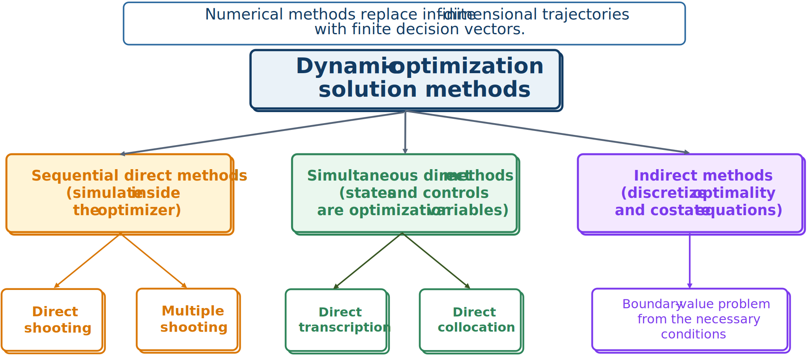
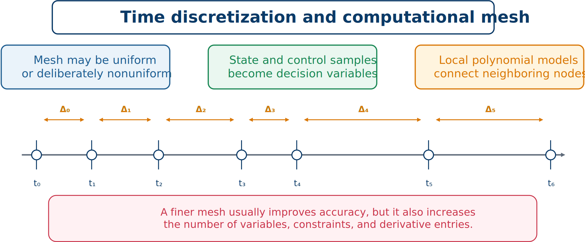

# From Continuous CCD to a Computable Problem

A continuous finite-horizon CCD formulation has finite plant and controller parameters but functional state and control decisions. Numerical approximation produces

```{math}
\begin{aligned}
\underset{\mathbf{z}\in\mathbb{R}^{n_z}}{\text{minimize}}\quad &F(\mathbf{z})\\
\text{subject to}\quad &\mathbf{g}_e(\mathbf{z})=\mathbf{0},\\
&\mathbf{g}_i(\mathbf{z})\leq\mathbf{0},\\
&\mathbf{z}^L\leq\mathbf{z}\leq\mathbf{z}^U,
\end{aligned}
```

where $\mathbf{z}$ includes sampled states and controls plus plant and controller variables.



*The numerical-method landscape for dynamic optimization.*

**Indirect methods** derive costate, stationarity, and transversality conditions and solve a boundary-value problem. They can be accurate and theoretically revealing, but costate initialization and active path constraints are difficult.

**Direct methods** parameterize controls, states, or both and solve an NLP. They are usually more robust for engineering problems with bounds, path constraints, black-box components, and plant–control coupling.

In **sequential direct methods**, a simulator computes states from optimized controls and parameters. In **simultaneous direct methods**, state samples are also decision variables and algebraic defects enforce the dynamics.

```{admonition} Terminology warning
:class: important
Sequential and simultaneous numerical methods describe how dynamic equations are solved. They are different from sequential and simultaneous CCD architectures, which describe how plant and controller decisions are coordinated.
```

## Time discretization

Choose a mesh

```{math}
t_0<t_1<\cdots<t_N=t_f,
\qquad h_k=t_{k+1}-t_k,
```

and define $\mathbf{x}_k\approx\mathbf{x}(t_k)$ and $\mathbf{u}_k\approx\mathbf{u}(t_k)$.



*The mesh converts continuous trajectories into finite samples and local approximations.*

For $n_x$ states and $n_u$ controls, node variables contribute approximately $(N+1)(n_x+n_u)$ scalars.

Uniform meshes suit smooth behavior. Nonuniform meshes place points near transients, switching, active-set changes, impacts, or boundary layers. The mesh must resolve the physics, not merely divide the horizon conveniently.

Local representations use piecewise-constant, piecewise-linear, trapezoidal, or Hermite–Simpson polynomials. Global or pseudospectral methods use high-order Legendre or Chebyshev approximations. Local methods refine naturally near nonsmooth behavior; global methods can converge very rapidly for smooth solutions.

Common control representations are piecewise constant, piecewise linear, and basis expansions. The choice should match actuator physics and the selected integration scheme.
