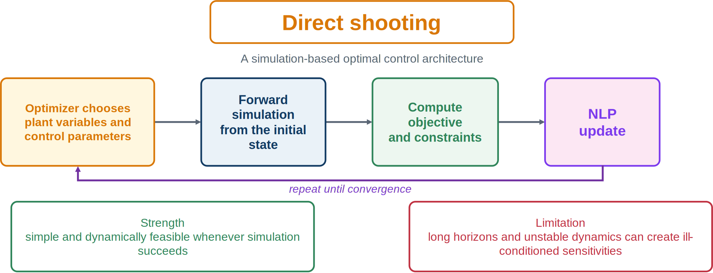
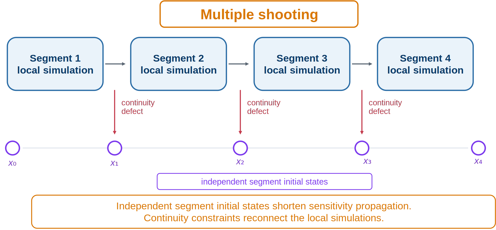

# Direct and Multiple Shooting

## Direct shooting

Parameterize control as $\mathbf{u}(t;\mathbf{q})$. The optimizer selects $\mathbf{q}$ and design variables; a forward integrator simulates the dynamics and returns objective and constraint values.



*Direct shooting embeds a full forward simulation in every optimization evaluation.*

Advantages include simple simulator integration, automatically integrated states, relatively few NLP variables, and reuse of mature ODE/DAE solvers.

Its main weakness is long-range sensitivity. If

```{math}
\mathbf{S}(t)=\frac{\partial\mathbf{x}(t)}{\partial\mathbf{q}},
```

then

```{math}
\dot{\mathbf{S}}=\mathbf{f}_x\mathbf{S}+\mathbf{f}_u\frac{\partial\mathbf{u}}{\partial\mathbf{q}},
\qquad\mathbf{S}(t_0)=\mathbf{0}.
```

For unstable or long-horizon systems, sensitivities may grow or decay severely, making terminal and path constraints difficult. Shooting is most suitable for stable systems, short horizons, low-dimensional controls, and moderate terminal requirements.

```{admonition} Numerical warning
:class: warning
Accurate forward simulation does not imply a well-conditioned optimization problem.
```

## Multiple shooting

Multiple shooting splits the horizon into segments with independent initial-state decisions $\mathbf{X}_k$.



*Short local simulations limit sensitivity propagation.*

Let $\boldsymbol{\Phi}_k(\mathbf{X}_k,\mathbf{q}_k,\mathbf{x}_p,\mathbf{x}_c)$ be the simulated endpoint of segment $k$. Continuity requires

```{math}
\mathbf{r}_k=\mathbf{X}_{k+1}-\boldsymbol{\Phi}_k(\mathbf{X}_k,\mathbf{q}_k,\mathbf{x}_p,\mathbf{x}_c)=\mathbf{0}.
```

Multiple shooting handles unstable dynamics and tight terminal constraints better, permits internal state guesses, and produces sparse continuity Jacobians. It adds state variables, constraints, and several local simulations. It lies between single shooting and direct transcription: integration remains inside each segment, while algebraic continuity reconnects the horizon.

:::{tip} Activity 7.1: Multiple Shooting versus Direct Collocation for an Unstable System
:class: dropdown

Consider

```{math}
\dot{\mathbf{x}}=
\begin{bmatrix}
0 & 1\\
4 & 0
\end{bmatrix}
\mathbf{x}
+
\begin{bmatrix}
0\\
1
\end{bmatrix}u,
```

with

```{math}
\mathbf{x}(0)=
\begin{bmatrix}
1\\
0
\end{bmatrix},
\qquad
\mathbf{x}(3)=
\begin{bmatrix}
0\\
0
\end{bmatrix}.
```

Minimize

```{math}
J=\int_0^3\left(\mathbf{x}^{T}\mathbf{x}+0.05u^2\right)\,dt,
\qquad
|u|\leq 5.
```

1. Derive the exact state-transition equation over one shooting interval:

   ```{math}
   \mathbf{x}_{i+1}
   =e^{A\Delta t}\mathbf{x}_i
   +\int_0^{\Delta t}e^{A(\Delta t-\tau)}B\,u_i\,d\tau.
   ```

2. Formulate a 10-segment multiple-shooting nonlinear program with piecewise-constant control.
3. Formulate a Hermite--Simpson transcription using 30 intervals.
4. Solve both formulations.
5. Compare Jacobian sparsity, condition number, optimizer iterations, and sensitivity to initial guesses.
6. Explain why direct single shooting performs poorly for this unstable system.
:::


:::{tip} Activity 7.2: Hypersensitive Optimal-Control Problem
:class: dropdown

Consider

```{math}
\dot{x}=-x^3+u,
```

with

```{math}
x(0)=1,
\qquad
x(T)=1.5,
\qquad
T=50.
```

Minimize

```{math}
J=\frac{1}{2}\int_0^T\left(x^2+u^2\right)\,dt.
```

1. Solve the problem using direct single shooting.
2. Solve it using multiple shooting with 5, 10, and 20 segments.
3. Solve it using GPOPS-II or Dymos with an adaptive collocation mesh.
4. Plot the state and control near:

   1. the initial boundary layer;
   2. the long interior arc; and
   3. the terminal boundary layer.

5. Compare the methods in terms of:

   1. convergence;
   2. sensitivity to the initial guess;
   3. Jacobian conditioning;
   4. mesh size; and
   5. computation time.

6. Independently integrate the collocation solution and report

   ```{math}
   e_x=
   \max_t
   \left|
   x_{\mathrm{collocation}}(t)
   -x_{\mathrm{verification}}(t)
   \right|.
   ```

7. Explain why this problem is difficult for single shooting even though it contains only one state.
:::
