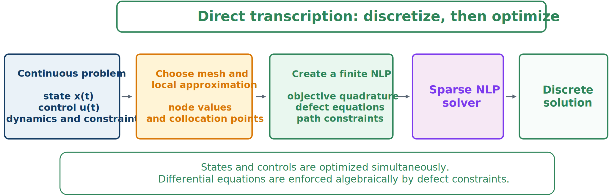

# Direct Transcription

Direct transcription treats state and control samples as optimization variables and replaces differential equations with algebraic defects.



*Discretize first, then optimize all trajectory and design variables together.*

A time-ordered decision vector may be

```{math}
\mathbf{z}=[\mathbf{x}_p,\mathbf{x}_c,\mathbf{x}_0,\mathbf{u}_0,\ldots,\mathbf{x}_N,\mathbf{u}_N]^T.
```

A generic transcription is

```{math}
\begin{aligned}
\underset{\mathbf{z}}{\text{minimize}}\quad
&\widehat{\Phi}(\mathbf{z})+\sum_{k=0}^Nw_kL(\mathbf{x}_k,\mathbf{u}_k,\mathbf{x}_p,\mathbf{x}_c,t_k)\\
\text{subject to}\quad
&\boldsymbol{\zeta}_k(\mathbf{x}_k,\mathbf{u}_k,\mathbf{x}_{k+1},\mathbf{u}_{k+1},\mathbf{x}_p,\mathbf{x}_c)=\mathbf{0},\\
&\mathbf{c}(\mathbf{x}_k,\mathbf{u}_k,\mathbf{x}_p,\mathbf{x}_c,t_k)\leq\mathbf{0},\\
&\mathbf{b}(\mathbf{x}_0,\mathbf{x}_N,\mathbf{x}_p,\mathbf{x}_c)=\mathbf{0},\\
&\mathbf{z}^L\leq\mathbf{z}\leq\mathbf{z}^U.
\end{aligned}
```

Direct transcription is valuable for CCD because it handles nonlinear plant-dependent dynamics, unstable systems, strong coupling, state/control path limits, and terminal constraints while exposing local sparsity.

:::{tip} Activity 7.3: Plant and Actuator Co-Design of a Dynamic System
:class: dropdown

Consider

```{math}
\dot{x}_1=x_2,
\qquad
m\dot{x}_2=-kx_1-cx_2+u,
```

where $m=1$ and $c=0.5$. The spring stiffness $k$ and actuator capacity $F_{\max}$ are plant-design variables:

```{math}
0.5\leq k\leq 8,
\qquad
0.2\leq F_{\max}\leq 5.
```

The control satisfies

```{math}
|u(t)|\leq F_{\max}.
```

Use

```{math}
\mathbf{x}(0)=
\begin{bmatrix}
1\\
0
\end{bmatrix},
\qquad
\mathbf{x}(t_f)=
\begin{bmatrix}
0\\
0
\end{bmatrix},
\qquad
t_f=4.
```

Minimize

```{math}
J=
\int_0^{t_f}
\left(x_1^2+0.1x_2^2+0.01u^2\right)\,dt
+0.03F_{\max}^2
+0.002k^2.
```

1. Nondimensionalize the states, control, time, and design variables.
2. Formulate the simultaneous direct-collocation problem.
3. Solve the problem using GPOPS-II or Dymos.
4. Determine whether the actuator constraint is active.
5. Repeat the solution after multiplying the $F_{\max}^2$ penalty by $0.1$, $1$, and $10$.
6. Explain how the actuator-cost weight changes both $k^*$ and $F_{\max}^*$.
:::
