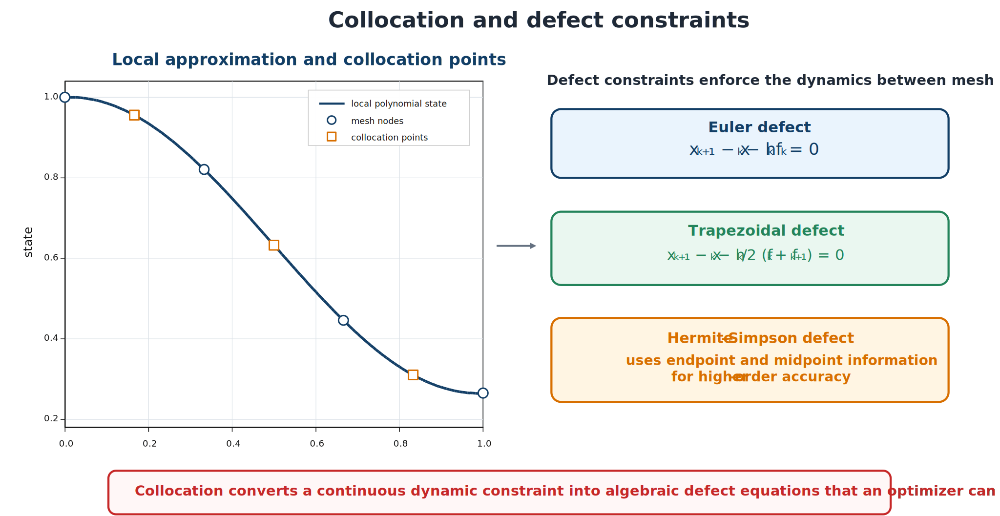

# Collocation and Defect Constraints

A **defect** measures disagreement between discrete state variables and the state change predicted by the dynamics. Zero defect means local dynamic consistency under the chosen approximation.



*Higher-order schemes use more information within each interval.*

## Euler forward

```{math}
\boldsymbol{\zeta}_k^{\mathrm{EF}}=
\mathbf{x}_{k+1}-\mathbf{x}_k-h_k\mathbf{f}_k=\mathbf{0}.
```

Euler forward is globally first order and typically needs a fine mesh.

## Trapezoidal rule

```{math}
\boldsymbol{\zeta}_k^{\mathrm{TR}}=
\mathbf{x}_{k+1}-\mathbf{x}_k-\frac{h_k}{2}(\mathbf{f}_k+\mathbf{f}_{k+1})=\mathbf{0}.
```

It is globally second order and implicit. Implicitness is natural in transcription because the NLP solver determines states and defects together.

## Hermite–Simpson

Define

```{math}
\mathbf{x}_{k+1/2}=\frac{\mathbf{x}_k+\mathbf{x}_{k+1}}{2}
+\frac{h_k}{8}(\mathbf{f}_k-\mathbf{f}_{k+1}),
\qquad
\mathbf{u}_{k+1/2}=\frac{\mathbf{u}_k+\mathbf{u}_{k+1}}{2}.
```

Then

```{math}
\boldsymbol{\zeta}_k^{\mathrm{HS}}=
\mathbf{x}_{k+1}-\mathbf{x}_k-
\frac{h_k}{6}(\mathbf{f}_k+4\mathbf{f}_{k+1/2}+\mathbf{f}_{k+1})=\mathbf{0}.
```

Hermite–Simpson offers high accuracy, local sparsity, and moderate implementation complexity.

## Zero-order-hold and higher-order single-step defects

For linear time-invariant dynamics $\dot{\mathbf{x}}=A\mathbf{x}+B\mathbf{u}$ with piecewise-constant control on an interval, the defect can be made exact rather than approximate using the matrix exponential:

```{math}
\boldsymbol{\zeta}_k^{\mathrm{ZOH}}=
\mathbf{x}_{k+1}-e^{Ah_k}\mathbf{x}_k-
\left(\int_0^{h_k}e^{A(h_k-\tau)}\,d\tau\right)B\mathbf{u}_k=\mathbf{0}.
```

This zero-order-hold defect introduces no truncation error for the assumed control interpolation, at the cost of a matrix exponential per interval and the loss of exactness once the dynamics become nonlinear or plant-parameter-dependent. Runge–Kutta families such as the classical fourth-order method extend the single-step idea to nonlinear dynamics by combining several interior stage evaluations per interval, trading additional function evaluations for higher order than Euler forward or the trapezoidal rule.

## Pseudospectral collocation and the differentiation matrix

Pseudospectral methods approximate the state on an interval with a single global Lagrange interpolating polynomial through $N$ collocation points and enforce the dynamics at those points using a **differentiation matrix** $D$, where differentiating the interpolant and evaluating at the collocation points gives $\dot{\mathbf{x}}(\tau_k)\approx\sum_jD_{kj}\mathbf{x}_j$. Three families of collocation points are in common use, each built from roots of Legendre polynomials: **Legendre–Gauss (LG)** points (both endpoints excluded), **Legendre–Gauss–Radau (LGR)** points (one endpoint included), and **Legendre–Gauss–Lobatto (LGL)** points (both endpoints included).

The three schemes are not merely cosmetic variations. The LG and LGR differentiation matrices are rectangular and full rank, so the collocated dynamics $D\mathbf{X}=\mathbf{F}$ can be rewritten equivalently in an integral form using a corresponding integration matrix — the differential and integral transcriptions agree exactly. The LGL differentiation matrix, in contrast, is square but **singular**.

This rank deficiency is not just a numerical curiosity: it propagates into the discrete costate (adjoint) system obtained from the Karush–Kuhn–Tucker conditions of the collocated NLP. Because the transformed adjoint systems for LG and LGR collocation inherit the full-rank differentiation matrix, they are themselves full rank and determine a unique discrete costate. The LGL transformed adjoint system inherits the singular differentiation matrix, so its costate equations possess a nontrivial null space; the recovered LGL costate approximation can oscillate around the true continuous costate even while the state and control trajectories converge normally. This defect is specific to LGL collocation — it does not occur with LG or LGR — and has been demonstrated by direct comparison against a known analytic costate on a benchmark problem.

```{admonition} Practical implication
:class: tip
If a CCD study needs a trustworthy costate or adjoint sensitivity (for example, to cross-check stationarity against an indirect formulation), prefer LG or LGR collocation over LGL. An oscillatory LGL costate does not necessarily mean the state and control solution is wrong — but it does mean the costate cannot be read off directly.
```

They can converge very rapidly for smooth trajectories but need multiple intervals or adaptation near discontinuities, and production transcription software typically varies both the number of intervals and the polynomial degree per interval to reach a target accuracy (see the next section).

| Feature | Local collocation | Global/pseudospectral |
| --- | --- | --- |
| Approximation | Low order per interval | High order over large intervals |
| Sparsity | Strong local bands | Denser within each polynomial interval |
| Smooth solutions | Algebraic mesh convergence | Potentially spectral convergence |
| Nonsmooth solutions | Local refinement | Multiple intervals or adaptation |
| Implementation | Relatively direct | Specialized matrices and quadrature |
