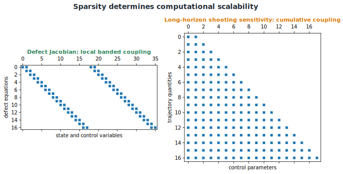

# Quadrature, Path Constraints, and Sparse NLPs

## Objective quadrature

The running cost must be discretized consistently with the trajectory approximation:

```{math}
\begin{aligned}
\text{rectangle:}\quad &\int_{t_k}^{t_{k+1}}L\,dt\approx h_kL_k,\\
\text{trapezoidal:}\quad &\int_{t_k}^{t_{k+1}}L\,dt\approx\frac{h_k}{2}(L_k+L_{k+1}),\\
\text{Simpson:}\quad &\int_{t_k}^{t_{k+1}}L\,dt\approx\frac{h_k}{6}(L_k+4L_{k+1/2}+L_{k+1}).
\end{aligned}
```

A low-order quadrature rule can limit the accuracy of an otherwise high-order transcription.

## Path constraints between nodes

Imposing $\mathbf{c}(\mathbf{x}_k,\mathbf{u}_k,\ldots)\leq\mathbf{0}$ only at nodes does not guarantee continuous feasibility. Reconstructed trajectories can overshoot. Remedies include dense-grid verification, extra enforcement points, margins, local refinement, and interpolation-error estimates.

Boundary constraints depend on selected endpoint nodes and do not create the same between-node issue.

## Why large NLPs remain manageable

A problem with 30 states, 10 controls, and 500 intervals has about 20,040 trajectory variables. Dimension alone is not decisive; **sparsity** is.

A local defect depends mainly on $\mathbf{x}_k$, $\mathbf{u}_k$, $\mathbf{x}_{k+1}$, $\mathbf{u}_{k+1}$, and global design variables. Its Jacobian touches only a small portion of the decision vector.



*Local time dependence produces exploitable sparse structure.*

Sparse SQP and interior-point solvers benefit from exact sparsity patterns, sparse derivatives, scaled variables and constraints, and bounds separated from general constraints.

Decision-vector ordering changes fill-in in the solver’s linear systems. Condensing can eliminate states, reducing dimension but potentially destroying sparsity. Partial condensing balances these effects.

## Where plant design variables live in the NLP

A production multi-phase transcription typically separates the decision vector into phase-dependent blocks — the state, control, and integral values on the mesh of each phase — and an explicit vector of **static parameters**: time-independent quantities that do not vary along the trajectory. Concretely, a widely used transcription formulation stacks the decision vector as the phase blocks followed by the static parameters appended at the end, with dedicated bounds and constraints on the static-parameter block alone.

This static-parameter vector is precisely the mechanism through which plant-design variables enter an off-the-shelf transcription code: a plant parameter such as a stiffness, mass, or gain is declared as a static parameter, and the dynamics, path constraints, and objective at every collocation point in every phase are then allowed to depend on it. Because a static parameter can affect the residual at every mesh point, its column in the constraint Jacobian is **dense** even though the state and control columns remain locally banded — the same structural asymmetry noted for the design-parameter column $p$ in the Hermite–Simpson Jacobian activity later in this chapter. The composite defect Jacobian is therefore block-diagonal (or block-banded) in the trajectory variables, with a small number of dense columns appended for the static parameters.

## Automated generation of the sparse NLP or QP

For the sizable subclass of CCD subproblems with linear dynamics and a quadratic objective — the case that recurs whenever an inner-loop or nested CCD architecture repeatedly re-solves a control subproblem for a fixed plant design — every matrix in the transcribed problem is a constant (state-, control-, and parameter-independent) sparse matrix. In that case the sparse Hessian and constraint Jacobian blocks can be assembled directly from the problem's symbolic structure, without any finite-differencing or automatic differentiation: each objective term, defect constraint, or path constraint contributes a known sparse block (banded for single-step defects such as Euler forward, trapezoidal, or Hermite–Simpson; block-structured for pseudospectral defects built from a differentiation matrix), and an automated procedure can assemble these blocks by row/column bookkeeping alone. This is attractive for nested CCD, where the inner control-design QP is solved many times per outer plant-design iteration and assembly overhead matters.
