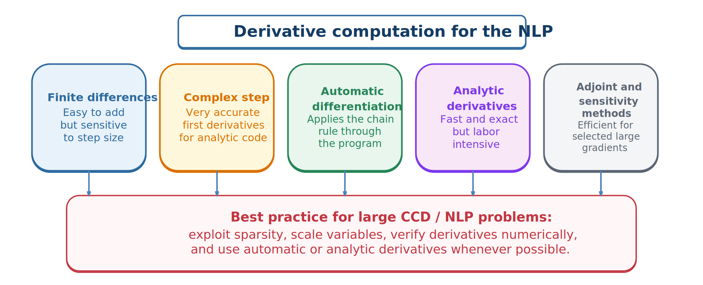

# Derivative Computation

Large CCD problems typically require gradient-based optimization: objective gradients, constraint Jacobians, and sometimes Lagrangian Hessians.



*Major derivative-computation options for nonlinear programming.*

## Finite differences

```{math}
\frac{\partial F}{\partial z_i}\approx\frac{F(\mathbf{z}+h\mathbf{e}_i)-F(\mathbf{z})}{h}
```

is easy to implement but balances truncation against cancellation and may require one evaluation per column. Sparse coloring perturbs structurally independent columns together.

## Complex-step differentiation

For analytic code,

```{math}
\frac{\partial F}{\partial z_i}\approx
\frac{\operatorname{Im}F(\mathbf{z}+ih\mathbf{e}_i)}{h}.
```

It avoids subtractive cancellation and is excellent for verification, provided complex numbers propagate correctly and nonanalytic operations are avoided.

## Analytic derivatives

For a trapezoidal defect,

```{math}
\boldsymbol{\zeta}_k=\mathbf{x}_{k+1}-\mathbf{x}_k-\frac{h_k}{2}(\mathbf{f}_k+\mathbf{f}_{k+1}),
```

representative blocks are

```{math}
\frac{\partial\boldsymbol{\zeta}_k}{\partial\mathbf{x}_k}=-I-\frac{h_k}{2}\mathbf{f}_{x,k},
\quad
\frac{\partial\boldsymbol{\zeta}_k}{\partial\mathbf{x}_{k+1}}=I-\frac{h_k}{2}\mathbf{f}_{x,k+1},
```

with analogous control blocks. These formulas expose local sparsity directly.

## Automatic differentiation and sensitivities

Automatic differentiation applies the chain rule to code and can provide machine-precision sparse Jacobians and Hessians. Forward mode suits few independent variables; reverse mode suits scalar outputs with many inputs.

Shooting derivatives often use direct or adjoint sensitivities. Direct sensitivities propagate one system per parameter; adjoints can be efficient for many parameters and few scalar outputs.

## Verification

Compare implemented derivatives against complex step or careful finite differences at random points. A normalized discrepancy is

```{math}
E_D=\frac{\|\mathbf{d}_{\mathrm{implemented}}-\mathbf{d}_{\mathrm{reference}}\|_2}
{\max(1,\|\mathbf{d}_{\mathrm{reference}}\|_2)}.
```

Derivative errors can cause slow convergence, false convergence, or convergence to the wrong point.

:::{tip} Activity 7.4: Analytical Hermite--Simpson Jacobian
:class: dropdown

Consider the nonlinear, parameter-dependent system

```{math}
\dot{x}_1=x_2,
\qquad
\dot{x}_2=-p\sin x_1+u,
```

where $p$ is a plant-design variable. For interval $i$, define

```{math}
\mathbf{f}_i=\mathbf{f}(\mathbf{x}_i,u_i,p),
\qquad
\mathbf{f}_{i+1}=\mathbf{f}(\mathbf{x}_{i+1},u_{i+1},p),
```

and

```{math}
\mathbf{x}_{i+1/2}
=\frac{\mathbf{x}_i+\mathbf{x}_{i+1}}{2}
+\frac{h_i}{8}\left(\mathbf{f}_i-\mathbf{f}_{i+1}\right).
```

The Hermite--Simpson defect is

```{math}
\mathbf{d}_i
=\mathbf{x}_{i+1}-\mathbf{x}_i
-\frac{h_i}{6}
\left(\mathbf{f}_i+4\mathbf{f}_{i+1/2}+\mathbf{f}_{i+1}\right).
```

1. Derive

   ```{math}
   \frac{\partial\mathbf{d}_i}{\partial\mathbf{x}_i},
   \qquad
   \frac{\partial\mathbf{d}_i}{\partial\mathbf{x}_{i+1}},
   \qquad
   \frac{\partial\mathbf{d}_i}{\partial u_i},
   \qquad
   \frac{\partial\mathbf{d}_i}{\partial u_{i+1}},
   \qquad
   \frac{\partial\mathbf{d}_i}{\partial p}.
   ```

2. Assemble the Jacobian sparsity pattern for $N$ intervals.
3. Determine the exact number of nonzero entries.
4. Explain why the column associated with $p$ is globally dense while the state and control blocks remain locally sparse.
5. Verify the analytical Jacobian using complex-step differentiation.
:::


:::{tip} Activity 7.5: Derivative Verification for a Shooting Formulation
:class: dropdown

Consider

```{math}
\dot{x}=-x^3+u,
\qquad
x(0)=1,
\qquad
0\leq t\leq 2.
```

Parameterize $u(t)$ using $N=20$ piecewise-constant values:

```{math}
\mathbf{U}=
\begin{bmatrix}
u_0 & u_1 & \cdots & u_{19}
\end{bmatrix}^{T}.
```

Minimize

```{math}
J(\mathbf{U})=x(2)^2+0.05\int_0^2u(t)^2\,dt.
```

1. Derive the forward-sensitivity equations

   ```{math}
   \frac{d}{dt}\left(\frac{\partial x}{\partial u_j}\right)
   =-3x^2\frac{\partial x}{\partial u_j}
   +\frac{\partial u}{\partial u_j}.
   ```

2. Derive the gradient $\nabla_{\mathbf{U}}J$.
3. Compute the gradient using:

   1. forward finite differences;
   2. central finite differences;
   3. complex-step differentiation; and
   4. sensitivity equations or automatic differentiation.

4. Perform a directional-derivative test using a random normalized vector $\mathbf{p}$.
5. Plot derivative error for step sizes from $10^{-2}$ to $10^{-14}$.
6. Explain the truncation-error and cancellation-error regions in the resulting plot.
:::
