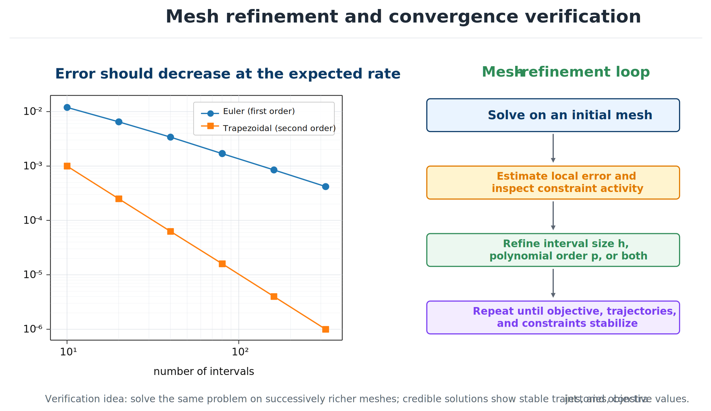

# Scaling, Refinement, and Verification

## Scaling and initialization

Use scaled variables and residuals,

```{math}
\widehat{z}_i=\frac{z_i-z_i^{\mathrm{ref}}}{s_i},
\qquad
\widehat{g}_j=\frac{g_j}{r_j},
```

so typical magnitudes are comparable. Dynamic defects need state-specific scales because position, velocity, temperature, and rotation have different units.

Useful initial guesses come from baseline simulation, simple boundary interpolation, known operating controls, simplified problems, and nearby parameter cases. Continuation gradually tightens constraints, increases disturbances, activates nonlinear physics, reduces regularization, or refines the mesh while warm-starting from the previous solution.

```{admonition} Why scaling changes what "feasible" means
:class: warning
Consider the scalar linear system $\dot y=ay$, $y(0)=y_0$, discretized with a trapezoidal defect. Most NLP solvers accept an equality defect once its *absolute* value falls within a solver tolerance $\epsilon$ (a common default is $\epsilon=10^{-6}$). Because the defect is linear in $y$, the *relative* error that this absolute tolerance permits scales with $1/y_0$: for a state with $y_0=10^{-6}$, a defect within $\epsilon$ can correspond to a relative error of order unity, while rescaling $y$ to unit initial magnitude drives the same absolute tolerance down to a relative error of order $\epsilon$. Two systems that are mathematically equivalent up to a change of units can therefore behave completely differently under the same solver settings — scaling state, control, and time to be $O(1)$ is what makes the solver's tolerance mean what it appears to mean.
```

A practical automatic-scaling recipe applies an affine map to each variable so that it lies in a fixed reference interval (for example $[-1/2,1/2]$), then scales each constraint by approximately the reciprocal of its gradient norm sampled at a few candidate points, so that both the scaled variables and the scaled Jacobian entries are $O(1)$ before the NLP solver ever sees them. Defect constraints inherit the scale factor of the state they enforce, so that dynamic consistency is checked in the same relative terms across states with very different physical units.

## Mesh refinement

One mesh is not enough evidence.



*Mesh refinement tests whether the reported design is stable under improved approximation.*

- **$h$-refinement:** add intervals, especially near nonsmooth behavior.
- **$p$-refinement:** increase polynomial degree in smooth regions.
- **$hp$-refinement:** combine both based on local smoothness.

Error indicators include model-versus-reconstruction derivative mismatch, low- versus high-order estimates, coefficient decay, constraint overshoot, independent-simulation error, and changes in objective and design.

Production pseudospectral codes automate $hp$-refinement as an explicit decision rule rather than trial and error. One published strategy compares the ratio of maximum to mean curvature of the state solution within a mesh interval against a user-specified threshold: exceeding the threshold increases the polynomial degree in that interval, while staying below it subdivides the interval into more, lower-degree intervals. A related strategy instead exploits the (near-)exponential convergence of orthogonal collocation directly: it estimates the polynomial degree needed to reach the target accuracy within an interval, raises the degree toward a user-specified upper limit $N_{\max}$ if that estimate is attainable, and otherwise subdivides. Software exposing this kind of combined interval-count/degree adaptation commonly labels the configuration $hp$-$(N_{\min},N_{\max})$, naming the allowed minimum and maximum polynomial degree per mesh interval. Either rule automates exactly the "add intervals near nonsmooth behavior, add degree in smooth regions" heuristic above, driven by a re-solve-and-re-estimate loop around the current mesh.

Monitor several convergence quantities:

```{math}
E_J^{(r)}=\frac{|J^{(r)}-J^{(r-1)}|}{\max(1,|J^{(r)}|)},
\qquad
E_z^{(r)}=\frac{\|\mathbf{z}_d^{(r)}-\mathbf{z}_d^{(r-1)}\|_2}{\max(1,\|\mathbf{z}_d^{(r)}\|_2)},
```

along with maximum defect and path-constraint violation.

## Independent simulation

Reconstruct the optimized control and simulate the original dynamics with a separate high-accuracy integrator. Compare trajectories, terminal values, objectives, and constraints. This reveals insufficient meshes, incorrect defects, inconsistent control interpolation, and hidden violations.

Inspect primal and dual infeasibility, stationarity, complementarity, step acceptance, regularization, and restoration warnings. A solver can terminate because it cannot progress—not because it found a credible optimum.

```{admonition} Verification warning
:class: warning
Small defects at mesh points do not guarantee small continuous-time error. Check reconstructed trajectories between nodes.
```

:::{tip} Activity 7.6: Minimum-Time Control with an Active State Constraint
:class: dropdown

Consider the double integrator

```{math}
\dot{x}_1=x_2,
\qquad
\dot{x}_2=u,
```

with boundary conditions

```{math}
\mathbf{x}(0)=
\begin{bmatrix}
0\\
0
\end{bmatrix},
\qquad
\mathbf{x}(t_f)=
\begin{bmatrix}
1\\
0
\end{bmatrix},
```

and constraints

```{math}
-1\leq u(t)\leq 1,
\qquad
|x_2(t)|\leq 0.6.
```

Minimize

```{math}
J=t_f.
```

1. Derive the optimal-control structure and identify all bang and state-constrained arcs.
2. Compute the switching times and optimal final time analytically.
3. Solve the problem using GPOPS-II or Dymos.
4. Plot $x_1(t)$, $x_2(t)$, and $u(t)$, and mark every switching point.
5. Repeat the numerical solution using 20, 40, and 80 mesh intervals, and report the error in $t_f$.
6. Verify the final solution using independent high-accuracy integration.
:::
