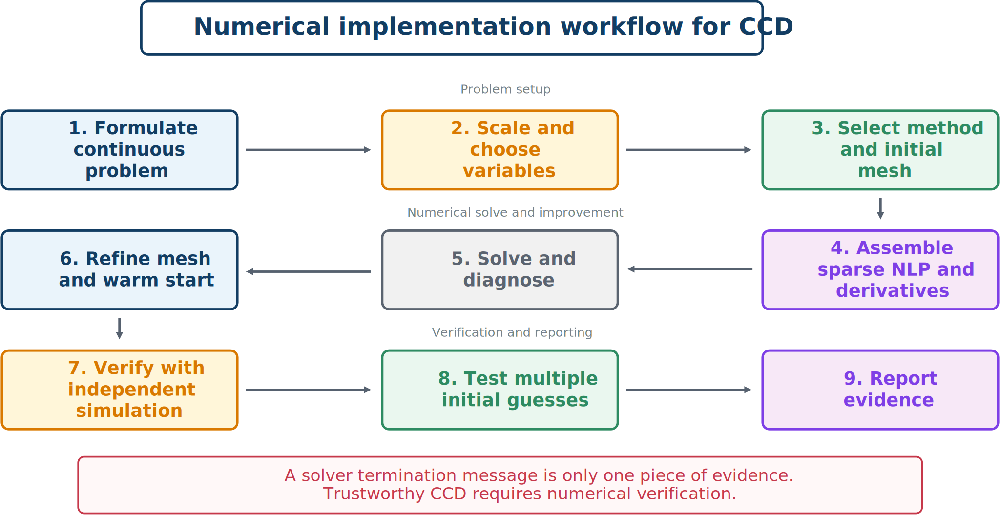

# Worked Example and Implementation Workflow

## Mass–spring–damper direct transcription

Consider

```{math}
m\ddot{q}+c\dot{q}+kq=u(t)+d(t),
```

with plant decisions $k,c$, state $\mathbf{x}=[q\;v]^T$, and

```{math}
\dot{\mathbf{x}}=
\begin{bmatrix}v\\-kq/m-cv/m+(u+d)/m\end{bmatrix}.
```

Use

```{math}
J=\int_0^T(w_qq^2+w_vv^2+w_uu^2)dt+w_kk+w_cc
```

with bounds on $q$, $u$, $k$, and $c$.

The decision vector is

```{math}
\mathbf{z}=[k,c,q_0,v_0,u_0,\ldots,q_N,v_N,u_N]^T.
```

Trapezoidal defects are

```{math}
0=q_{k+1}-q_k-\frac{h_k}{2}(v_k+v_{k+1}),
```

```{math}
0=v_{k+1}-v_k-\frac{h_k}{2}(f_{v,k}+f_{v,k+1}).
```

The second is nonlinear because plant decisions multiply state variables. Use trapezoidal objective quadrature, node bounds, and dense between-node checks.

A credible study uses at least three meshes, design and objective convergence, dense constraint checks, independent simulation, derivative verification, and multiple initial guesses.

## Numerical workflow



*The loop from refinement back to formulation and method selection is intentional.*

1. Formulate the continuous problem.
2. Scale variables, objective terms, and residuals.
3. Select shooting, multiple shooting, or transcription.
4. Choose the mesh, polynomial order, control interpolation, and quadrature.
5. Assemble sparse functions and verified derivatives.
6. Solve and inspect feasibility, stationarity, and warnings.
7. Refine and warm start.
8. Verify with independent simulation and dense constraint checks.
9. Test nonconvexity using multiple starts and continuation.
10. Report method, mesh, scaling, solver, tolerances, derivatives, initialization, convergence, residuals, and verification.

## Method selection

| Method | Best suited for | Main strength | Main limitation |
| --- | --- | --- | --- |
| Direct shooting | Stable systems, short horizons | Simple simulator connection | Long-horizon conditioning |
| Multiple shooting | Unstable systems, terminal constraints | Short sensitivity propagation | Added states and continuity equations |
| Local collocation | General nonlinear path-constrained CCD | Sparse and locally refinable | Large NLP and trajectory initialization |
| Pseudospectral | Smooth high-accuracy trajectories | Rapid smooth convergence | Awkward near discontinuities |
| Indirect | Known active sets and theoretical analysis | High accuracy and costates | Difficult initialization and constraints |
