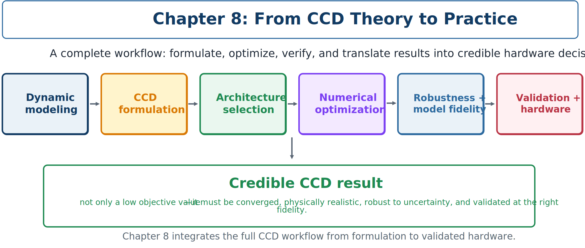

# Chapter 8: Practical CCD Studies and Advanced Topics

*Applications, robustness, model fidelity, implementation, reproducibility, and validation*

> A practical CCD study connects mathematical optimization to engineering evidence. Its final design must remain credible when the model, environment, solver, and hardware are examined critically.

Earlier chapters developed the theory and computational tools of control co-design (CCD). This chapter integrates those ideas through two applications. An active vehicle suspension provides a complete tutorial in plant–control coupling, trajectory-dependent objectives, path constraints, alternative CCD architectures, uncertainty, and implementation limits. A larger wind–wave energy application shows how the same ideas scale to multiphysics systems with expensive models, many operating conditions, and multiple control layers.

## Learning objectives

After completing this chapter, you should be able to:

1. formulate and interpret a complete active-suspension CCD study;
2. compare sequential, nested, and simultaneous results fairly;
3. extend CCD formulations to multiple scenarios and uncertain quantities;
4. choose suitable model fidelity for each design stage;
5. use surrogate and multi-fidelity models to accelerate CCD;
6. identify constraints that connect optimized designs to hardware;
7. construct a reproducible numerical and experimental validation plan; and
8. organize a practical CCD workflow from problem definition to validated design.



## What makes a CCD study practical?

A mathematically correct formulation is necessary, but insufficient. A practical study establishes a defensible chain of evidence:

1. the design question is meaningful;
2. the model represents important physics and information flow;
3. objectives and constraints reflect engineering priorities;
4. the selected CCD architecture is solved reliably;
5. the result is converged and reproducible;
6. the design is robust to realistic uncertainty;
7. higher-fidelity models and experiments support the conclusion; and
8. the controller and hardware can be implemented safely.

A failure at any link can invalidate the result. For example, a simultaneous solution may exploit nonexistent actuator bandwidth; a robust design may use an unrealistic uncertainty distribution; or a surrogate-assisted optimum may fail when checked with the original model.

```{admonition} Practical definition of success
:class: tip
A successful CCD study identifies a coordinated plant–control design and supplies enough numerical, physical, and experimental evidence for another engineer to understand, reproduce, challenge, and continue it.
```