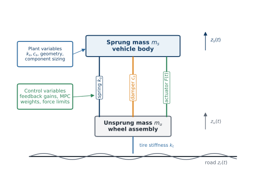
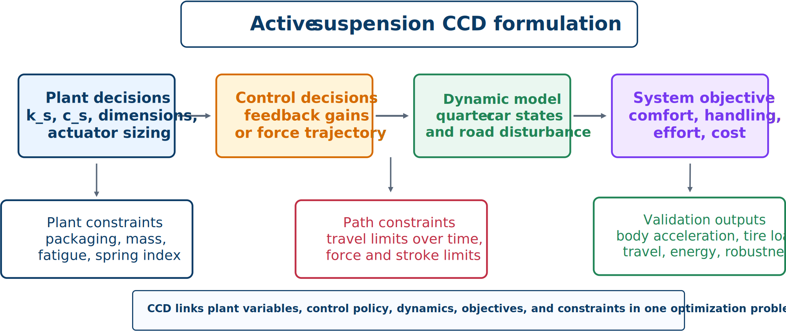

# Active-Suspension Model and Formulation

## Engineering purpose

A vehicle suspension must isolate the body from road disturbances while maintaining tire contact and acceptable suspension travel. Passive springs and dampers provide inherent behavior. An active actuator can improve comfort and handling, but introduces power, sensing, control, cost, and reliability requirements. Plant choices change the dynamics and best control action; control action changes motion, tire load, travel, and the value of plant designs.

## Quarter-car model



The sprung mass $m_s$ represents one-quarter of the vehicle body; $m_u$ represents the wheel and associated components. With road displacement $z_r(t)$, suspension stiffness $k_s$, damping $c_s$, active force $F(t)$, tire stiffness $k_t$, and upward displacement positive,

$$
m_s\ddot z_s=-k_s(z_s-z_u)-c_s(\dot z_s-\dot z_u)+F,
$$

$$
m_u\ddot z_u=k_s(z_s-z_u)+c_s(\dot z_s-\dot z_u)-F-k_t(z_u-z_r).
$$

A convenient state vector is

$$
\mathbf{x}=[z_s,\dot z_s,z_u,\dot z_u]^T.
$$

Important outputs include body acceleration $\ddot z_s$ for comfort, tire deflection $z_u-z_r$ for road holding, suspension travel $z_s-z_u$, actuator force and energy, and component mass, cost, and packaging.

## Plant and control decisions

A low-fidelity plant vector may be

$$
\mathbf{x}_p=[k_s,c_s,F_{\max}]^T.
$$

At higher fidelity, stiffness and damping follow from geometry. Decisions can include spring wire and coil diameter, active coil count, damper piston diameter, orifice area, and actuator rating. A fully detailed suspension study makes these choices explicit. One published quarter-car formulation defines the plant vector as $\mathbf{x}_p=[d,D,p,N_a,D_o,D_p,D_s]^T$, where $d$ and $D$ are the spring wire and helix diameters, $p$ is the coil pitch, $N_a$ is the number of active coils, $D_o$ is the damper valve diameter, $D_p$ is the damper piston diameter, and $D_s$ is the damper stroke. The spring constant follows from $k_s=d^4G/[8D^3N_a(1+1/(2C^2))]$ with spring index $C=D/d$, and the damper constant follows from an orifice-flow relation in $D_p$, $D_o$, and the damper fluid properties. Resulting plant constraints include a spring-index bound roughly $4\le C\le12$ (springs with $C<4$ are difficult to form; $C>12$ can tangle), a buckling limit on free length versus helix diameter, a packaging bound on outer spring diameter, a Soderberg fatigue criterion combining mean and alternating shear stress over the load history, and a damper-fluid thermal model relating heat generation ($q_{\mathrm{gen}}=c_s\dot\xi_3^2$, with $\xi_3$ the relative damper velocity) to a bounded fluid temperature that guards against seal damage and damping fade. Comparing a sequential design (plant optimized as a passive system, then a fixed open-loop force trajectory optimized for that plant) against a fully simultaneous direct-transcription solution of this same detailed model, the simultaneous result improved the system objective by nearly 20%, but it also commanded substantially higher peak control force (roughly 2400 N versus 1400 N for the sequential design) and required more than an order of magnitude more function evaluations to solve. Coordinated designs are therefore not free: performance gains and added actuation and computational cost trade off together.

Control decisions depend on the representation:

- **Open-loop:** sampled forces $F_0,\ldots,F_N$.
- **State feedback:** gains in $F=-K\mathbf{x}$.
- **Output feedback:** gains using measurable signals.
- **MPC:** weights, prediction horizon, sample time, and estimator parameters.



## System-level objective and constraints

A representative finite-horizon objective is

$$
\begin{aligned}
J(\mathbf{x}_p,\mathbf{x}_c)=\int_{t_0}^{t_f}\big[&w_h(z_u-z_r)^2+w_c\ddot z_s^2+w_uF^2\\
&+w_r(z_s-z_u)^2\big]dt+w_mM(\mathbf{x}_p)+w_CC(\mathbf{x}_p).
\end{aligned}
$$

The terms represent handling, comfort, control effort, suspension travel, plant mass, and cost. Quantities with firm allowable values are often clearer as constraints. For example,

$$
-r_{\max}\le z_s(t)-z_u(t)\le r_{\max},
$$

$$
|F(t)|\le F_{\max},\qquad |\dot F(t)|\le \dot F_{\max}.
$$

Plant feasibility must also capture spring index and manufacturability, buckling, free and solid height, stress and fatigue, packaging, actuator stroke, velocity, power, thermal capacity, and bandwidth. A force limit alone can permit impossible high-frequency actuation.

:::{tip} Activity 8.1: Full Active-Suspension CCD Benchmark
:class: dropdown

Consider the quarter-car suspension model

```{math}
\begin{aligned}
m_s\ddot{z}_s
&=-k_s(z_s-z_u)-c_s(\dot{z}_s-\dot{z}_u)+f_a,\\
m_u\ddot{z}_u
&=k_s(z_s-z_u)+c_s(\dot{z}_s-\dot{z}_u)-k_t(z_u-z_r)-f_a,
\end{aligned}
```

with actuator dynamics

```{math}
\dot{f}_a=\omega_a(f_c-f_a).
```

Use

```{math}
m_s=300\ \mathrm{kg},
\qquad
m_u=40\ \mathrm{kg},
\qquad
k_t=190{,}000\ \mathrm{N/m},
\qquad
\omega_a=60\ \mathrm{rad/s}.
```

The plant-design bounds are

```{math}
\begin{aligned}
10{,}000&\leq k_s\leq40{,}000\ \mathrm{N/m},\\
500&\leq c_s\leq3500\ \mathrm{N\,s/m},\\
500&\leq F_{\max}\leq4000\ \mathrm{N}.
\end{aligned}
```

Use the causal feedback controller

```{math}
f_c(t)=\operatorname{sat}\!\left[
-K_1(z_s-z_u)-K_2(\dot{z}_s-\dot{z}_u)
-K_3(z_u-z_r)-K_4\dot{z}_u,
F_{\max}
\right],
```

with gain bounds

```{math}
\begin{aligned}
0&\leq K_1\leq60{,}000, &
0&\leq K_2\leq6000,\\
0&\leq K_3\leq80{,}000, &
0&\leq K_4\leq6000.
\end{aligned}
```

The road input is a half-cosine bump:

```{math}
z_r(t)=
\begin{cases}
\dfrac{h_b}{2}\left[1-\cos\!\left(\dfrac{2\pi(t-t_b)}{T_b}\right)\right],
&t_b\leq t\leq t_b+T_b,\\[1em]
0,&\text{otherwise},
\end{cases}
```

where

```{math}
h_b=0.05\ \mathrm{m},
\qquad
t_b=0.25\ \mathrm{s},
\qquad
T_b=0.10\ \mathrm{s}.
```

Use the system-level objective

```{math}
\begin{aligned}
J={}&\frac{1}{T}\int_0^T\Bigg[
0.45\left(\frac{\ddot{z}_s}{2.5}\right)^2
+0.20\left(\frac{z_u-z_r}{0.015}\right)^2\\
&\qquad
+0.20\left(\frac{z_s-z_u}{0.05}\right)^2
+0.10\left(\frac{f_c}{3000}\right)^2
\Bigg]dt\\
&+0.05\left(\frac{F_{\max}}{3000}\right)^2
+0.02\left(\frac{k_s}{25{,}000}\right)^2
+0.02\left(\frac{c_s}{2000}\right)^2,
\qquad T=2\ \mathrm{s}.
\end{aligned}
```

Impose

```{math}
|z_s-z_u|\leq0.08\ \mathrm{m},
\qquad
|z_u-z_r|\leq0.025\ \mathrm{m},
\qquad
|f_c|\leq F_{\max},
\qquad
|f_a|\leq F_{\max}.
```

1. Derive the five-state nonlinear closed-loop model.

2. Formulate the single-pass sequential design:

   1. optimize $k_s$, $c_s$, and $F_{\max}$ using a fixed nominal controller; and
   2. freeze the plant and optimize $K_1,\ldots,K_4$.

3. Formulate the nested design

   ```{math}
   \min_{k_s,c_s,F_{\max}}
   \left[\min_{K_1,\ldots,K_4}J\right].
   ```

4. Formulate the simultaneous CCD problem.

5. Solve all three formulations using identical dynamics, constraints, integration tolerances, initial conditions, and objective weights.

6. Use at least ten initial guesses for the nested and simultaneous formulations.

7. Compare the best designs in terms of

   ```{math}
   J^*,\quad k_s^*,\quad c_s^*,\quad F_{\max}^*,
   \quad K_1^*,\ldots,K_4^*.
   ```

8. Verify every candidate design using an independent high-accuracy forward simulation and a time grid at least ten times finer than the optimization grid.

9. Explain any disagreement between the nested and simultaneous results in terms of local minima, inner-loop convergence, derivatives, scaling, and solver termination criteria.
:::
