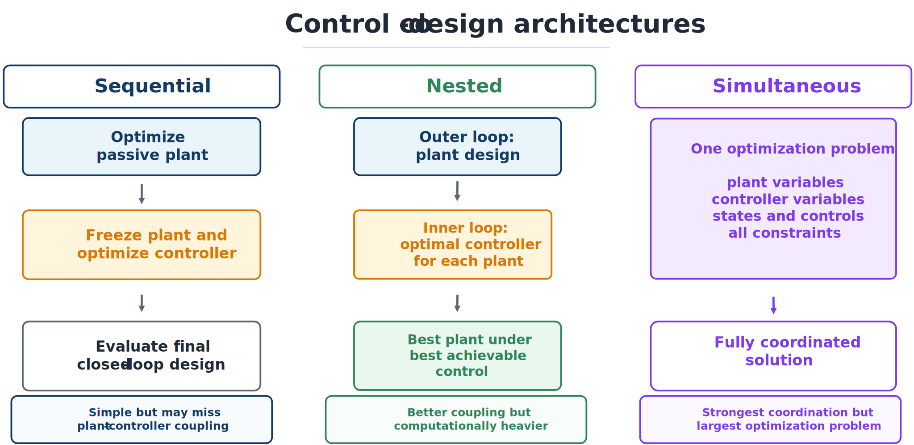
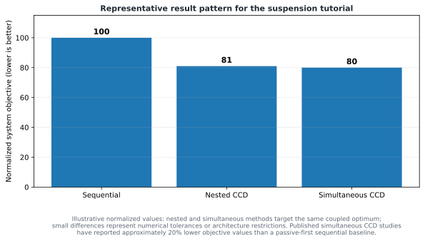

# Comparing Suspension CCD Architectures

## Fair comparison

Sequential, nested, and simultaneous methods should use the same physical model, scenarios, system objective, bounds, path and boundary constraints, discretization accuracy, and convergence requirements. Initialization effort and solver tolerances should also be comparable. Otherwise, differences may reflect formulation rather than coordination.

## Sequential formulation

A passive-first baseline is

$$
\mathbf{x}_p^{\mathrm{seq}}=\arg\min_{\mathbf{x}_p}J(\mathbf{x}_p,\mathbf{x}_c=0),
$$

$$
\mathbf{x}_c^{\mathrm{seq}}=\arg\min_{\mathbf{x}_c}J(\mathbf{x}_p^{\mathrm{seq}},\mathbf{x}_c).
$$

It answers a practical question: how much value is lost when physical suspension selection precedes active-control design?

## Nested and simultaneous formulations

Nested CCD evaluates each plant under its best achievable controller:

$$
\min_{\mathbf{x}_p}\ \psi(\mathbf{x}_p),\qquad
\psi(\mathbf{x}_p)=\min_{\mathbf{x}_c,\mathbf{x}(\cdot),\mathbf{u}(\cdot)}J(\mathbf{x}_p,\mathbf{x}_c).
$$

The inner problem enforces control and dynamic constraints; the outer problem enforces plant constraints. This is conceptually attractive but potentially expensive.

Simultaneous CCD solves

$$
\min_{\mathbf{x}_p,\mathbf{x}_c,\mathbf{x}(\cdot),\mathbf{u}(\cdot)}J(\mathbf{x}_p,\mathbf{x}_c)
$$

subject to dynamics, plant constraints, path constraints, and controller relations. After transcription, every plant, controller, state, and control variable appears in one sparse nonlinear program.



## Representative result pattern



With the sequential result normalized to 100, a representative pattern places nested and simultaneous results near 80. These values are instructional, not a reproduction of one dataset. Under ideal conditions, nested and simultaneous formulations can target the same coupled optimum; differences may arise from inner-solve accuracy, local minima, controller restrictions, or numerical tolerances.

Interpretation should examine whether the coordinated plant becomes softer or stiffer, how damping changes, actuator force and energy, active constraints, improvement by objective component, and performance on unseen road profiles. Active control may support passive elements that look unattractive alone but work well in the closed-loop system.

```{admonition} Do not report only the aggregate objective
:class: warning
A weighted value can hide unacceptable tradeoffs. Report individual objective terms, active constraints, trajectories, computation measures, and physical design values.
```

## Verified performance and computational trade-offs

A detailed active-suspension case study built exactly the model above — spring wire diameter, helix diameter, pitch, and active coil count for the plant, damper valve and piston diameter and stroke for the actuator — and evaluated a ramp-input load case together with a rough-road load case built from measured road-roughness data, using sequential, nested, and simultaneous strategies under matched dynamics, constraints, and tolerances. Two findings deserve emphasis.

First, which architecture is fastest numerically depends heavily on the derivative method available, not only on the coordination strategy. With symbolic derivatives and a sufficiently fine time mesh, the simultaneous formulation was the fastest approach, roughly ten times faster than the same formulation using the complex-step method (whose accuracy was itself close to symbolic). When only complex-step or finite-difference derivatives were available, the nested formulation became faster — in some cases by an order of magnitude — because its inner-loop subproblem reduces to a small, well-structured quadratic program while the outer loop's derivative burden stays low; increasing outer- and inner-loop accuracy in the nested strategy moved solution time from single-digit seconds to several minutes.

Second, the nested strategy carries a structural hazard that a purely theoretical equivalence argument can hide: sampling plant designs uniformly within the stated bounds, roughly 44% produced an infeasible inner-loop optimal control problem. A naive nested implementation started from such a plant design would fail to converge before the outer loop ever assessed it.

```{admonition} Derivative method interacts with architecture choice
:class: important
A claim that "simultaneous beats nested" or the reverse is incomplete without stating which derivative method (symbolic, complex-step, or finite difference) was used and at what mesh density. The faster architecture can flip when only the derivative method changes, and a fair comparison must report both.
```

## Extending the comparison to architecture

The plant-and-control comparison generalizes to include architecture — which passive and active components exist and how they connect — as a third coordinated design layer, consistent with the three design domains introduced earlier in the course. One suspension study organized this extension as a trilevel solution strategy: an outer level proposes a candidate architecture from a catalog of components (masses, springs, dampers, a force actuator, and junctions), a middle level solves the outer-loop plant-design problem for that candidate architecture with a multistart search, and an inner level solves the resulting control subproblem, nested inside the plant level, which is itself nested inside the architecture level.

Applied to a quarter-car suspension with fixed sprung and unsprung mass, six architectures were compared on a common objective combining handling, comfort, and control effort: a canonical passive spring-damper design, a pure active design (a force actuator alone), a canonical active design (spring and damper in parallel with a force actuator), an active design augmented with a tuned-mass dynamic absorber, and two novel architectures discovered by the outer-level architecture search. The canonical passive design performed worst of the six. A novel passive architecture using seven additional components (extra masses, springs, and dampers) reduced the objective by about 12% relative to the canonical passive design, driven mainly by improved handling. Among active designs, the canonical active architecture improved on the pure-active design by about 3.5%, while adding a dynamic absorber gave no measurable benefit — the optimizer drove the absorber mass to its lower bound, effectively removing it from the system. A second novel active architecture, again using seven additional components, gave the best overall result: about 13% better than the canonical active design, and achieved with the smallest peak control force of any active variant considered.

These architecture-level results reinforce a point from Chapter 1: coordinating control with plant *and* architecture decisions can outperform coordinating control with plant decisions alone, but only when the added architectural complexity is justified by measured performance rather than assumed. A complexity metric that simply counts additional components makes this tradeoff explicit rather than hiding it inside a single aggregate objective.
