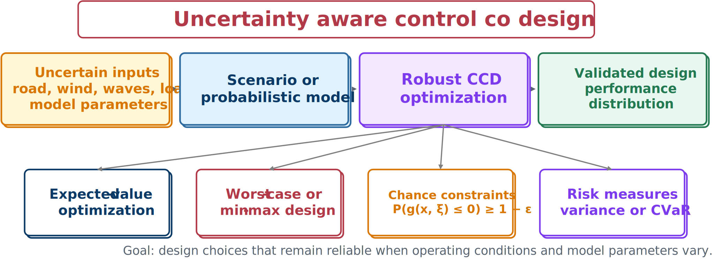

# Uncertainty and Robustness

Nominal CCD assumes a fixed model and operating condition. Real systems encounter environmental variability, payload changes, manufacturing tolerances, sensor noise and delay, model-form error, and actuator saturation or derating. A nominal optimum near a constraint boundary may therefore be fragile.

## Scenario formulation

For scenario $s$ with uncertain quantities $\boldsymbol{\theta}_s$ and weight $p_s$,

$$
\min_{\mathbf{x}_p,\mathbf{x}_c}\sum_{s=1}^{N_s}p_sJ(\mathbf{x}_p,\mathbf{x}_c;\boldsymbol{\theta}_s)
$$

subject to required scenario constraints

$$
g(\mathbf{x}_p,\mathbf{x}_c;\boldsymbol{\theta}_s)\le0,
\qquad s=1,\ldots,N_s.
$$

Suspension scenarios might combine bump, rough-road, pothole, and sinusoidal inputs; light, nominal, and heavy payloads; tire-property changes; sensor delay; and actuator derating.

## Risk-aware alternatives

- **Worst case:** $\min_{\mathbf{x}_p,\mathbf{x}_c}\max_{\boldsymbol{\theta}\in\Theta}J(\mathbf{x}_p,\mathbf{x}_c;\boldsymbol{\theta})$ protects against the most damaging defined case, but may be conservative.
- **Mean–variance:** $\min\ \mathbb{E}[J]+\lambda\operatorname{Var}(J)$ balances average and dispersion.
- **Chance constraint:** $\mathbb{P}(g(\mathbf{x}_p,\mathbf{x}_c;\boldsymbol{\theta})\le0)\ge1-\epsilon$ imposes a satisfaction probability.
- **CVaR:** penalizes the upper tail of poor outcomes and reveals more than mean performance alone.



## A taxonomy of uncertain CCD formulations

Uncertainty can be represented in three fundamentally different ways: probabilistically, when a distribution is known or can be estimated; crisply, as a bounded set with no probability measure attached; or possibilistically, through a fuzzy membership function, for cases where even the shape and size of a bounding set are not well known. This representation choice interacts with a second distinction: aleatory uncertainty is irreducible variability inherent to the phenomenon itself (manufacturing variation across nominally identical parts cannot be reduced by acquiring more knowledge), while epistemic uncertainty reflects limited knowledge that could in principle be reduced by more data, more testing, or a better model (an unvalidated model-form assumption is epistemic).

Crossing these representations with risk attitude yields several specialized uncertain-CCD (UCCD) formulations, all built from the same nominal, all-at-once CCD problem. A **stochastic-expectation** formulation minimizes the expected objective subject to expected-value constraints and is risk-neutral. A **stochastic chance-constrained** formulation instead requires each constraint to be satisfied with at least a target probability, $\mathbb{P}[g_i\le0]\ge1-\mathbb{P}_{f,i}$, generalizing the chance constraint above. A **probabilistic robust** formulation penalizes both the expected value and the standard deviation of the objective and constraints together, trading multiobjective weight for reduced sensitivity — the mean–variance idea generalized to constraints as well as the objective. A **worst-case robust** formulation replaces the probabilistic description entirely with a bounded uncertainty set and requires feasibility for every realization in that set. **Fuzzy expected-value** and **possibilistic chance-constrained** formulations use possibility measures instead of probability measures when only vague, expert-elicited information about the uncertainty is available, such as linguistic descriptions of an expected operating range.

The worst-case robust formulation (WCR-UCCD) is structurally a bi-level, min–max problem. The outer level chooses plant, control, and state variables to minimize a deterministic objective, while an inner-level maximization searches the uncertainty set for the worst-case realization of each constraint,

$$
\Phi_i=\max_{\boldsymbol\theta\in\Theta}\ g_i(\mathbf{x}_p,\mathbf{x}_c;\boldsymbol\theta),
$$

and the outer problem enforces $\Phi_i\le0$ for every constraint $i$. Because uncertain objectives and constraints play an interchangeable role in a UCCD formulation, an uncertain objective can always be moved into the constraint set through an **epigraph reformulation**: introduce a new scalar decision variable $v$ and the constraint $o(\cdot)-v\le0$, then minimize $v$. This lets every complication introduced by uncertainty be handled uniformly within the inequality constraints, rather than requiring separate machinery for the objective.

Two further distinctions are useful when formulating a UCCD problem. Uncertainty that acts through the same channel as the control input is called *matched* (or lumped); uncertainty that enters the dynamics through a different channel is called *mismatched*, and generally cannot be compensated by feedback in the same direct way. Equality constraints also split into two types under uncertainty: *Type I* constraints describe the physics of the system (the dynamics and any algebraic relations) and must be satisfied at every point in the uncertainty space considered; *Type II* constraints describe a design requirement that cannot be strictly satisfied once its arguments are uncertain, and so must instead be relaxed — typically to a statement about its expected value while its variance is minimized.

```{admonition} Choosing an uncertainty representation is a modeling decision
:class: tip
The representation is not fixed by the physics alone. When the risk associated with a specific criterion is severe enough that no constraint violation can be tolerated, a worst-case robust formulation may be preferable even when distributional information is available — the choice reflects how much conservatism the design can afford, not only how much is known about the uncertainty.
```

## Verification under uncertainty

Even a nominal optimization should be tested with Monte Carlo simulation or a structured validation set. Report mean and worst objective, constraint-violation probability, percentiles of key outputs, sensitivities, and observed failure modes. Keep validation scenarios independent from those used to tune the design whenever possible.

:::{tip} Activity 8.2: Robust Suspension Design Using Expected Value, Worst Case, and CVaR
:class: dropdown

Use the suspension model from Activity 8.1. Define the uncertain sprung mass and bump height as

```{math}
m_s\in\{240, 300, 360\}\ \mathrm{kg},
\qquad
h_b\in\{0.03, 0.05, 0.07\}\ \mathrm{m}.
```

This produces nine equally probable scenarios. Let the scenario objective be

```{math}
J_s(\mathbf{x}_p,\mathbf{x}_c),
\qquad
s=1,\ldots,9.
```

1. Formulate the expected-value problem

   ```{math}
   \min_{\mathbf{x}_p,\mathbf{x}_c}
   \frac{1}{9}\sum_{s=1}^{9}J_s.
   ```

2. Formulate the worst-case problem using an epigraph variable $\eta$:

   ```{math}
   \begin{aligned}
   \min_{\mathbf{x}_p,\mathbf{x}_c,\eta}\quad&\eta,\\
   \text{subject to}\quad&J_s\leq\eta,
   \qquad s=1,\ldots,9.
   \end{aligned}
   ```

3. Formulate the combined mean-worst-case problem

   ```{math}
   \min\quad\frac{1}{9}\sum_{s=1}^{9}J_s+\lambda\eta,
   \qquad
   \lambda\in\{0, 0.1, 0.5, 1, 2\}.
   ```

4. Formulate the empirical CVaR objective at confidence level $\alpha=0.9$ using auxiliary variables $\xi_s$:

   ```{math}
   \operatorname{CVaR}_{\alpha}
   =\eta+\frac{1}{(1-\alpha)N_s}\sum_{s=1}^{N_s}\xi_s,
   ```

   subject to

   ```{math}
   \xi_s\geq J_s-\eta,
   \qquad
   \xi_s\geq0.
   ```

5. Require every path constraint to hold in all nine scenarios.

6. Solve the nominal, expected-value, worst-case, and CVaR designs.

7. Compare

   ```{math}
   J_{\mathrm{nominal}},
   \qquad
   \mathbb{E}[J],
   \qquad
   \max_sJ_s,
   \qquad
   \operatorname{CVaR}_{0.9}.
   ```

8. Quantify the nominal-performance penalty of robustness.

9. Determine which plant and controller variables change most strongly when moving from nominal to robust design.

10. Explain why a robust design can have a worse nominal objective but still be the more credible engineering design.
:::
