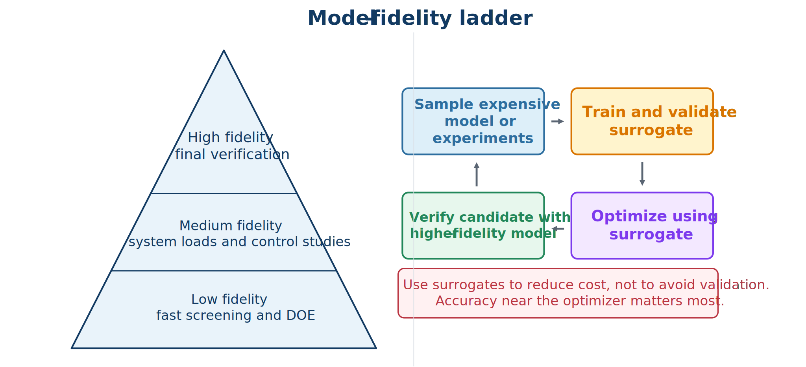

# Model Fidelity and Surrogate Models

## A fidelity ladder

No single model is best for every stage. Model fidelity should rise as the design narrows and the claim becomes stronger.



- **Low fidelity** supports broad exploration, sensitivity studies, architecture screening, and initialization.
- **Medium fidelity** adds nonlinearities, actuator and sensor models, realistic loading, and implementation details.
- **High fidelity** provides cross-checks with detailed multiphysics simulation, hardware-in-the-loop (HIL), prototypes, or experiments.

The key question is not whether a model is “accurate” in general, but whether it is sufficiently accurate for the design decision. The optimum can exploit omitted physics, so discrepancy must be assessed near promising designs, not only near a baseline.

## Surrogate-assisted CCD

When repeated high-fidelity simulations are expensive, a surrogate workflow can:

1. sample plant, control, and operating variables;
2. run high-fidelity closed-loop simulations;
3. fit a reduced-order model, response surface, Gaussian process, neural surrogate, or derivative-function surrogate;
4. validate within the intended domain;
5. optimize with the surrogate;
6. evaluate candidates in the original model; and
7. add infill samples where error or improvement is large.

Trust regions, error indicators, and conservative margins can reduce damaging extrapolation. A surrogate for a scalar metric may be insufficient for controller design: transient trajectories, stability, peaks, and path constraints can require a dynamic surrogate.

## Multi-fidelity reasoning

Low-fidelity models can rank designs or provide trends while a smaller number of high-fidelity cases correct bias and validate candidates. A discrepancy model can be written schematically as

$$
y_H(\mathbf{d})=y_L(\mathbf{d})+\delta(\mathbf{d}),
$$

where $\mathbf{d}$ collects design and operating variables. The correction $\delta$ is useful only within a validated domain and must not conceal structural model errors.

:::{tip} Activity 8.3: Surrogate-Assisted Wind-Turbine CCD with Adaptive Infill
:class: dropdown

Consider a simplified floating-wind CCD problem with plant and controller variables

```{math}
\mathbf{x}_p=
\begin{bmatrix}D_p&K_m&C_m\end{bmatrix}^{T},
\qquad
\mathbf{x}_c=
\begin{bmatrix}K_{\Omega}&K_{\theta}&K_{\dot{\theta}}\end{bmatrix}^{T},
```

where $D_p$ is a platform-dimension parameter and $K_m$ and $C_m$ are effective mooring stiffness and damping parameters. A high-fidelity simulator returns

```{math}
\mathbf{y}=
\begin{bmatrix}
P_{\mathrm{mean}}&\theta_{\mathrm{rms}}&M_{\mathrm{tower,max}}&T_{\mathrm{moor,max}}
\end{bmatrix}^{T}.
```

The system-level objective is

```{math}
\begin{aligned}
J_{\mathrm{HF}}={}&-\frac{P_{\mathrm{mean}}}{P_{\mathrm{ref}}}
+0.3\left(\frac{\theta_{\mathrm{rms}}}{\theta_{\mathrm{ref}}}\right)^2\\
&+0.2\left(\frac{M_{\mathrm{tower,max}}}{M_{\mathrm{ref}}}\right)^2
+0.1\left(\frac{T_{\mathrm{moor,max}}}{T_{\mathrm{ref}}}\right)^2
+C_{\mathrm{plant}}(\mathbf{x}_p).
\end{aligned}
```

1. Construct a Latin-hypercube design of experiments containing at least 150 plant-controller samples.

2. Train separate Gaussian-process or radial-basis surrogates for all four outputs.

3. Split the data into training, validation, and test sets, and report

   ```{math}
   R^2,\qquad \mathrm{RMSE},\qquad \max|e|.
   ```

4. Formulate the surrogate CCD problem, including high-fidelity output constraints

   ```{math}
   M_{\mathrm{tower,max}}\leq M_{\mathrm{allow}},
   \qquad
   T_{\mathrm{moor,max}}\leq T_{\mathrm{allow}}.
   ```

5. Solve the surrogate optimization from at least twenty initial guesses.

6. Evaluate the best five surrogate candidates in the high-fidelity model.

7. Define a combined infill criterion

   ```{math}
   \mathcal{I}(\mathbf{z})
   =\widehat{J}(\mathbf{z})-\kappa\sigma_J(\mathbf{z})+\rho V(\mathbf{z}),
   ```

   where $\sigma_J$ is predictive uncertainty and $V$ is a predicted constraint-violation penalty.

8. Add at least five adaptive infill points per iteration and repeat until the high-fidelity objective changes by less than $0.5\%$.

9. Compare the surrogate optimum and final high-fidelity optimum.

10. Explain why a surrogate that predicts only annual energy or mean power is insufficient when transient loads appear in the constraints.
:::

:::{tip} Activity 8.4: Multi-Fidelity CCD with a Trust-Region Correction Model
:class: dropdown

Let $J_L(\mathbf{z})$ be a low-fidelity CCD objective and $J_H(\mathbf{z})$ the corresponding high-fidelity objective, where

```{math}
\mathbf{z}=
\begin{bmatrix}
\mathbf{x}_p\\
\mathbf{x}_c
\end{bmatrix}.
```

Define the discrepancy

```{math}
\delta(\mathbf{z})=J_H(\mathbf{z})-J_L(\mathbf{z}).
```

At iteration $k$, construct the corrected model

```{math}
m_k(\mathbf{z})=J_L(\mathbf{z})+\widehat{\delta}_k(\mathbf{z}),
```

and solve

```{math}
\min_{\mathbf{z}}\quad m_k(\mathbf{z})
\qquad
\text{subject to}
\qquad
\left\|\mathbf{z}-\mathbf{z}^{(k)}\right\|_2\leq\Delta_k.
```

1. Derive the predicted reduction

   ```{math}
   \Delta m_k=m_k(\mathbf{z}^{(k)})
   -m_k(\mathbf{z}^{(k)}+\mathbf{s}_k).
   ```

2. Derive the actual high-fidelity reduction

   ```{math}
   \Delta J_{H,k}=J_H(\mathbf{z}^{(k)})
   -J_H(\mathbf{z}^{(k)}+\mathbf{s}_k).
   ```

3. Define the trust-region ratio

   ```{math}
   \rho_k=\frac{\Delta J_{H,k}}{\Delta m_k}.
   ```

4. Propose explicit rules for:

   1. accepting or rejecting the trial design;
   2. shrinking the trust region; and
   3. expanding the trust region.

5. Implement the method for a low-fidelity suspension or wind model and a higher-fidelity validation model.

6. Use both additive and multiplicative corrections:

   ```{math}
   J_H\approx J_L+\widehat{\delta},
   \qquad
   J_H\approx\widehat{\beta}J_L.
   ```

7. Compare the two correction strategies in terms of

   ```{math}
   \text{high-fidelity calls},
   \quad
   \text{final objective},
   \quad
   \text{constraint satisfaction}.
   ```

8. Determine whether the low-fidelity optimum lies inside a region where the correction model is accurate.

9. Explain why unconstrained optimization of a corrected surrogate can be unreliable without a trust region or another mechanism that controls extrapolation.
:::
