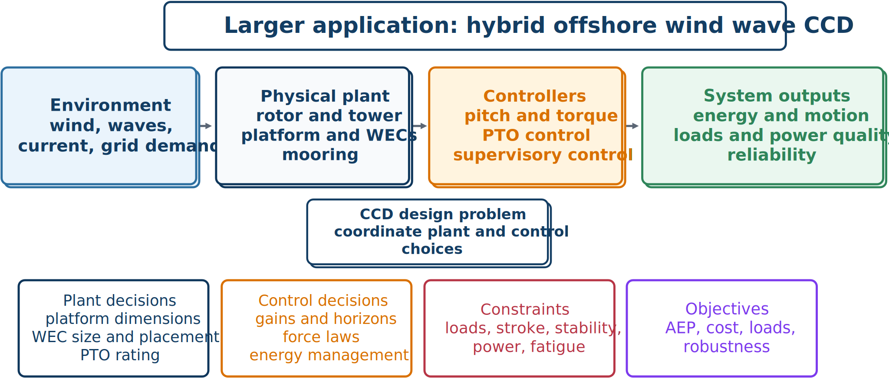

# Wind and Wave Energy CCD

Floating wind and wave-energy systems combine aerodynamics, hydrodynamics, structural dynamics, moorings, power electronics, and multiple controllers. Their stochastic environment affects annual energy, extreme loads, fatigue, platform motion, power quality, and reliability.

## Plant and control decisions

Candidate plant variables include rotor and blade properties, tower dimensions, platform geometry and mass distribution, mooring layout and stiffness, wave-energy-converter (WEC) geometry and placement, power-take-off (PTO) force and stroke ratings, and storage or conversion capacity.

Control decisions may include generator-torque and blade-pitch gains, platform-motion or load feedback, WEC PTO damping or optimal-force parameters, MPC horizons and weights, supervisory power sharing, and fault-handling thresholds.

## Multi-scenario objective

A representative objective combines energy, loads, motion, power variation, and cost:

$$
\begin{aligned}
\min_{\mathbf{x}_p,\mathbf{x}_c}J={}&-w_EE_{\mathrm{ann}}(\mathbf{x}_p,\mathbf{x}_c)
+w_LD_{\mathrm{fat}}(\mathbf{x}_p,\mathbf{x}_c)\\
&+w_MM_{\mathrm{motion}}(\mathbf{x}_p,\mathbf{x}_c)
+w_PP_{\mathrm{var}}(\mathbf{x}_p,\mathbf{x}_c)
+w_CC_{\mathrm{cap}}(\mathbf{x}_p).
\end{aligned}
$$

Annual behavior is approximated with weighted wind–wave bins, turbulent seeds, or representative scenarios. Constraints can address blade, tower, and mooring loads; platform pitch, heave, and surge; WEC angle, stroke, and PTO force; electrical power; closed-loop stability; clearance; survivability; and fault conditions.

## Multi-fidelity strategy

A practical hierarchy uses:

1. frequency-domain or linear models for screening;
2. reduced or identified dynamic models for controller optimization;
3. engineering time-domain simulation for detailed design; and
4. CFD, high-order structural models, or experiments for selected verification.

A low-fidelity optimum is a candidate hypothesis, not final evidence.

## Sequential versus integrated outcomes

A sequential process may optimize platform stability, add WECs, and then tune controllers. Integrated CCD may instead select a platform that moves more but enables better energy capture, locate WECs to reduce turbine motion, balance PTO rating against structural-load mitigation, or coordinate wind, wave, and storage subsystems. The system optimum can therefore differ qualitatively from individually optimized subsystems.

## Quantitative evidence of integrated benefit

Across published wind turbine CCD studies, integrated formulations generally outperform sequential design when plant and control are strongly coupled, but the reported margin varies with how tightly the two domains actually interact for the specific system studied. A nested formulation applied to a spar-buoy floating turbine reported more than 11% improvement in annual energy production relative to a sequential baseline; a related linear-parameter-varying-based nested formulation on the same class of platform achieved about 3.4% reduction in levelized cost of energy. At larger scale, a 22 MW semisubmersible floating turbine study found that simultaneous CCD reduced structural mass by about 2% compared to a sequential approach while maintaining comparable performance — a smaller margin that illustrates a general pattern: the size of the CCD benefit depends not only on the chosen coordination architecture but on how strongly the system's plant and control decisions are coupled in the first place. When coupling is weak or dominated by a single subsystem, a sensitivity study focused on tower design reported only about 0.53% reduction in cost of energy from coordinated design, even though structural changes (a lighter, taller tower under fatigue-driven constraints) were still identified. A CCD study should therefore report, and not merely assume, the strength of plant–control coupling before claiming a large expected benefit.

## Research gaps and a path to standardization

A recent review of wind turbine CCD identified a consistent set of open gaps across the literature: a predominant reliance on fixed-structure PI/PID controllers that restricts the achievable control-design space; isolated, rather than joint, optimization of pitch and torque control; no consensus on which objective function (AEP, LCOE, mass, or cost) should drive a CCD study; sequential, discipline-specific workflows persisting even when a fully coupled simulation tool is already available; no systematic method for quantifying how strongly plant and control disciplines actually couple in a given design or for deciding how to decompose a large CCD problem into tractable subproblems; a persistent tension between model fidelity and computational cost; uncertainty that is often ignored across all CCD phases; and a shortage of validated, interpretable AI-based surrogates and controllers. The review also noted that current CCD studies rarely report the information needed for one study to be compared against another — consistent quantitative performance metrics, sensitivity analyses, and computational cost are inconsistently documented.

To close this gap, the review proposed three priorities for the field: establishing standard, reproducible benchmark problems for wind turbine CCD; developing comparative guidelines for how to decompose a wind turbine design problem based on a systematic, quantified analysis of design coupling rather than intuition; and extending the scope of wind turbine CCD studies toward more fully coupled tower–platform–control formulations rather than partial or sequential treatments. These priorities echo the practical-study checklist introduced at the start of this chapter: a credible CCD result needs not only a coordinated design, but evidence that lets another engineer reproduce, challenge, and extend it.
