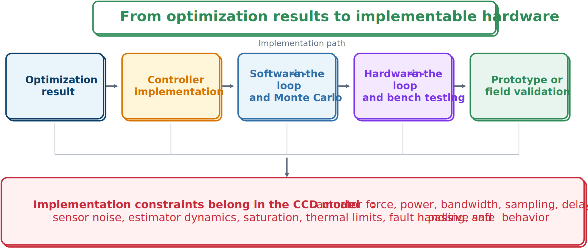

# From Optimization to Implementable Hardware

A numerical optimum is an idealized mathematical object. Implementation requires physical dimensions and components, a digital controller, sensor and estimator specifications, real-time software, communications, and safe saturation and fault behavior.



## Constraints to model

A closed-loop CCD formulation should consider:

- actuator saturation, rate, stroke, bandwidth, and efficiency;
- sampling and computational delay;
- sensor bandwidth, resolution, bias, and noise;
- state-estimation dynamics;
- anti-windup and saturation logic;
- electrical power and thermal limits;
- quantization and communications; and
- behavior when control is disabled.

```{admonition} Passive safety
:class: tip
When sensing, computation, or actuation fails, the passive plant should remain stable and avoid catastrophic behavior. The resulting constraints may reduce nominal performance but improve deployability.
```

## Controller realization

An open-loop optimal trajectory can inform a realizable controller but normally should not be implemented directly unless future inputs are known. Practical transitions include fitting low-order feedback to optimal trajectories, gain scheduling, embedding the problem in MPC, identifying switching or feedforward rules, and simplifying learned policies under explicit safety constraints.

## Validation stages

A staged campaign can proceed through:

1. software-in-the-loop simulation;
2. Monte Carlo uncertainty tests;
3. processor-in-the-loop or real-time execution;
4. hardware-in-the-loop testing;
5. component bench tests;
6. scaled or full prototypes; and
7. field validation.

Each stage should address a named modeling or implementation risk and use predefined acceptance criteria.

:::{tip} Activity 8.5: From Optimized Suspension to Implementable Hardware
:class: dropdown

Use the optimized active-suspension design from Activity 8.1. Replace the ideal implementation with the sampled-data controller

```{math}
f_{c,k}=\operatorname{sat}\!\left[-K\widehat{\mathbf{x}}_k,F_{\max}\right],
```

which is updated every $T_s$ seconds and held constant between updates. The sensor measurements satisfy

```{math}
\mathbf{y}_k=C\mathbf{x}_k+\mathbf{v}_k,
```

where $\mathbf{v}_k$ is zero-mean measurement noise. The command is delayed by $n_d$ sampling intervals, and the actuator also satisfies

```{math}
|\dot{f}_a|\leq R_{\max}.
```

1. Derive a discrete-time model using zero-order hold.

2. Construct a state observer or Kalman filter for the available measurements.

3. Implement the delayed command

   ```{math}
   f_{c,k}^{\mathrm{applied}}=f_{c,k-n_d}.
   ```

4. Impose the actuator-rate limit using

   ```{math}
   |f_{a,k+1}-f_{a,k}|\leq R_{\max}T_s.
   ```

5. Evaluate

   ```{math}
   T_s\in\{0.001, 0.005, 0.01, 0.02, 0.05\}\ \mathrm{s}
   ```

   and

   ```{math}
   n_d\in\{0, 1, 2, 5\}.
   ```

6. Determine the largest sampling time and delay for which all path constraints remain satisfied.

7. Add a passive-safety requirement: when the actuator is disabled, the passive suspension must satisfy

   ```{math}
   |z_s-z_u|\leq0.10\ \mathrm{m}.
   ```

8. Re-optimize the plant and controller while including sampling time, command delay, observer dynamics, force-rate limits, and passive safety.

9. Compare the ideal and implementable CCD designs in terms of

   ```{math}
   J,\quad k_s,\quad c_s,\quad F_{\max},\quad \text{constraint margin}.
   ```

10. Design a software-in-the-loop, hardware-in-the-loop, and bench-test validation sequence for the final design.
:::
