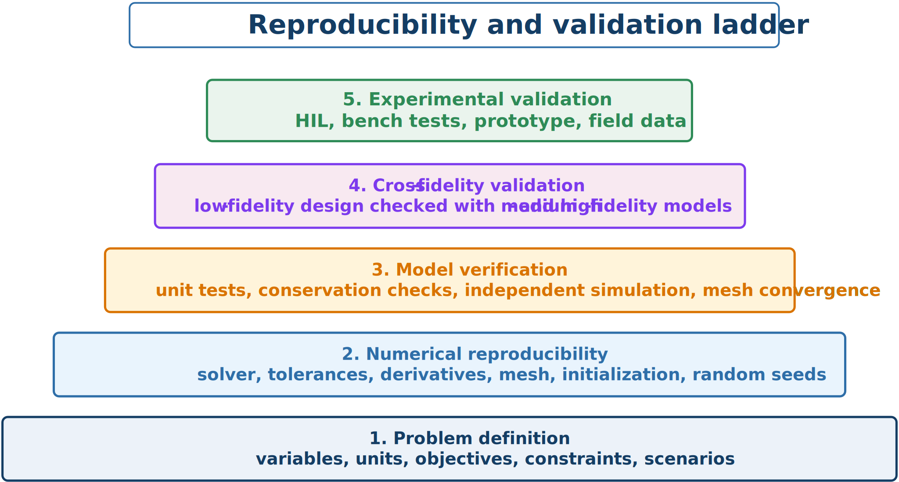

# Reproducibility and Validation

CCD studies depend on model versions, meshes, derivatives, tolerances, initial guesses, scaling, random seeds, and data processing. Recording these choices allows others to recreate the design and diagnose differences.



## Minimum reproducibility package

A complete package should include:

- governing equations, assumptions, variables, units, bounds, and scaling;
- objective terms, weights, constraints, scenarios, and input data;
- model and software versions;
- solver algorithms, tolerances, and linear-solver settings;
- derivative methods and sparsity information;
- mesh, time step, and convergence study;
- initial guesses, seeds, and multistart strategy;
- optimized designs and trajectories;
- postprocessing scripts and validation cases; and
- limitations and known failure modes.

## Numerical verification

Before assigning physical meaning, confirm acceptable feasibility and optimality residuals, mesh convergence, between-node feasibility in an independent simulation, derivative accuracy, consistency across starts, and freedom from hidden scaling or bound errors.

## Model validation

Validation asks whether the mathematical model predicts the real or higher-fidelity system well enough for the design decision. Compare trajectories, natural frequencies and damping, loads and energy, constraint margins, stability and bandwidth, and—critically—model error near the optimized design.

Validation is not a single score. Small average error can hide critical peaks or rare failures. Match validation evidence to the design claim: fatigue claims require fatigue-driving loads; feasibility claims require extreme trajectories and constraint margins.

```{admonition} Avoid validation leakage
:class: warning
Do not repeatedly tune a model or surrogate on the cases used to claim independent validation. Preserve a final test set or use additional high-fidelity and experimental cases not used during model construction.
```

:::{tip} Activity 8.6: Independent Reproduction and Validation Audit
:class: dropdown

A research team reports an optimized CCD design

```{math}
\mathbf{z}^*=
\begin{bmatrix}
\mathbf{x}_p^*\\
\mathbf{x}_c^*
\end{bmatrix},
```

with objective $J_{\mathrm{reported}}$, maximum path-constraint violation below $10^{-6}$, and a claimed $18\%$ improvement over a sequential baseline. Perform an independent reproduction and validation audit.

1. Define a reproducibility package containing:

   1. governing equations;
   2. units and variable definitions;
   3. initial and boundary conditions;
   4. objective weights;
   5. all constraints and bounds;
   6. software versions;
   7. solver settings;
   8. initialization;
   9. random seeds; and
   10. raw and processed data.

2. Recompute the reported objective using an independent implementation.

3. Define the relative objective discrepancy

   ```{math}
   e_J=
   \frac{|J_{\mathrm{reproduced}}-J_{\mathrm{reported}}|}
   {\max(1,|J_{\mathrm{reported}}|)}.
   ```

4. Independently simulate the reported control law and compute the maximum trajectory discrepancy

   ```{math}
   e_x=\max_t\left\|
   \mathbf{x}_{\mathrm{reported}}(t)-\mathbf{x}_{\mathrm{independent}}(t)
   \right\|_{\infty}.
   ```

5. Re-evaluate every path constraint on a dense grid and report

   ```{math}
   v_{\max}=\max_{t,j}g_j\!\left(\mathbf{x}(t),\mathbf{u}(t)\right).
   ```

6. Repeat the optimization using:

   1. at least ten initial guesses;
   2. two mesh densities;
   3. two NLP solvers or algorithms; and
   4. two derivative methods.

7. Reconstruct the sequential baseline using exactly the same model, objective, constraints, tolerances, and information assumptions as the CCD problem.

8. Compute the verified improvement

   ```{math}
   \eta_{\mathrm{verified}}=
   \frac{J_{\mathrm{seq,verified}}-J_{\mathrm{CCD,verified}}}
   {J_{\mathrm{seq,verified}}}.
   ```

9. Test both designs under uncertainty and at a higher model-fidelity level.

10. Define explicit acceptance criteria for

    ```{math}
    e_J,\qquad e_x,\qquad v_{\max},\qquad \eta_{\mathrm{verified}}.
    ```

11. Classify the final conclusion as one of the following:

    1. numerically reproduced and physically validated;
    2. numerically reproduced but not physically validated;
    3. partially reproduced; or
    4. not reproduced.

12. Explain why an optimizer success message and a low reported objective are insufficient evidence for a credible CCD result.
:::
