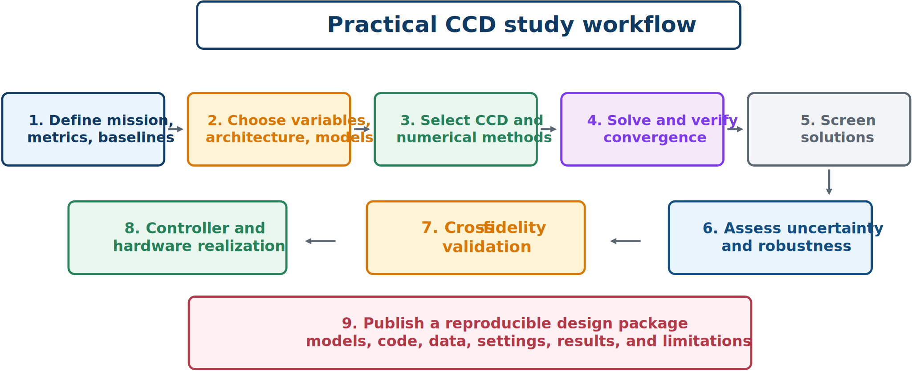

# Practical CCD Workflow and Examples

## Nine-step workflow

1. **Define mission, metrics, and baselines.** Quantify the value of coordination against at least one fair conventional design.
2. **Choose variables, architecture, and models.** Identify flexible plant, control, information, and architecture decisions; document model limits.
3. **Select CCD and numerical architectures.** Coordination and discretization are separate choices.
4. **Solve and verify convergence.** Use scaling, derivatives, sparse structure, multiple starts, and mesh refinement; record settings.
5. **Screen the result physically.** Inspect values, active bounds, trajectories, actuator demand, stability, and failure modes.
6. **Assess uncertainty and robustness.** Test scenarios and uncertain parameters beyond nominal optimization.
7. **Perform cross-fidelity and independent validation.** Use detailed models, independent implementations, or new data.
8. **Realize controller and hardware.** Implement sampling, estimation, actuator dynamics, saturation logic, and real-time limits.
9. **Publish a reproducible package.** Enable others to recreate the study and understand its limitations.

## Example 8.1: suspension architectures

Using the suspension objective, compare:

- **Sequential:** optimize $k_s$ and $c_s$ with $F=0$, freeze the plant, then optimize feedback or force trajectory.
- **Nested:** solve the specified control problem for every proposed plant.
- **Simultaneous:** transcribe states and controls and solve one sparse NLP containing plant and trajectory decisions.

Report total objective and every component, plant and controller values, peak travel and force, acceleration and tire-deflection trajectories, computation measures, mesh convergence, and independent simulation. Similar nested and simultaneous solutions support the theoretical equivalence and both implementations. Differences require investigation of inner convergence, local minima, feasibility, discretization, and controller representation.

## Example 8.2: robust suspension

For three road profiles and three payloads, define nine scenarios with probabilities $p_s$:

$$
J_R(\mathbf{x}_p,\mathbf{x}_c)=\sum_{s=1}^{9}p_sJ_s(\mathbf{x}_p,\mathbf{x}_c)+\lambda\max_sJ_s(\mathbf{x}_p,\mathbf{x}_c).
$$

The first term rewards average performance; the second penalizes a weak worst case. Enforce actuator and travel limits in all scenarios. Compare nominal and robust designs on all cases, including the nominal penalty, worst-case improvement, violations, and design changes.

## Example 8.3: surrogate-assisted wind CCD

From high-fidelity histories of rotor speed, platform pitch, tower moment, generator power, and controller signals:

1. sample wind, wave, plant, and controller conditions;
2. run high-fidelity closed-loop simulations;
3. identify a reduced or derivative-function surrogate;
4. validate histories and performance metrics;
5. optimize controller or plant–controller design;
6. re-evaluate the optimum at high fidelity;
7. add infill cases near disagreement or promising designs; and
8. complete multi-seed and extreme-condition validation.

A metric-only surrogate is inadequate when transient loads govern decisions or constraints.

## Common failure modes

1. unfair baselines with different models, objectives, or constraints;
2. ideal actuators with unlimited rate, energy, bandwidth, or thermal capacity;
3. overfitting to one environmental realization;
4. unverified mesh or tolerance convergence;
5. surrogate extrapolation;
6. metric-only validation that misses peaks or constraints;
7. hidden assumptions about states, preview, or computation;
8. incomplete code, data, units, and settings; and
9. reporting a low objective without its physical mechanism.
