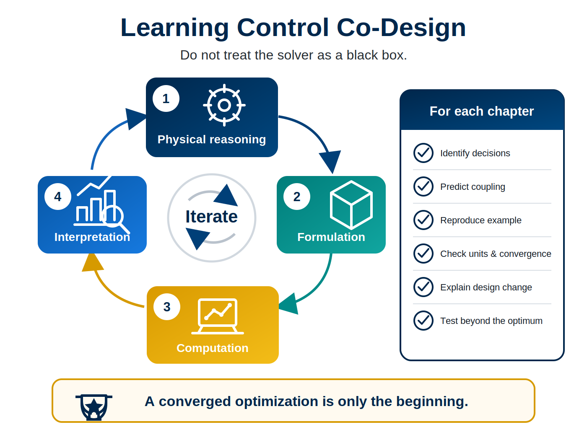

# Advice to Students

Control co-design is learned by moving repeatedly between physical reasoning, mathematical formulation, computation, and design interpretation. Do not treat the optimization solver as a black box.

For each chapter:

1. identify the physical and control decisions before reading the formulation;
2. predict the important coupling mechanisms;
3. reproduce the example in Python or MATLAB;
4. check units, constraints, scaling, and numerical convergence;
5. explain why the optimized design changed; and
6. test the result under conditions that were not optimized.

The activities and exercises are part of the course narrative. A converged optimization is only the beginning of the engineering argument.
